## Challenge : Le coffre fort

## Informations du challenge

| Catégorie | Difficulté | Points | Auteur |
|-----------|------------|--------|--------|
| Osint | Facile | 50 | B3cha |

**Preuve :** `08312618`

## Résumé

Fidèle à sa réputation, le CTE de la RGPACA propose un challenge inédit pour trouver la plateforme
de CTFd du CTE.

En début de CTE, chaque capitaine reçoit dans sa boîte mail le fichier de briefing intitulé `Briefing Operation vérité.pdf`

A la lecture du fichier, nous apprenons que l'enquête démarre avec une femme nommée `Mélanie LEFEVRE`.
L'énoncé nous indique qu'il faut commencer les recherches par ses réseaux sociaux. Une difficulté toutefois : `Mélanie LEFEVRE` est un nom et prénom très commun.

Une phrase du briefing attire notre attention : *Celle-ci cherche des preuves pour établir **la vérité** sur la campagne d'usurpation d'identité dont elle fait l'objet*.

Avec le titre de l'opération *OPERATION VERITE* nous pouvons penser au réseau social **truthsocial.com**

On effectue une recherche sur `Mélanie LEFEVRE` sur ce réseau social, après une analyse des différents profils, un profil en particulier attire
notre attention :

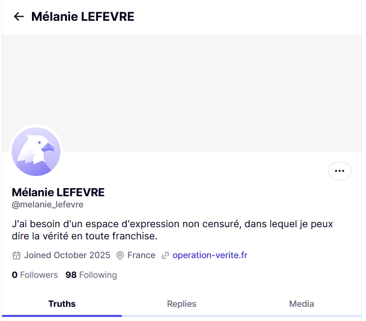

La biographie de la personne nous rapproche du CTE, le site web dans son profil indique l'url du même nom que celui de l'opération :
`https://www.operation-verite.fr`

En se rendant sur ce site web, on arrive sur la page suivante :


Pas de doute, nous sommes au bon endroit et ça commence fort.
Il demande un `code secret` pour ouvrir la porte du coffre-fort. "Oh, non ne me dites pas qu'on va rester coincés encore une fois
devant la porte d'entrée !"
<p align="center">
  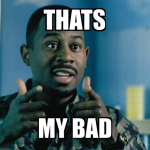
</p>


L'analyse de la page montre une roue crantée : "Du lock picking numérique ? Je n'ai jamais vu ça dans un ctf !"
Commençons par comprendre comment ça marche : https://fr.wikihow.com/d%C3%A9couvrir-la-combinaison-d'un-coffre-fort

Il faut donc trouver une combinaison à 4 nombres allant de 00 à 99. Pour saisir le premier nombre, il faut tourner la molette à droite
x fois, puis tourner la molette à gauche y fois, puis de nouveau dans l'autre sens (droite) et enfin à gauche pour déterminer le dernier nombre de la combinaison finale. En fin de saisie, cliquez sur la molette au centre pour soumettre le code.

# Analyse sonore spectrale

On remarque qu'à chaque tour de molette, un clic sonore est émis. Ceci nous rappelle la séquence
de clics sonores émise en fin de trailer publié sur le compte LinkedIn de la team EternalBlue :
https://www.linkedin.com/company/eternalblue-ctf-team/

Le son du code est le suivant :


Il faut isoler la séquence sonore et procéder à une analyse spectrale en utilisant par exemple le site (https://academo.org/demos/spectrum-analyzer/) ou le logiciel Audacity :

- En partant du 0, on entend 8 clics, donc on fait 8 tours de molette à droite on obtient la position `08`.
<p align="center">
  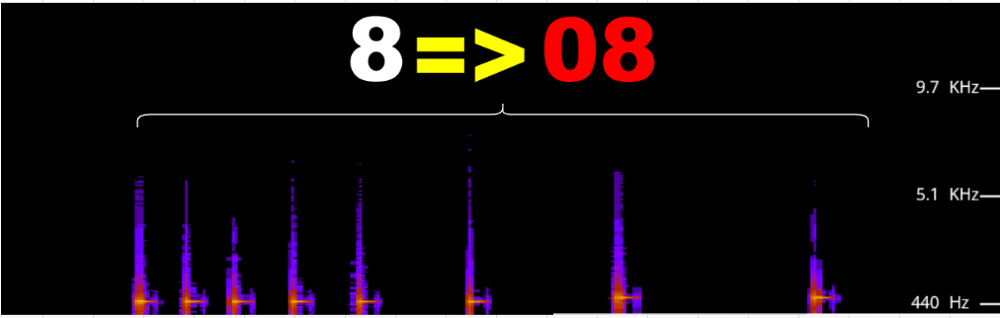
</p>

- Depuis cette position (c'est-à-dire `08`), on entend 77 clics, on fait (100-(8+69)) tours de molette à gauche, et on arrive sur la position `31`
<p align="center">
  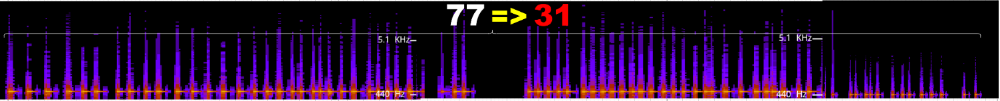
</p>

- Depuis la nouvelle position `31`, on entend 95 clics, on fait 69 + 26 tours de molette à droite, et on arrive sur la position `26`
<p align="center">
  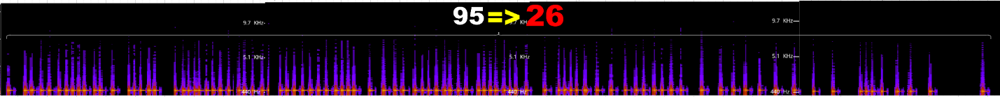
</p>

- Depuis la dernière position `26`, on entend 8 clics, on fait 26 - 8 tours de molette à gauche, et on obtient la dernière position `18`
<p align="center">
  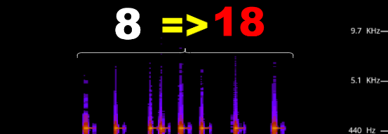
</p>

On obtient ainsi la séquence suivante : `08312618`, essayons sans trop tarder sur le coffre-fort : Bingo !

# Analyse des méta-données du fichier de briefing

Il y a une autre façon de trouver ce code secret. En faisant un `exiftool` sur le fichier reçu lors du briefing : `Briefing Operation vérité.pdf`
On obtient les données suivantes :

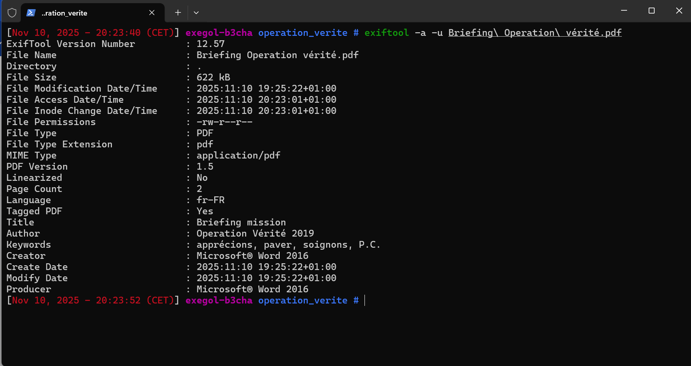

Deux lignes nous intéressent particulièrement :

```shell
Author 	: Operation Vérité 2019
Keyword	: apprécions, paver, soignons, P.C.
```

Les 3 mots nous font penser à https://what3words.com :

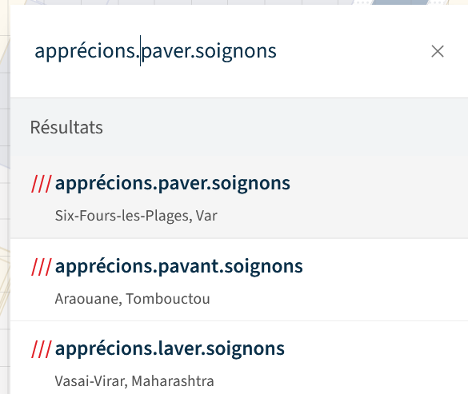

Ceci nous mène à la localisation suivante : (43.10889408559928, 5.855917963616724), un lieu sur la commune de `La Seyne-sur-mer`

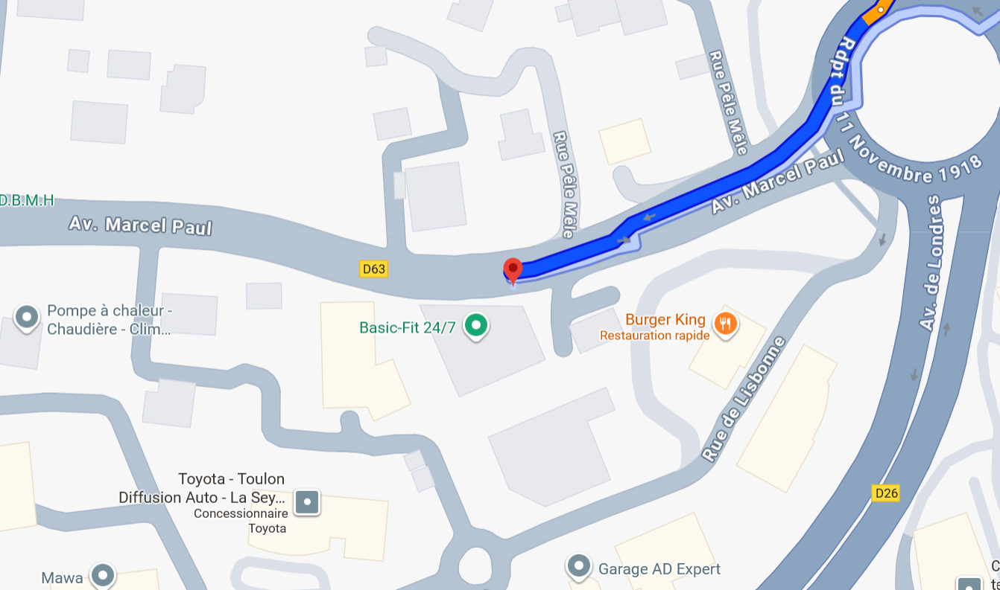

En passant en vue Google Street, on obtient la vue suivante :

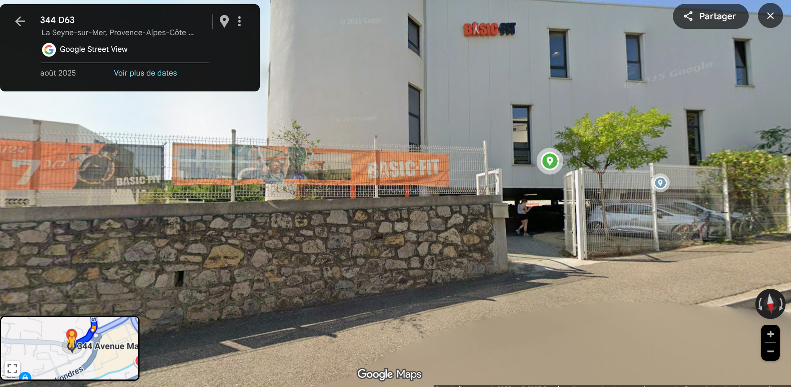

Un élément des méta-données qu'on n'a pas encore exploité est l'année **2019** dans le champ `Author`, nous allons prendre la photo sur Google Street datant de 2019 :

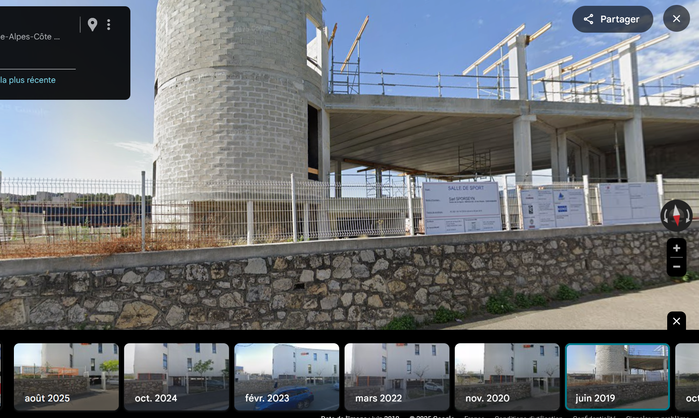

La vue pointe sur un bâtiment en construction avec des pancartes d'affichage public de travaux, en se rapprochant
plusieurs chiffres s'offrent à nous, lesquels prendre ?

Dans les keywords les trois mots se terminent par P.C. qui pourrait signifier : `Permis de Construire` ?

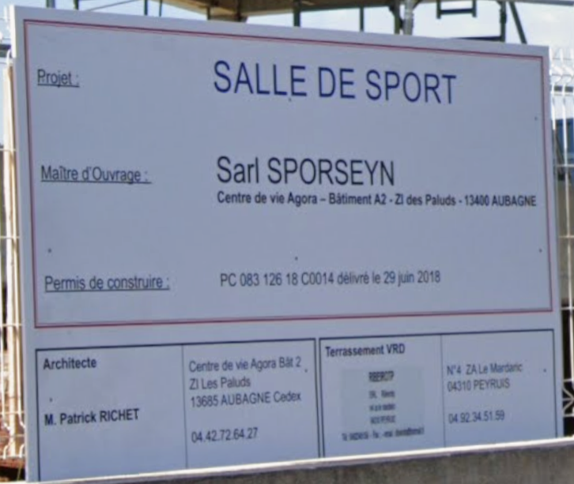

Le numéro de permis de construire présente bien une série de 8 chiffres avant la lettre **C** : `08312618` : **Bingo c'est le code secret recherché !**

On peut désormais ouvrir la porte du coffre-fort et accéder au Ctfd du CTE.

**Nota :** toujours dans l'analyse de message caché, à la dernière ligne du texte de briefing, une citation à 90% de noir est inscrite

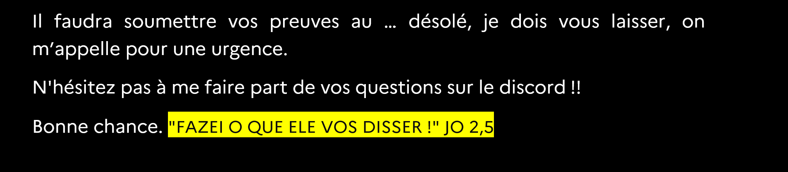

Cette citation doit nécessairement servir à un moment ou un autre dans le CTE.

✅ Preuve : **08312618**
