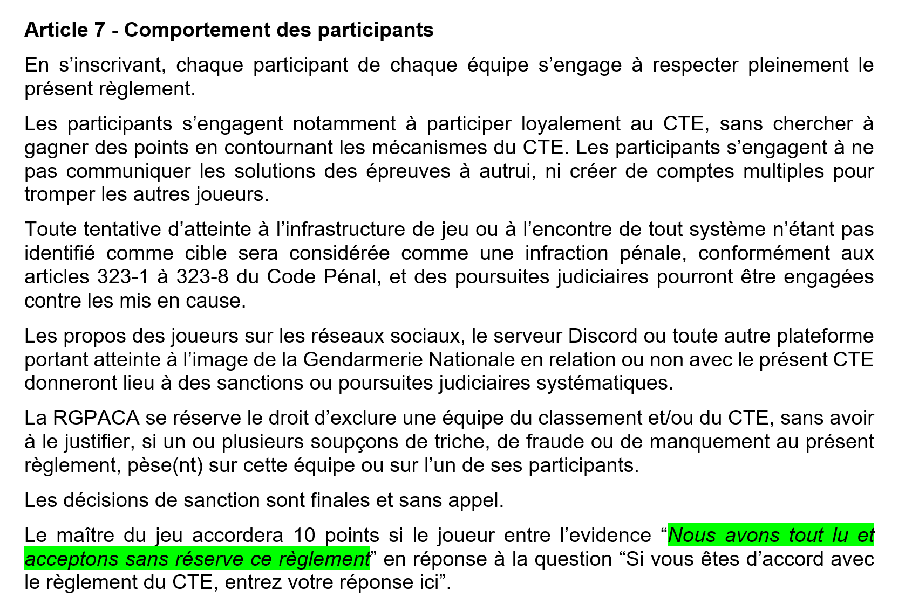

## Challenge : Prestation de serment

## Informations du challenge

| Catégorie | Difficulté | Points | Auteur |
|-----------|------------|--------|--------|
| Lecture | Facile | 10 | B3cha |

**Preuve :** `Nous avons tout lu et acceptons sans réserve ce règlement`

## Résumé

Ce challenge permet de valider le règlement du jeu de manière explicite par chaque équipe.

L'acceptation du règlement du CTEv2 engage juridiquement les joueurs. En cas de litige, seul ce document juridique fait foi
en plus des lois françaises.

## Etape 1 : relecture du Règlement du CTEv2

### Réception du règlement

Au démarrage du CTEv2, le vendredi 05 juin 2026 à 20h00, chaque équipe/joueur inscrit sur le formulaire de pré-inscription grist ou directement sur l'adresse `cyber-rgpaca@gendarmerie.interieur.gouv.fr` reçoit sur sa boîte mail d'inscription deux documents PDF :
1. Reglement CTEv2.pdf
2. Briefing Operation vérité.pdf

En cas de non-réception, les joueurs peuvent contacter les organisateurs sur le serveur Discord du jeu et leur signaler la non-réception des documents de démarrage du jeu.

### Analyse du règlement

Après une relecture attentive du document `Reglement CTEv2.pdf`, celui-ci présente dans son **Article 7 - Comportement des participants**
la réponse attendue à la question : `Si vous êtes d’accord, entrez l’évidence ici ?`

## Etape 2 : validation de la preuve

### Résultat

La réponse attendue pour valider le premier challenge est **Nous avons tout lu et acceptons sans réserve ce règlement**.

Attention : la preuve est sensible à la casse, il faut donc copier/coller le texte tel quel depuis le document du règlement pour valider la réponse.

Elle permet ainsi d'engranger ses 10 premiers points.

✅ Preuve : `Nous avons tout lu et acceptons sans réserve ce règlement`
