## Challenge : Banque root

## Informations du challenge

| Catégorie | Difficulté | Points | Auteur |
|-----------|------------|--------|--------|
| Osint | Moyen | 200 | B3cha |

**Preuve:** `24950`

---

## Résumé

Ce challenge nécessite de retrouver l'adresse gmail de **Mélanie** puis parcourir son google agenda.
Celui-ci contient plusieurs documents à analyser qui détaillent les dépenses injustifiées.

## Etape 1 : Identification de l'adresse mail (gmail) de Mélanie

L'analyse des différents comptes des réseaux sociaux de Mélanie montre que certains de ses pseudonymes sont écrits en leetspeak.
La vidéo du trailer à la 22 secondes présente le nom de Mélanie écrit en leetspeak :

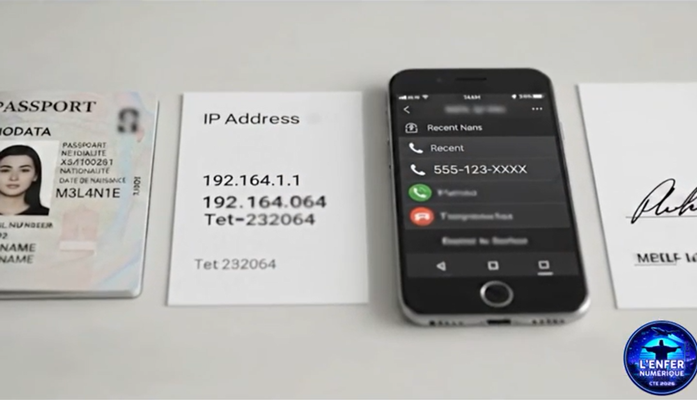

Cette indication est également fournie sur le compte `thumbler` de Mélanie :

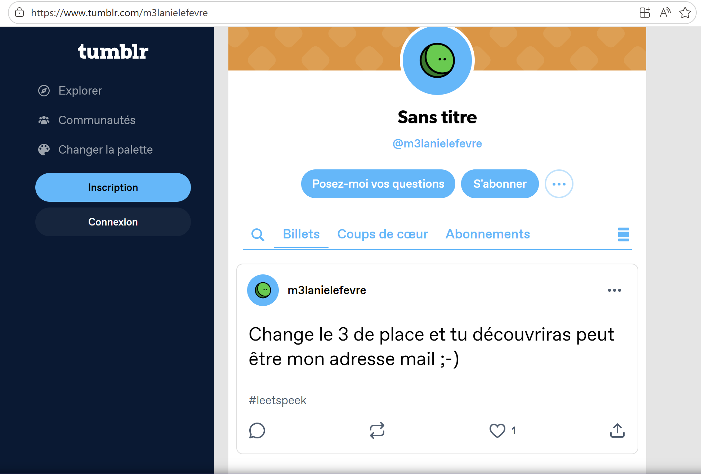

Nous allons donc utiliser un petit outil sympa https://nikoko107.github.io/hammer/, pour produire toutes les variantes possibles
en leetspeak et essayer de construire l'adresse mail de Mélanie : en `gmail.com`, `proton.me`, `yahoo.fr`, etc.

Commençons d'abord par une distance de Hamming de 1, c'est à dire 1 substitution :

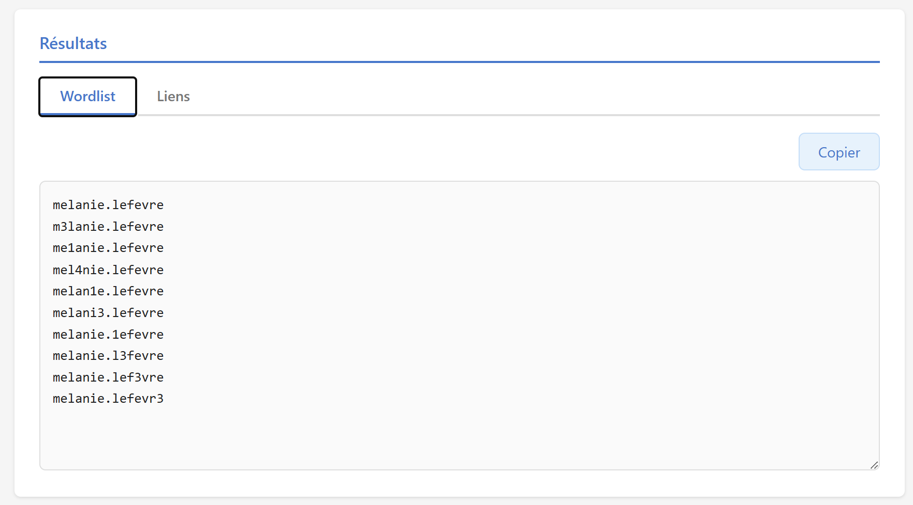

Puis ajoutons la partie provider :
```shell
melanie.lefevre@gmail.com
m3lanie.lefevre@gmail.com
me1anie.lefevre@gmail.com
mel4nie.lefevre@gmail.com
melan1e.lefevre@gmail.com
melani3.lefevre@gmail.com
melanie.1efevre@gmail.com
melanie.l3fevre@gmail.com
melanie.lef3vre@gmail.com
melanie.lefevr3@gmail.com
```
Puis vous avez la possibilité de tester toutes ces adresses de manière automatique via l'outil `Epios` ou encore `ghunt`.

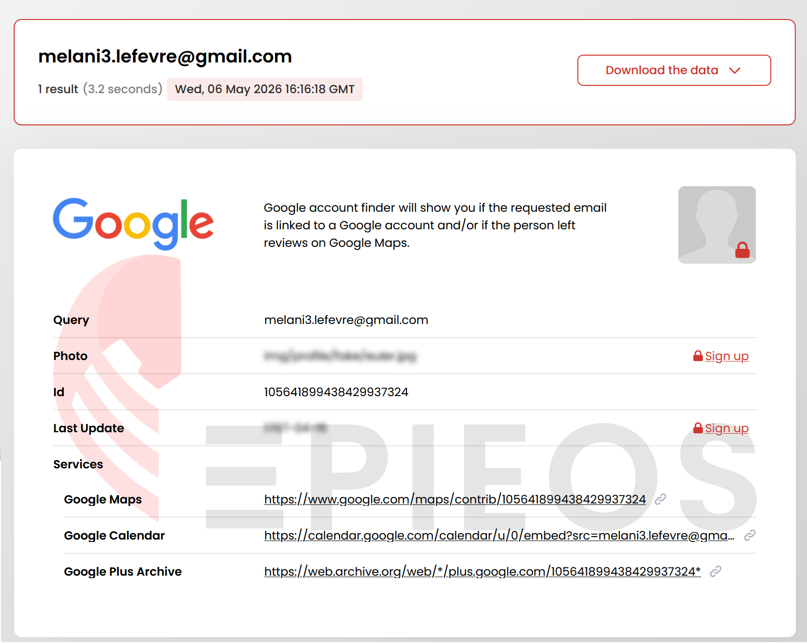

Ou bien tout simplement en complétant l'url suivante avec l'adresse mail de Mélanie comme suit :

https://calendar.google.com/calendar/u/0/embed?src=melani3.lefevre@gmail.com

On trouve donc bien une adresse mail pour mélanie sur gmail `melani3.lefevre@gmail.com`

Il y a un événement en particulier en date du **01 juin 2026** qui nous intéresse :

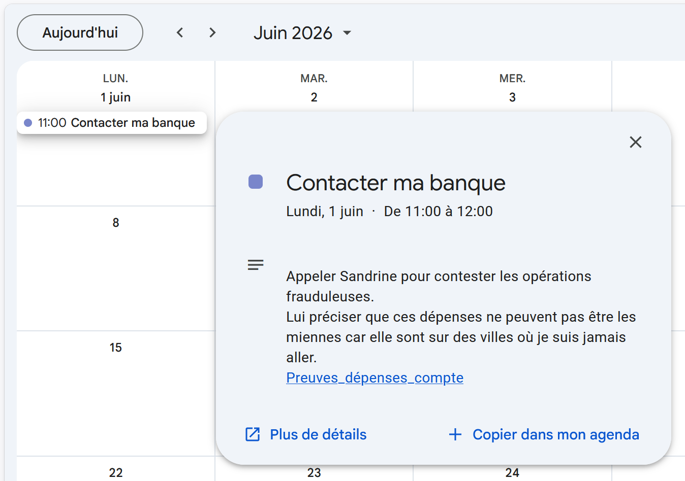

Mélanie avait rendez-vous avec sa banquière le 01/06/2026 pour discuter avec elle de ses dépenses injustifiées.

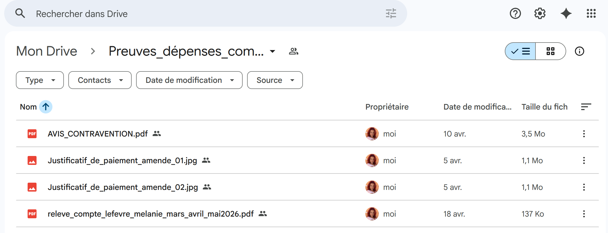

Le document intitulé `releve_compte_lefevre_melanie_mars_avril_mai_2026.pdf` nous intéresse tout particulièrement.

## Etape 2 : Analyse des documents sur le drive de Mélanie

### AVIS DE CONTRAVENTION

Le 12/03/2026 une contravention d'un montant de **35€** majoré à **85€** commise sur la commune de Toulon pour le véhicule
`AA-376-LT` YAMAHA. Après quelques recherches sur les sites spécialisés, il s'agit d'un scooter de marque YAMAHA X-MAX125.

Est-ce une infraction commise par Mélanie ? ou un usurpateur.

### JUSTIFICATIF DE PAIEMENT 02

Un document attestant un règlement par carte bancaire pour un montant de **85€** en date du 12/03/2026.
Ce paiement est probablement le règlement de la contravention du scooter X-MAX. Ceci signifie que l'amende a été payée
hors délai.

### JUSTIFICATIF DE PAIEMENT 01

Un second document attestant un règlement par carte bancaire pour un montant de **35€** en date du 26/11/2021 bien plus ancienne que la précédente infraction.

Il faudra vérifier la présence de cette dépense contestée par Mélanie sur le relevé de compte bancaire.

### RELEVE DE COMPTE BANCAIRE

Tout l'enjeu de ce document est d'identifier les dépenses suspectes ou frauduleuses que Mélanie va contester auprès de sa banquière.

On retrouve bien le logo de la Banque de Mélanie annoncée dans la vidéo du Trailer du CTE.

Commençons par désigner au marqueur les débits qui nous semblent injustifiés :

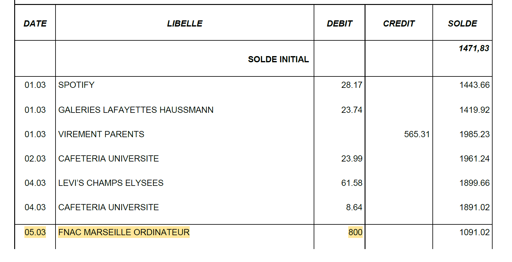
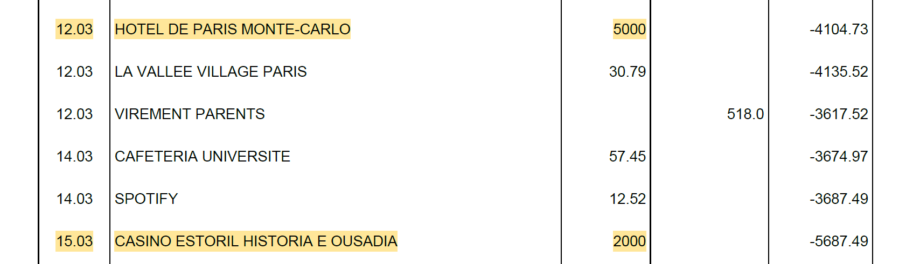
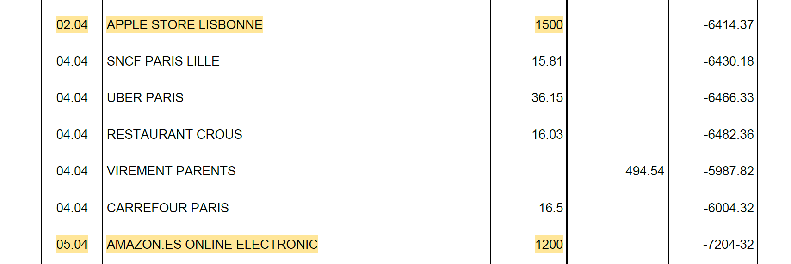
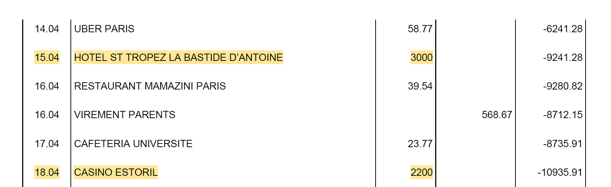
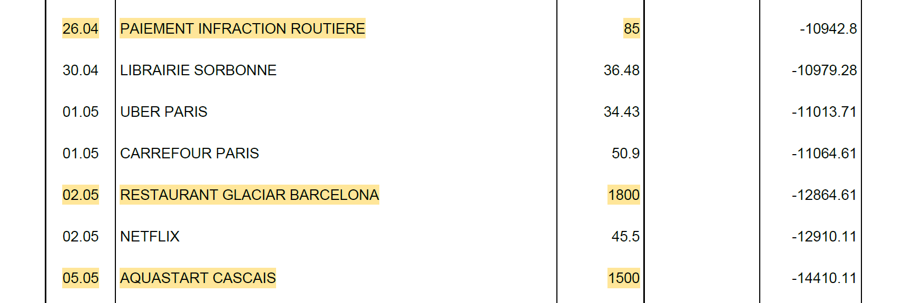
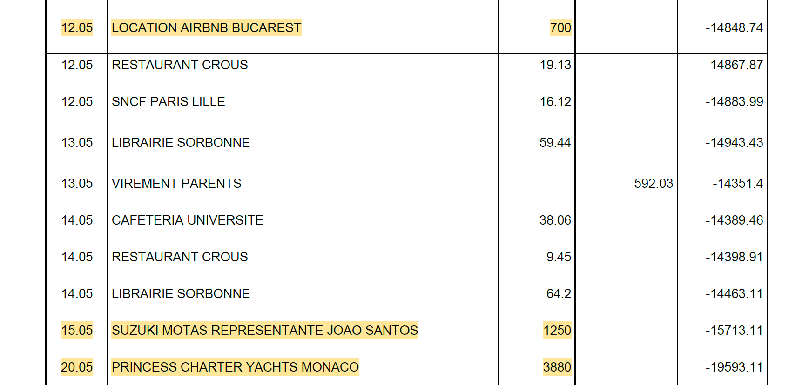

Voici un tableau récapitulatif des lignes suspectes identifiées :

| Date  | Libelle | Débit | Explication |
|-------|------------|--------|--------|
| 05.03 | FNAC MARSEILLE ORDINATEUR | 800 | Mélanie habite Paris, pour quelle raison aurait-elle un achat à La Fnac Marseille |
| 12.03 | HOTEL DE PARIS MONTE-CARLO | 5000 | Dépense hors de prix pour une étudiante qui perçoit 518€ de ses parents |
| 15.03 | CASINO ESTORIL HISTORIA E OUSADIA | 2000 | Dépense à l'étranger (portugal) ?!? |
| 02.04 | APPLE STORE LISBONNE | 1500 | Dépense à l'étranger ?!? |
| 05.04 | AMAZON ES ONLINE ELECTRONIC | 1200 | achat espagne |
| 15.04 | HOTEL ST TROPEZ LA BASTIDE D'ANTOINE | 3000 | Montant hors train de vie Mélanie |
| 18.04 | CASINO ESTORIL | 2200 | Dépense Casino à l'étranger ?!? |
| 26.04 | PAIEMENT INFRACTION ROUTIERE | 85 | présence de l'avis de contravention dans le google drive |
| 02.05 | RESTAURANT GLACIAR BARCELONA | 1800 | Dépense à l'étranger ?!? |
| 05.05 | AQUASTART CASCAIS | 1500 | Dépense à l'étranger ?!? |
| 12.05 | LOCATION AIRBNB BUCAREST | 700 | Dépense à l'étranger ?!? |
| 15.05 | SUZUKI MOTAS REPRESENTANTE JOAO SANTOS | 1250 |  Dépense à l'étranger ?!? |
| 20.05 | PRINCESS CHARTIER YACHTS MONACO | 3880 | Montant hors train de vie Mélanie |

Le total de ces dépenses s'élève à  : **24915**.

En testant ce montant, le flag est incorrect. Normal, il faut ajouter la contravention de **35€** en date du 26/11/2021
que Mélanie souhaite contester.

Nous obtenons donc un total de **24950**, ce qui représente l'Enfer numérique pour une étudiante aux revenus modestes.

### Résultat

La solution de notre challenge est la somme des dépenses injustifiées :

✅ **Preuve:** `24950`
