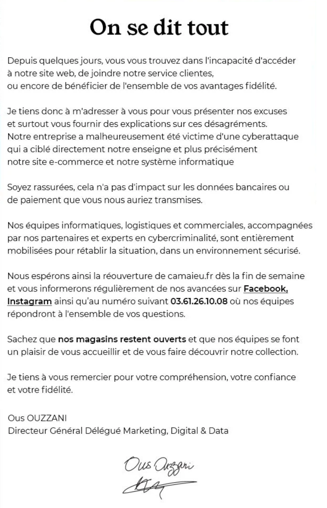
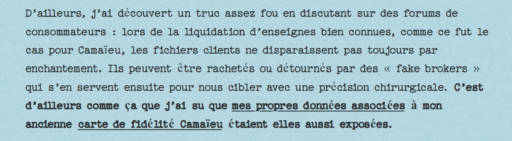
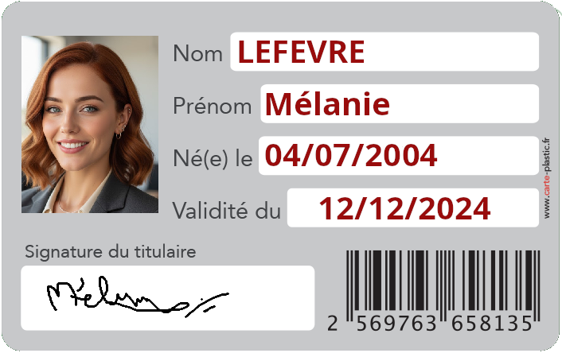

## Challenge : Ca aussi c'est du vol

## Informations du challenge

| Catégorie | Difficulté | Points | Auteur |
|-----------|------------|--------|--------|
| Osint | Facile | 100 | B3cha |

**Preuve:** `Carte de fidelite camaieu` ou `Carte de fidélité camaïeu`

## Résumé

Ce challenge nécessite de retrouver l'ancienne carte de fidélité qui a fait fuiter les données personnelles de **Mélanie** :

1. Une partie de l'information se trouve sur le profil Facebook de Mélanie https://www.facebook.com/profile.php?id=61566117843238
2. Une confirmation sur le blog **Diariste** de Mélanie trouvé lors du challenge `Son histoire`

## Analyse du profil Facebook de Mélanie

Sur le compte Facebook de Mélanie (https://www.facebook.com/profile.php?id=61566117843238), il y a un post
qui date du 24 avril 2026 qui montre clairement qu'il propose 1 AN de CARTE CAMAÏEU.

Or, une rapide recherche sur google montre que la société Camaïeu a été placée sous redressement judiciaire au mois de **septembre 2022**.
par le tribunal de commerce de Lille.

https://www.assemblee-nationale.fr/dyn/opendata/CRCANR5L17S2025PO866653N035.html

On comprend donc que ce post de Mélanie a vocation à attirer notre attention.

D'autres recherches sur l'entreprise Camaïeu montre que celle-ci a fait l'objet de cyber attaque malgré une situation financière difficile :

https://www.lemondeinformatique.fr/actualites/lire-deja-affaibli-camaieu-affronte-une-cyberattaque-83240.html

Cette cyberattaque, a même fait l'objet d'un communiqué officiel :

## Analyse du blog Diariste de Mélanie

Après une longue lecture du blog de Mélanie, un article en particulier en date du `16 avril 2026` intitulé **Faux brokers, cartes de fidélité piratées : le business de la revente de données**
parle d'une technique redoutable de vol d'identité.

En effet, les escrocs ne se contentent plus de pirater les systèmes d'informations de leurs victimes et voler leur base de données
ceux-ci proposent d'acheter le fichier client à leur victime ou aux sociétés en cessation de paiement dans l'optique de sauver quelque chose.

https://onmavolemonidentite.wordpress.com/2026/04/16/amendes-sncf-ter-peages-et-si-cetait-toi-la-prochaine-victime/

Ainsi, l'entreprise en difficulté financière pense vendre son fichier client à des sociétés de démarchage, or les **Brokeurs de données**
ne sont pas tous d'honnêtes entreprises.

Le troisième paragraphe de l'article présente deux liens :

Ces deux liens : https://onmavolemonidentite.wordpress.com/wp-content/uploads/2026/03/carte-melanie-verso.png
et https://onmavolemonidentite.wordpress.com/wp-content/uploads/2026/03/carte-melanie-recto.png

Le résultat est sous nos yeux, le programme de fidélité de Mélanie a eu raison de son identité, vendue à des escrocs.

### Resultat

La solution de notre challenge est donc l'adhésion au programme de fidélité **Camaïeu**.

✅ **Preuve:** `Carte de fidelite camaieu` ou `Carte de fidélité camaïeu` (les deux propositions sont acceptées)
