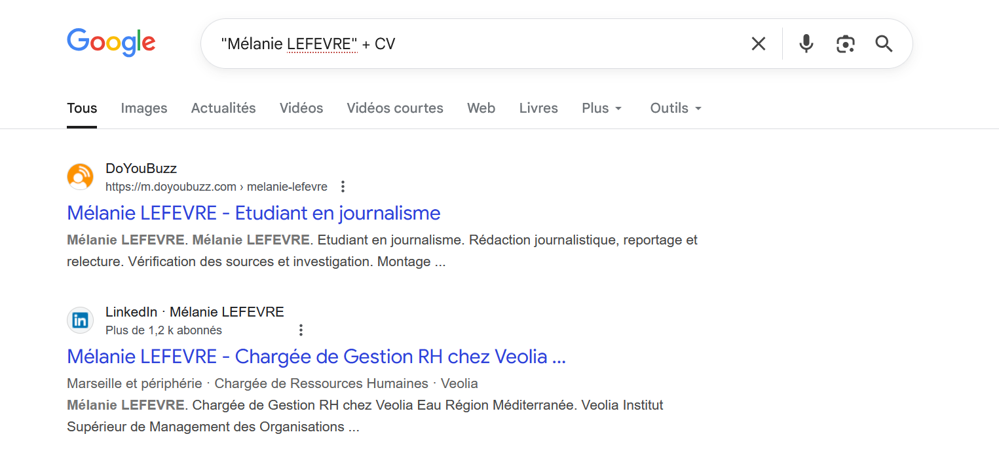
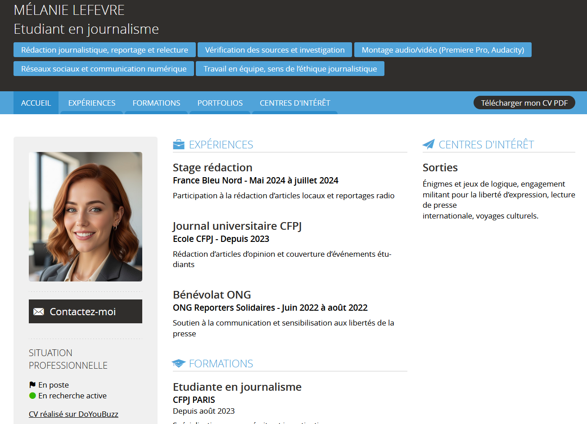

## Challenge : L'emploi

## Informations du challenge

| Catégorie | Difficulté | Points | Auteur |
|-----------|------------|--------|--------|
| Osint | Facile | 100 | B3cha |

**Preuve :** `Etudiante en journalisme`

## Résumé

Ce challenge nécessite de retrouver un site qui contient les informations sur le travail de **Mélanie**, un CV par exemple :
1. LinkedIn est le site le plus connu
2. ou un autre si pas de résultat concluant à l'étape 1

## Étape 1 : Rechercher sur Google

### Avec l'identité de `Mélanie LEFEVRE`

Le meilleur endroit pour trouver l'emploi d'une personne est de chercher sur les sites web d'emploi, qui permettent la publication de son Curriculum Vitae.
Dans Google, recherchons avec le motif suivant : `"Mélanie LEFEVRE" + CV` (Dorks)

Nous sommes tentés de prendre le second résultat `LinkedIn`, mais le premier est plus intéressant : en se rendant sur le profil doyoubuzz.com de Mélanie LEFEVRE, la photo de la fille est identique à celle du profil truthsocial (https://truthsocial.com/@melanie_lefevre) ; c'est bien notre Mélanie.

Il ne faut surtout pas rester sur la description Google, mais se rendre sur la fiche détaillée et lire le parcours de Mélanie. Peut-être que certains détails seront utiles pour d'autres énigmes.
On apprend dans la rubrique `FORMATIONS` qu'elle a commencé depuis 2023 un poste `d'Etudiante en journalisme` : la voici, notre preuve recherchée.

## Résultat

La solution de notre challenge est donc **étudiante en journalisme**.

✅ **Preuve :** `Etudiante en journalisme` ou `étudiante en journalisme` (les deux sont acceptés).
