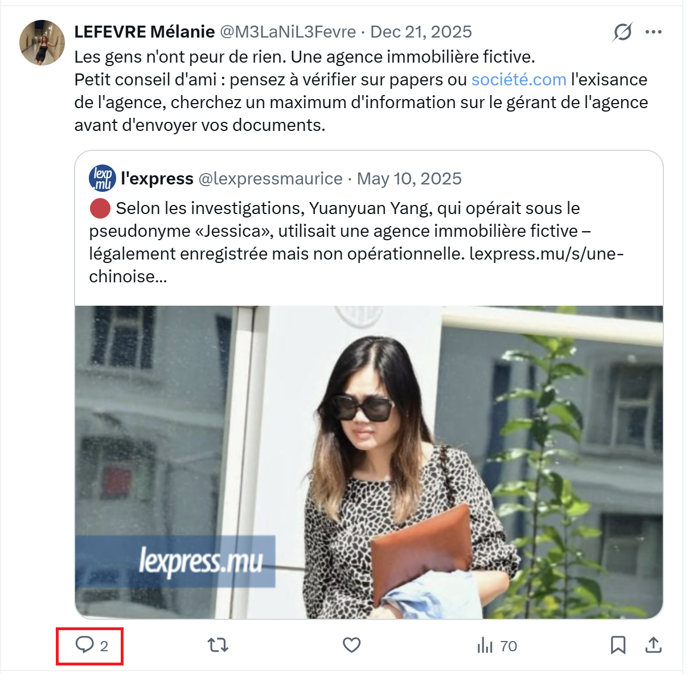
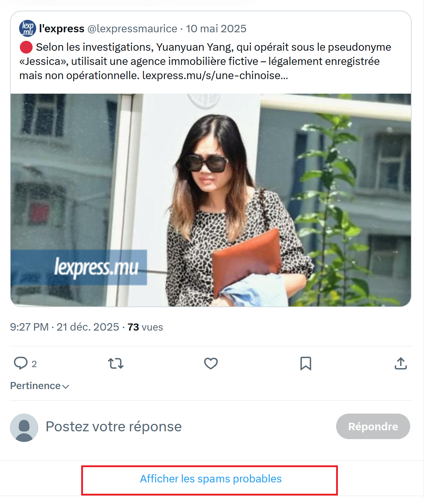
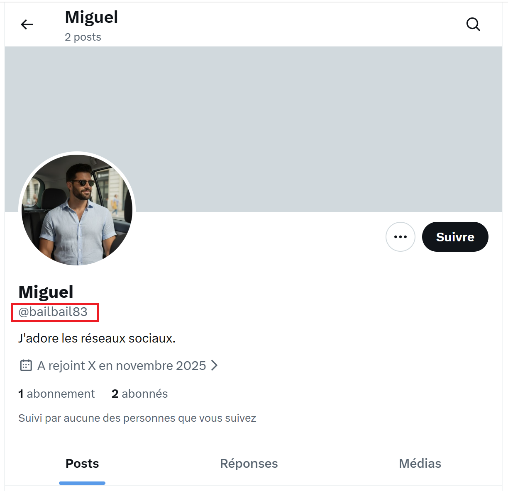
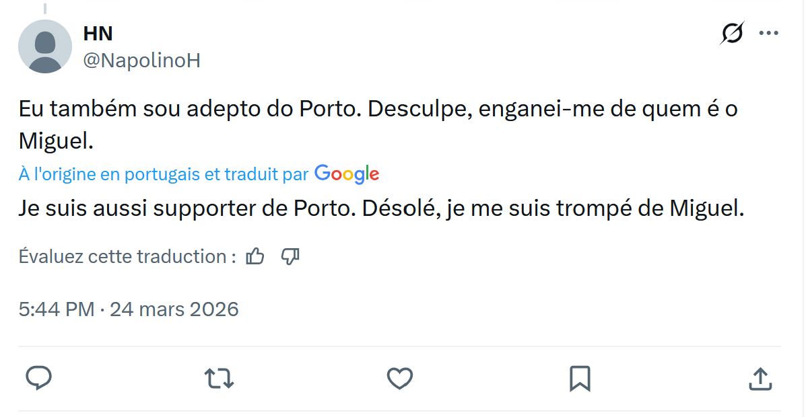
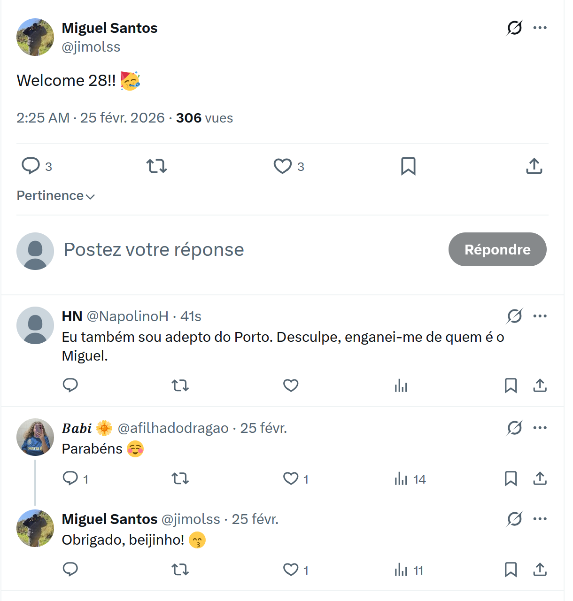

## Challenge : L'enfer continue

## Informations du challenge

| Catégorie | Difficulté | Points | Auteur |
|-----------|------------|--------|--------|
| Osint | Moyen | 300 | B3cha |

**Preuve :** `bailbail83`

## Résumé

Dans ce challenge, il faut trouver le pivot qui permet de relier Mélanie à la personne qui a éventuellement volé ou usurpé son identité. Pour cela, les étapes sont les suivantes :
1. Retrouver le post de **Mélanie** sur le compte X avec la réponse de Miguel
2. Identifier ce nouveau personnage de l'histoire

----

## Étape 1 : retrouver le post X de Mélanie

Sur le deuxième compte X de **Mélanie** (https://x.com/M3LaNiL3Fevre) :

En scrollant sur son compte, un post du 21 décembre 2025 parle de crise du logement et d'agence immobilière fictive.
Deux commentaires sont positionnés sur ce post.

Pour visionner le post, il faut cliquer sur le bouton : `Afficher les spams probables`

----

# Remonter la piste de l'escroc

Le message de ce Miguel (https://x.com/bailbail83/status/2045169306049147364) contient le texte suivant :
`Si vous cherchez un site de confiance, en voici un http://immo-location-pro.fr J'ai déjà utilisé, fiable à 100%`.
Une nouvelle url d'un site `http://immo-location-pro.fr` qu'il faudra investiguer (sans doute la réponse à un autre challenge).

Ce message est celui d'un certain `bailbail83`, qui mène au compte d'un nouveau personnage :

Le pseudo de cette personne coïncide parfaitement avec le format de la preuve recherchée **MiaoumMiaou13** (insensible à la casse).
Faut-il s'arrêter là pour autant ? Non : qui est ce `Miguel` ?

# Identifier le propriétaire du compte X : bailbail83

Dans la liste des followers de **Miguel**, il y a un certain **HN** avec le pseudo `@NappolinoH` (pour ceux qui ont suivi le CTEv1, il s'agissait du chef du groupe de faussaires **DoubleFace** : Henri NAPPOLINO, alias Le Papillon).
En analysant les posts de **HN**, on remarque ce commentaire :

Il dit se tromper en s'adressant à un certain **Miguel SANTOS**.

Ce Miguel SANTOS est supporter du FC Porto :

On peut ainsi dire avec certitude que notre `bailbail83` se nomme **Miguel SANTOS**.

✅ Preuve : **bailbail83**
