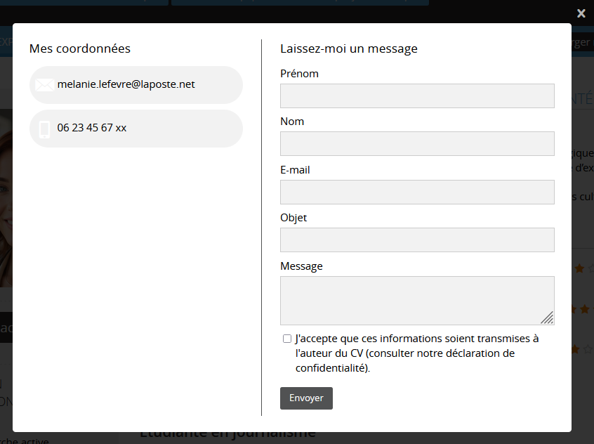
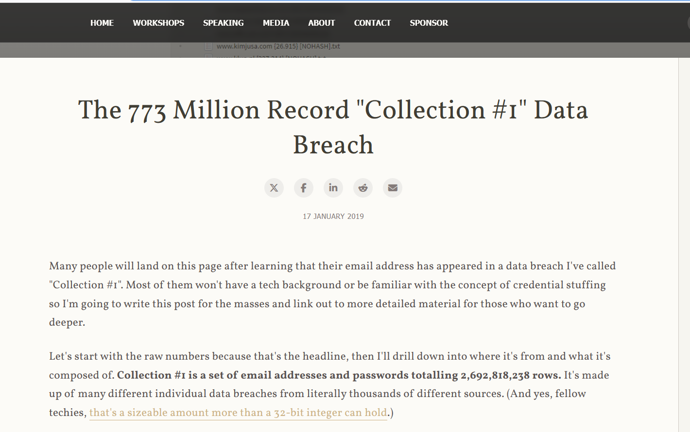
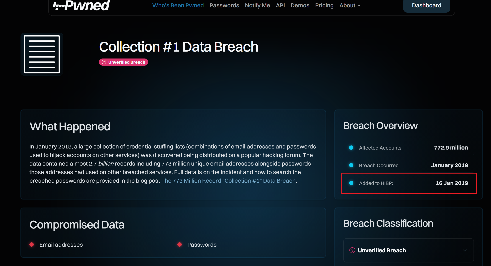

## Challenge : Le commencement

## Informations du challenge

| Catégorie | Difficulté | Points | Auteur |
|-----------|------------|--------|--------|
| Osint | Facile | 150 | B3cha |

**Preuve :** `01-2019`

## Résumé

Ce challenge nécessite de retrouver la plus ancienne trace de fuite de données personnelles de **Mélanie** :
1. À partir de l'adresse mail identifiée sur le challenge `L'emploi` (sur le compte Doyoubuzz de Mélanie)
2. Recherche sur la ressource `HaveIBeenPwned` s'il existe un leak avec cette adresse mail

## Étape 1 : Récupération de l'adresse mail de Mélanie

### Identification

Sur le compte Doyoubuzz.com de Mélanie (https://www.doyoubuzz.com/melanie-lefevre), il existe un bouton `Contactez-moi` sous sa photo de profil.

On découvre deux éléments importants :
1. l'adresse mail de Mélanie : **melanie.lefevre@laposte.net**
2. le numéro de téléphone incomplet de Mélanie : **06 23 45 67 xx**

## Étape 2 : Recherche d'antécédents

### Contexte

Il existe un site très connu pour savoir si vos données ont fuité lors d'une précédente cyberattaque : https://haveibeenpwned.com/. Il suffit de rentrer l'adresse mail `melanie.lefevre@laposte.net` sur le site et de lancer la recherche.

On y découvre que cette adresse a fait l'objet de deux fuites de données :
1. La première fuite : **courant 2025**
2. La seconde, plus ancienne : en **janvier 2019**

Nous avons donc le mois (01) et l'année (2019), reste à trouver le jour.

Le second leak propose un lien : https://www.troyhunt.com/the-773-million-record-collection-1-data-reach/ — suivons-le :

Il est possible que certains joueurs cliquent sur le bouton `Détails` :

Sur ce menu apparaît la date du `16 Jan 2019` ; cette réponse est aussi acceptée. Plusieurs sources présentaient des informations non concordantes.
Le flag du challenge a été simplifié durant l'épreuve (sans le jour).

Le résultat est sous nos yeux : `17 JANUARY 2019` ou `16 Jan 2019`.

## Résultat

La solution de notre challenge est donc janvier 2019.

✅ **Preuve :** `01-2019`
