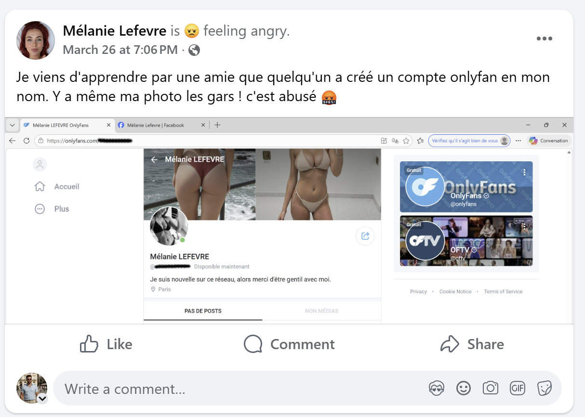
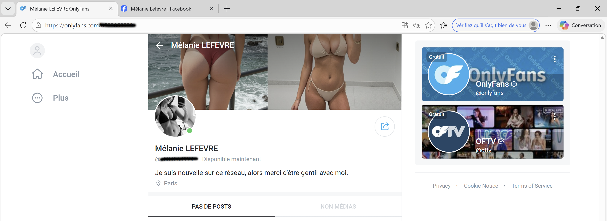
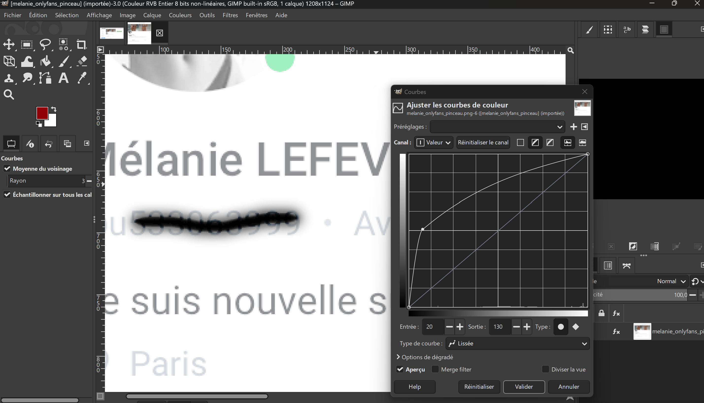
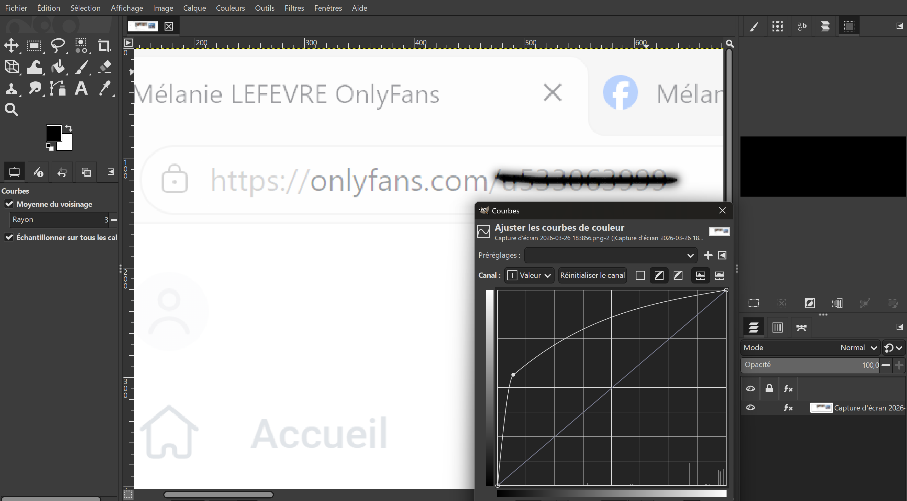
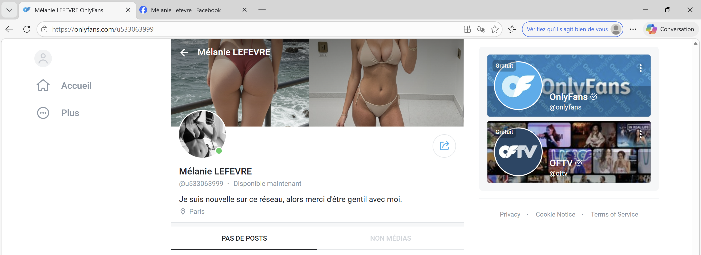

## Challenge : Le compte de la honte

## Informations du challenge

| Catégorie | Difficulté | Points | Auteur |
|-----------|------------|--------|--------|
| Osint | Facile | 150 | B3cha |

**Preuve :** `u533063999`

## Résumé

Ce challenge nécessite de retrouver le réseau sur lequel les usurpateurs ont créé un compte pour **Mélanie**, afin d'entacher sa réputation :
1. D'abord retrouver l'ancien message posté par Mélanie sur son compte Facebook
2. Ensuite, récupérer le flag à partir de la capture d'écran du faux compte `OnlyFans`

## Étape 1 : retrouver sur Facebook le message de ras-le-bol

Il arrive parfois que les usurpateurs cherchent à nuire à la réputation de leur victime. Pour cela, ils créent des faux comptes sur des sites pour adultes, utilisent de vraies photos de leur victime ou en génèrent désormais par IA, puis y mettent le vrai numéro de téléphone de la victime. Ainsi, cette dernière se retrouve submergée d'appels et de messages malveillants, l'obligeant parfois à changer de **numéro de téléphone** ou **d'adresse mail**.
Nous sommes ici dans une forme de harcèlement numérique (répréhensible par la loi — article 226-2-1 du Code pénal).

Le nom du challenge `le compte de la honte` laisse penser à une atteinte aux mœurs ou à la probité de la personne.
De plus, le trailer du CTE diffusé le 01 juin 2026 présente un plan intéressant à la 10ᵉ seconde.
Sur le téléphone de Mélanie, plusieurs notifications s'affichent dont le logo du réseau `OnlyFans` : c'est là que se trouve le flag.

Les recherches directement sur le site https://onlyfans.com/ nécessitent la création d'un compte et une recherche par nom et prénom `Mélanie LEFEVRE`. Malheureusement, pas de résultat concluant. Probablement parce que le compte n'est pas certifié.
Les harceleurs n'ont pas réussi à certifier le compte de Mélanie et à fournir une preuve de vie acceptée par la plateforme (chapeau OnlyFans).

En se rendant sur le compte Facebook de Mélanie (https://www.facebook.com/profile.php?id=61566117843238), il y a un post intéressant :

Mélanie publie une capture du compte usurpateur `OnlyFans` en caviardant (c'est-à-dire en cachant) **l'id du compte** que nous recherchons.

Il faut maintenant exercer un traitement d'image pour afficher l'id.

**Nota :** ce challenge vise à vous faire réfléchir également sur la manière dont vous protégez vos informations personnelles sur les réseaux sociaux. Parfois, un simple rectangle noir n'est pas suffisant. Restez vigilant !

## Étape 2 : extraire l'id du compte OnlyFans via traitement d'image

Essayons maintenant d'effectuer un traitement sur l'image pour retrouver l'id du faux compte OnlyFans.
Cette information est disponible à deux endroits : `sous le nom du profil` et dans `l'url`.

En ouvrant l'image sous **Gimp**, option `Couleurs` puis `Courbes`, et en déplaçant la courbe, les chiffres apparaissent mieux :

Il devient possible de lire l'id du compte : `u533063999`. Vérifions sur le site OnlyFans avec l'url : https://onlyfans.com/u533063999

En cliquant sur la photo de profil du compte, nous avons confirmation qu'il s'agit bien du profil recherché.
Faites très attention à votre identité numérique : parfois des personnes mal intentionnées créent des comptes avec votre identité pour vous nuire et commettre des actes illicites, ou tout simplement pour dégrader votre image (c'est aussi cela, l'enfer numérique).

**Gardez la maîtrise de votre empreinte numérique.**

## Résultat

La solution de notre challenge est donc **u533063999**.

✅ **Preuve :** `u533063999`
