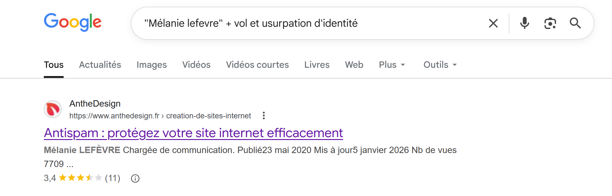
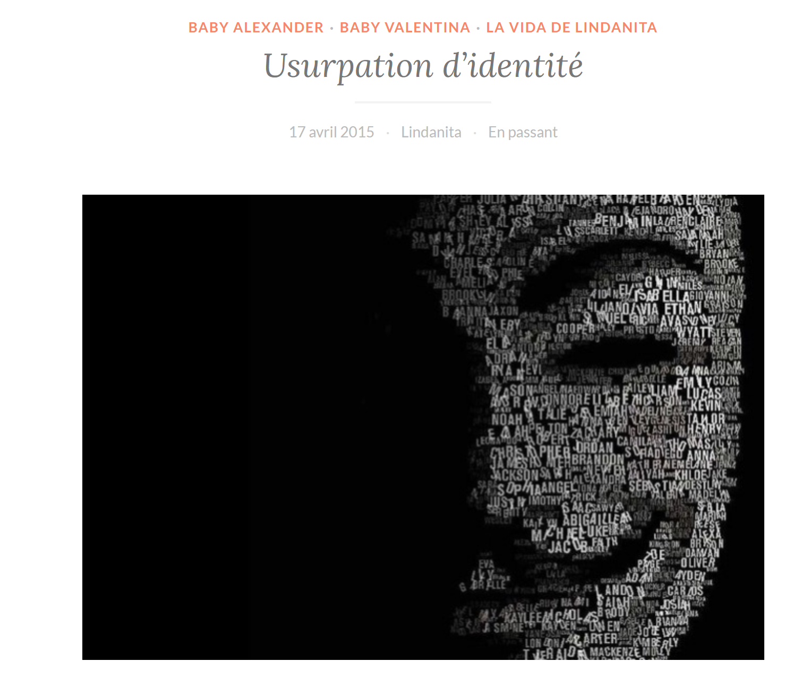
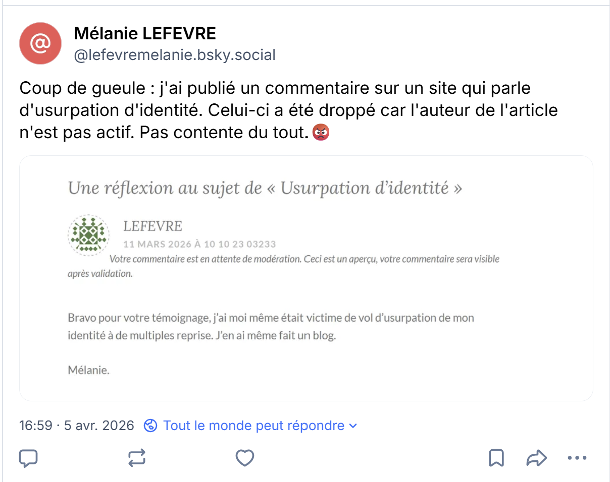
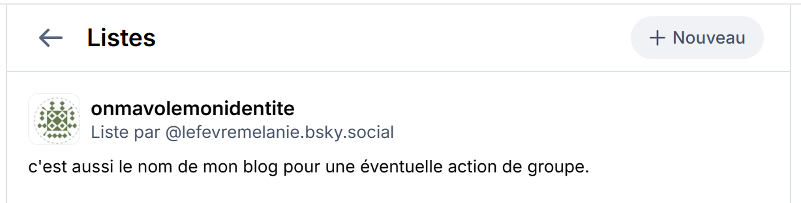
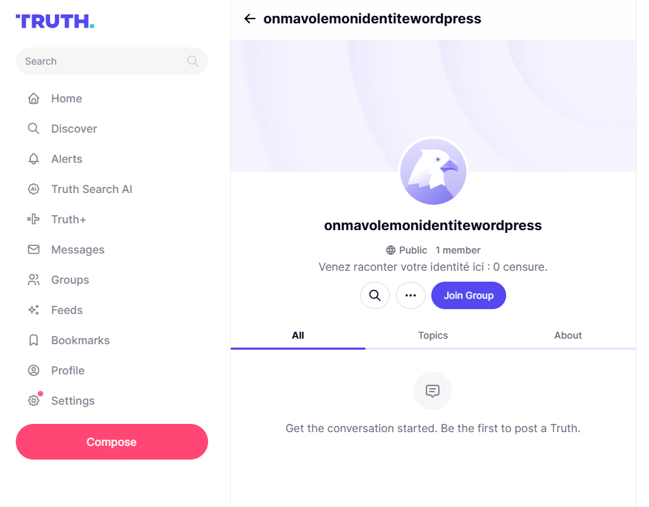
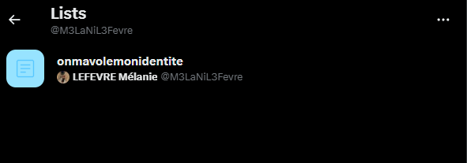
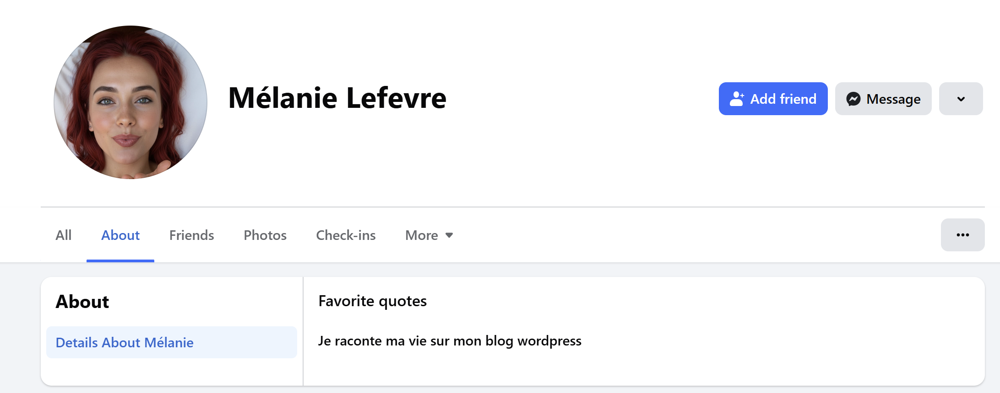
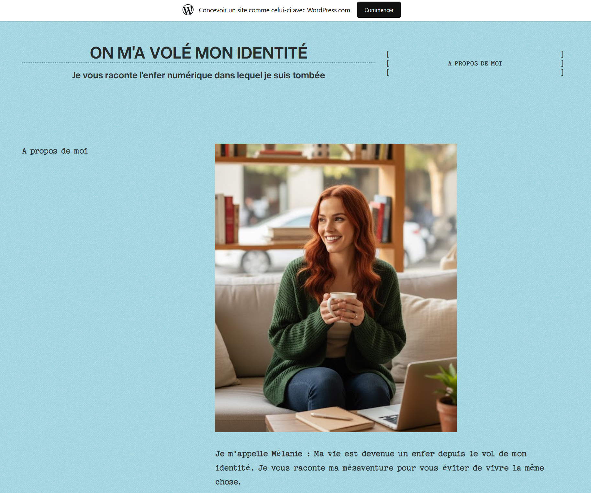

## Challenge : Les autres victimes

## Informations du challenge

| Catégorie | Difficulté | Points | Auteur |
|-----------|------------|--------|--------|
| Osint | Facile | 150 | B3cha |

**Preuve :** `www.onmavolemonidentite.wordpress.com`

## Résumé

Ce challenge nécessite de retrouver un site qui contient les informations sur les autres victimes racontées par Mélanie :

1. Retrouver le blog de Mélanie sur WordPress
2. Lire les différents articles rédigés par Mélanie : elle y donne la parole aux victimes

## Étape 1 : Rechercher sur Google

Comme toute future journaliste d'investigation qui se respecte, Mélanie s'adonne sur son temps libre, corps et âme, à son combat contre le vol et l'usurpation de son identité. Pour recueillir ces témoignages, il n'y a pas 36 possibilités :
- un journal intime
- un site web
- **un blog**

Dans Google, recherchons avec le motif suivant : `"Mélanie LEFEVRE" + vol et usurpation d'identité` (Dorks)

Il y a effectivement un résultat unique, mais celui-ci n'est pas probant.

Nous n'avons rien trouvé non plus sur son journal intime (compte diariste du challenge `Son histoire`).

Si c'est un site web, Mélanie a dû acheter **un nom de domaine** dédié avec les mots-clés suivants : vol + usurpation d'identité.
Comme elle ne s'y connaît pas bien en informatique, la solution est un blog `Wordpress`, facile à mettre en place sans connaissances informatiques particulières.

Le format du flag `www.eternelblue.team.fr` nous conforte dans cette direction => www.siteàtrouver.wordpress.com

Dans Google, recherchons avec le motif suivant : `site:wordpress.com "Usurpation d'identité"` (Dorks)

On trouve plusieurs articles sur WordPress qui en parlent, mais sans lien évident avec Mélanie.

https://lavidadelindanita.wordpress.com/2015/04/17/usurpation-didentite/

Cette jeune femme raconte son usurpation d'identité dans un article du `17 avril 2015`, avec un unique commentaire intéressant (malheureusement celui-ci n'a pas été validé, car le compte est trop ancien).

En cherchant sur les RS, le compte BlueSky de Mélanie (https://bsky.app/profile/lefevremelanie.bsky.social), un post de Mélanie est intéressant :

On apprend dans ce commentaire du `11-MARS-2026` que Mélanie a elle-même créé son propre blog.

Après examen approfondi du compte BlueSky de Mélanie, on découvre une liste nommée `onmavolemonidentite` avec exactement le même logo que sur le post BlueSky de Mélanie.

Le commentaire sous cette liste parle de **blog**, possiblement le nom du groupe WordPress.

## Étape 2 : Recherches sur WordPress

Pour trouver le nom de son blog WordPress, il faut croiser cette information avec une autre, rencontrée sur le compte social Truth, dans la rubrique `Mes groupes` :

La même information est disponible sur le second compte X de Mélanie (https://x.com/M3LaNiL3Fevre) dans la rubrique liste également :

Pour savoir de quel site nous parlons, il faut se rendre cette fois-ci sur le compte Facebook de Mélanie : https://www.facebook.com/profile.php?id=61566117843238&sk=about

Mélanie dit clairement que son blog est sur WordPress.

Il suffit maintenant de former l'url WordPress pour voir si elle est valide : `onmavolemonidentite` + `wordpress.com`

ce qui donne : https://onmavolemonidentite.wordpress.com/

Dans la rubrique **about**, les photos et la description de Mélanie :

Le compte contient plusieurs articles (des témoignages d'autres victimes d'usurpation d'identité) qu'il convient de lire pour ne pas louper d'autres challenges.

## Résultat

La solution de notre challenge est donc le blog WordPress de Mélanie : **https://onmavolemonidentite.wordpress.com/**.

✅ **Preuve :** `www.onmavolemonidentite.wordpress.com` (ne pas oublier le www dans le format du flag)
