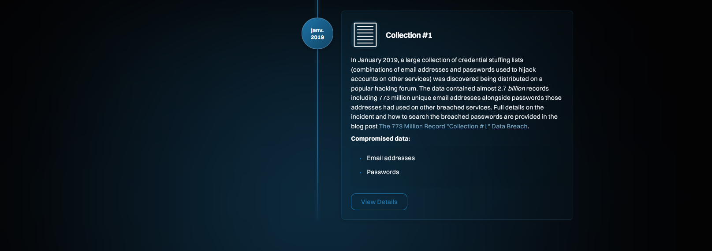
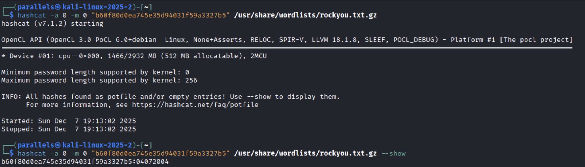

## Challenge : Mot de passe faible

## Informations du challenge

| Catégorie | Difficulté | Points | Auteur |
|-----------|------------|--------|--------|
| Osint | Facile | 150 | B3cha |

**Preuve :** `04072004`

Lors du challenge `L'emploi`, nous avons réussi à obtenir l'adresse mail de Mélanie : **melanie.lefevre@laposte.net**, qui se trouve sur son profil `doyoubuzz.com`.
De plus, la ressource `HaveIBeenPwned` indique que le premier leak de Mélanie remonte à 2019, dans une `Collection #1`.



## Recherche du site de leak des données

Il faut donc retrouver sur internet un endroit où un échantillon de ce leak de données aurait pu être posté.
Après quelques recherches infructueuses sur Google, nous décidons de regarder dans la ressource http://www.pastebin.com : des échantillons de leak y sont souvent publiés.


On trouve un résultat positif en recherchant l'adresse mail `melanie.lefevre@laposte.net` :
```shell
melanie.lefevre@laposte.net,b60f80d0ea745e35d94031f59a3327b5
```

## Retrouver le mot de passe

En observant la taille du hash, on constate qu'il ressemble beaucoup à un hash produit par **MD5**. Et si on prend en compte le nom du challenge `Mot de passe faible`, tout porte à croire qu'une attaque par *Force Brute* est possible.
Sans trop tarder, lançons la commande `hashcat` sur ce hash de mot de passe :



On découvre que le mot de passe correspondant à ce hash est `04072004` : on dirait une date de naissance, peut-être celle de Mélanie.
Il ne faut jamais mettre de date de naissance comme mot de passe, que ce soit la sienne ou celle d'un proche. C'est la première chose que testent les hackers. Sans compter que le Brute Force est quasi instantané, comme vous avez pu le constater par vous-même.

## Résultat

La solution de notre challenge est "04072004".

✅ **Preuve :** `04072004`
