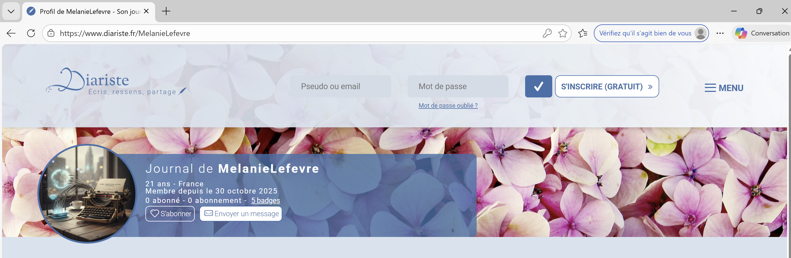
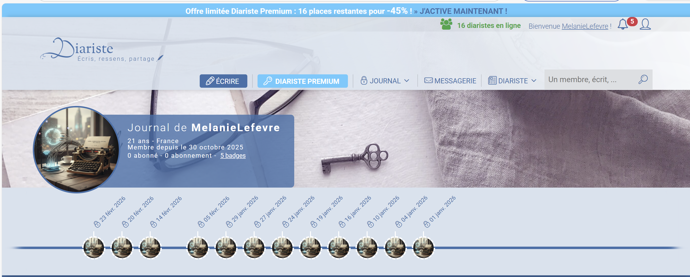
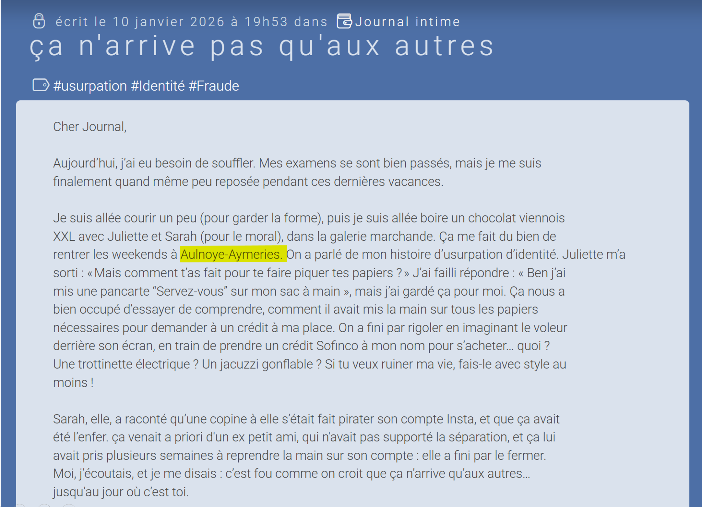

## Challenge : Son histoire

## Informations du challenge

| Catégorie | Difficulté | Points | Auteur |
|-----------|------------|--------|--------|
| Osint | Facile | 100 | B3cha |

**Preuve :** `Aulnoye-Aymeries`

## Résumé

Ce challenge nécessite deux étapes simples pour être résolu :
1. Trouver la ressource non indexée où **Mélanie** se confesse : `diariste.fr`
2. Lire le journal intime de Mélanie et identifier l'article qui parle de son lieu de naissance

## Étape 1 : Recherche du journal intime de Mélanie

### Identification de la ressource

La première étape consiste à trouver le site/ressource qui pourrait contenir l'information du lieu de naissance de Mélanie.
Pour construire votre raisonnement de recherche, il faut resituer les faits dans le contexte de l'histoire.
**Mélanie LEFEVRE** a a priori subi un vol d'identité. Le challenge `Le commencement` montre qu'en plus de son adresse mail personnelle, le mot de passe de Mélanie a été dévoilé : il n'est rien d'autre que sa date de naissance `04072004` (comme le font beaucoup de personnes).
Nous recherchons des informations d'état civil (date de naissance, lieu de naissance, etc.) qui ont été volées, très probablement à la suite d'une cyberattaque à l'encontre d'une mairie ou d'une municipalité.
Dans le briefing du CTE, on nous dit que **Mélanie** est déterminée à trouver les responsables de ce qui lui arrive.
Et comme elle est étudiante en journalisme (d'après le challenge `L'emploi`), elle a très certainement rédigé quelque part des articles, posts ou autres confessions sur une ressource en ligne.
Cette ressource pourrait être un blog personnel, un journal intime, ou les réseaux sociaux (plus difficiles pour écrire une longue prose).

Recherchons sur Google les sites possibles sur lesquels Mélanie aurait pu raconter son histoire.
Un profil en particulier attire notre attention sur le site : https://www.diariste.fr/MelanieLefevre
Il s'agit d'une sorte de journal intime public très connu des joueurs de CTF.

Le profil indiqué contient plusieurs publications : c'est parti pour la lecture.

## Étape 2 : analyse des publications

Après une lecture approfondie des posts de Mélanie (au passage, son histoire est très touchante), nous remarquons le post du 10 janvier 2026 à 19h53, où elle raconte qu'elle rentre chez elle à `Aulnoye-Aymeries`, avec la précision suivante **(j'y ai vu le jour et grandi)**.

Pour confirmer ce lieu, nous allons regarder si cette ville n'a pas subi une cyberattaque par le passé.
https://umap.openstreetmap.fr/fr/map/attaques-cybersecurite-aupres-dorganismes-publics_821557#8/50.145226/2.724609
Un article sur Google nous propose le lien : https://www.francebleu.fr/infos/societe/apres-le-piratage-informatique-de-la-mairie-de-douai-des-donnees-personnelles-des-habitants-volees-1618429159

En fin d'article, l'auteur écrit : `Douai n'est pas la première commune du Nord à avoir été touchée par ce type de piratage. 
En novembre dernier, la mairie d'Aulnoye-Aymeries en avait également été victime.`

Le résultat est donc bien : `Aulnoye-Aymeries`

## Résultat

La solution de notre challenge est donc Aulnoye-Aymeries.

✅ **Preuve :** `Aulnoye-Aymeries`
