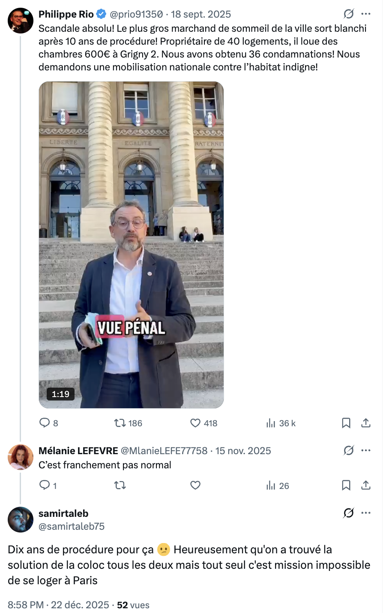
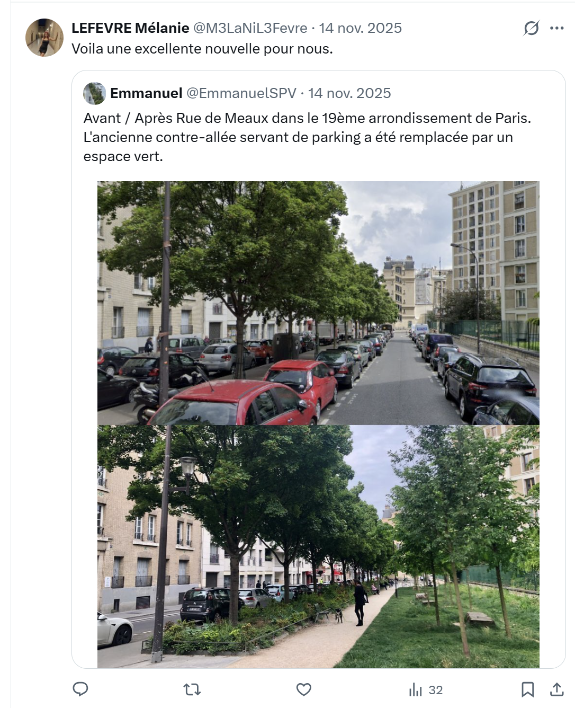
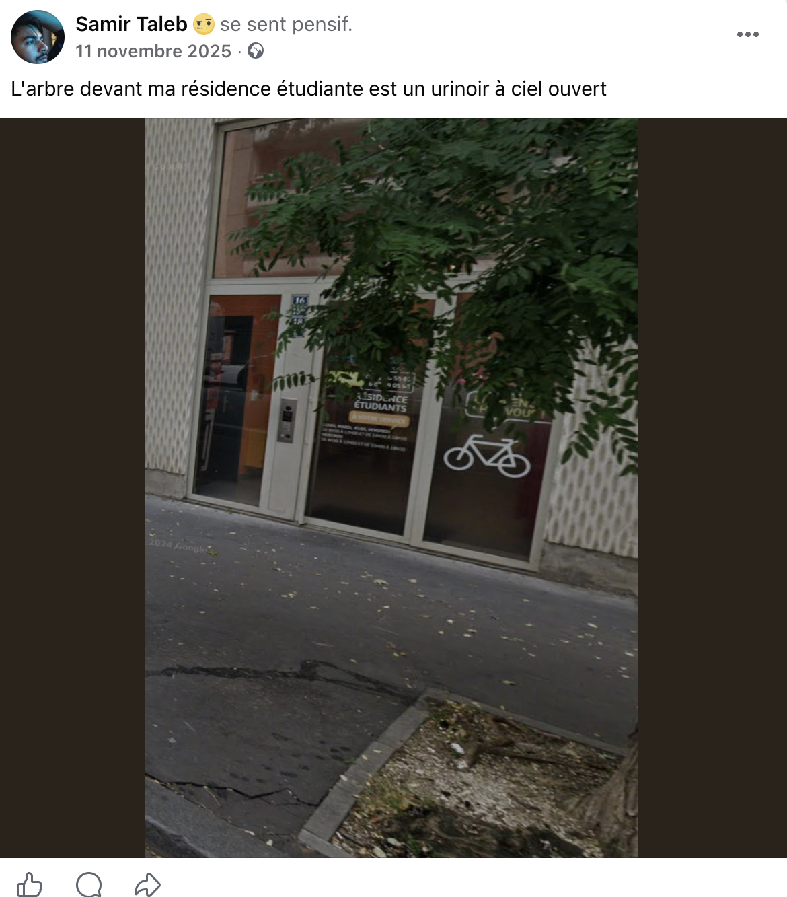
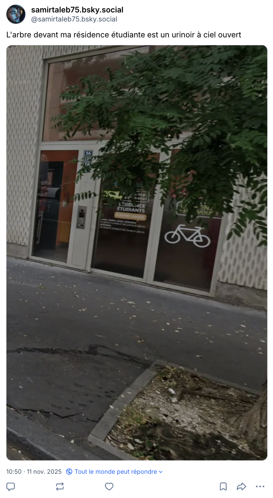
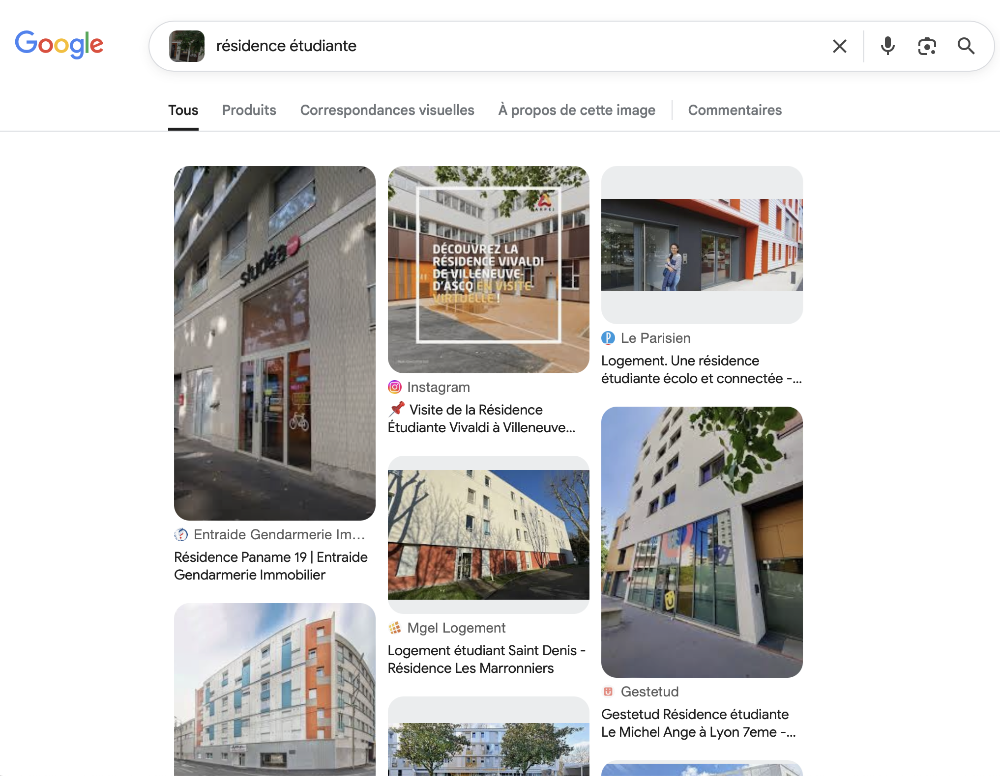
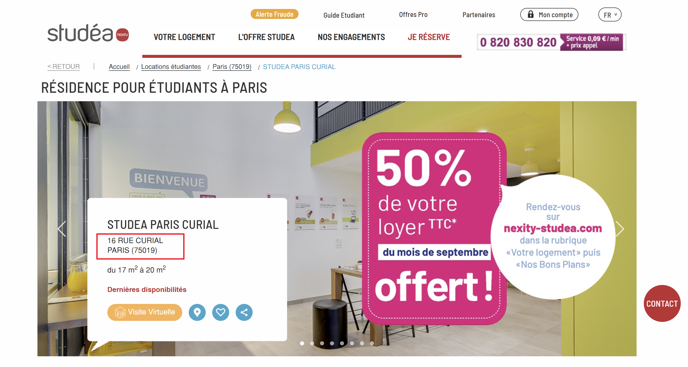

# Challenge : Domiciliation

## Informations du challenge

| Catégorie | Difficulté | Points | Auteur |
|-----------|------------|--------|--------|
| Osint | Moyen | 300 | B3cha |

**Preuve :** `16 rue Curial, Paris 75019`

---

## Résumé

Ce challenge nécessite de retrouver le post de la façade de la résidence dans laquelle **Samir** et **Mélanie** sont colocataires.
Une recherche par image inversée permet d'identifier la résidence étudiante : `Studea`.
À noter que le challenge concerne l'adresse de **Mélanie** alors que nous sommes dans la catégorie `Conseils d'un ami`, en l'occurrence **Samir**. Ceci signifie que pour trouver l'adresse de Mélanie, il faut passer par Samir comme pivot. Il faut donc suivre ses réseaux sociaux en priorité.

### Identification de la colocation

Le compte X de Samir présente beaucoup de publications ; pour filtrer, nous allons utiliser dans la zone de recherche de X la **dork** suivante : `from:samirtaleb75 filter:replies` (permet d'afficher uniquement les réponses).
Samir publie une réponse à l'un des posts de Mélanie :

Dans le commentaire de Samir (https://x.com/samirtaleb75/status/2003193377039536400), nous déduisons que Mélanie et Samir sont en colocation. Pas étonnant, vu le prix des logements étudiants dans Paris petite couronne.

**Trouver l'adresse de domiciliation de Mélanie revient donc à trouver l'adresse de logement de Samir.**

Le post de Mélanie sur X (https://x.com/EmmanuelSPV/status/1989260012682928252) donne comme indication qu'elle réside dans le 19ᵉ arrondissement de Paris.

### Analyse des réseaux sociaux de Samir

Les recherches sur le compte Facebook de Samir (https://www.facebook.com/profile.php?id=61583227872259) permettent d'identifier une photo montrant la porte d'entrée de sa résidence étudiante :

La même photo (dans laquelle il se plaint de la propreté de sa rue) est également présente sur son compte BlueSky (https://bsky.app/profile/samirtaleb75.bsky.social) :

### Recherche par image inversée

Procédons à une recherche par image inversée sur Google en utilisant la photo téléchargée depuis les précédents posts identifiés :

Le premier résultat est le bon ; il ne reste plus qu'à faire une recherche sur Google Maps pour identifier le nom de la résidence.

### Adresse de la résidence

La résidence identifiée dans le 19ᵉ est : **Studéa Nexity**.
En se rendant sur le site web https://www.nexity-studea.com/, l'adresse est présentée sur la page d'accueil du site :

À l'url suivante : https://www.nexity-studea.com/locations-etudiantes/paris/studea-paris-curial-1-po0000310

Nous avons notre flag ; il ne reste plus qu'à l'écrire conformément au format demandé dans l'énoncé du challenge.

---

## Résultat

La preuve recherchée n'est rien d'autre que l'adresse de la résidence étudiante `Studéa` (Nexity) dans le 19ᵉ arrondissement de Paris.

✅ **Preuve :** `16 rue Curial, Paris 75019`
