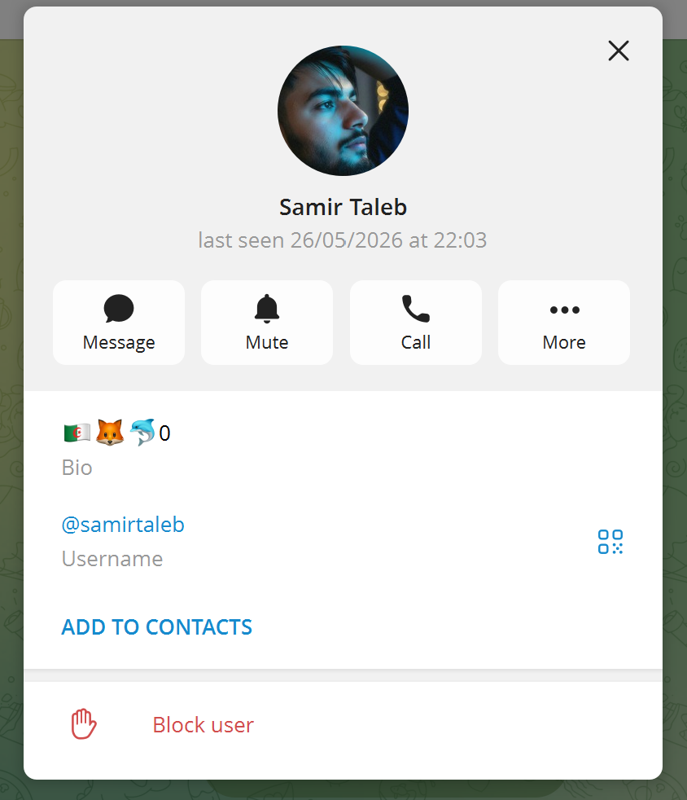
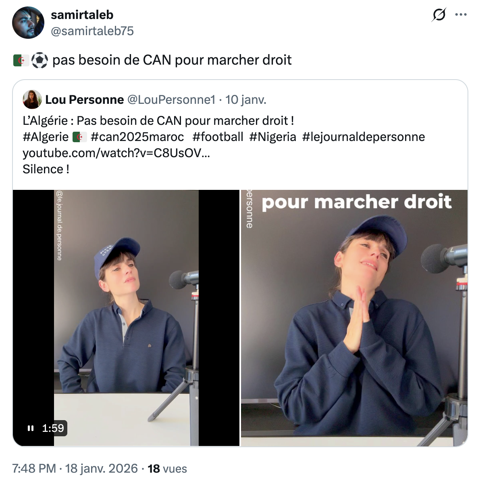
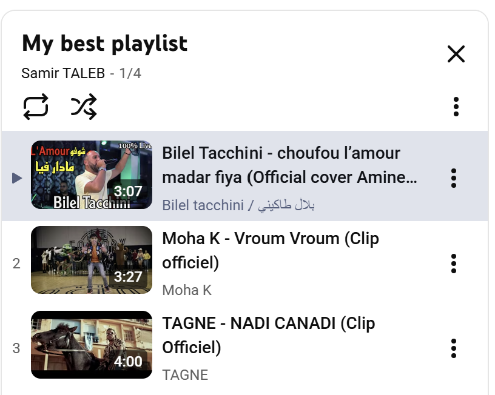

# Challenge : Double nationalité

## Informations du challenge

| Catégorie | Difficulté | Points | Auteur |
|-----------|------------|--------|--------|
| Osint | Facile | 100 | B3cha |

**Preuve :** `Algérienne` (insensible à la casse)

---

## Résumé

Ce challenge nécessite de faire le tour des réseaux sociaux de Samir pour identifier sa deuxième nationalité.

### Le compte Telegram

Identifier le compte Telegram de Samir est assez facile : faire une recherche sur Telegram avec les mots-clés suivants : `samirtaleb` : t.me/@samirtaleb.
L'analyse du profil Telegram de Samir permet d'identifier le drapeau `Algérien`, le Fennec (emblème de l'équipe nationale de football d'Algérie), ainsi que le flipper 0.

### Le compte X (ex-Twitter)

Sur le compte X de Samir, deux posts d'intérêt permettent de renforcer notre première hypothèse :

Samir supporte clairement l'équipe de football d'Algérie.

### Le compte Snapchat

Sur le compte Snapchat de Samir, son pseudo `samirtaleb-dz75` : le **DZ** est l'indicatif de l'Algérie (arabe : الجزائر, tamazight : **Dz**ayer).

### Le compte YouTube

La chaîne YouTube de Samir, trouvée lors du challenge `Hello Kitty`, propose une playlist **My best playlist**.
À l'analyse des chansons proposées (hors épisode Hello Kitty), ce sont des chanteurs `Algériens`.

---

## Résultat

Nous disposons de suffisamment de points de confirmation pour affirmer que Samir possède la nationalité algérienne (en tout cas, il l'affirme clairement), probablement en plus de la nationalité française.

✅ **Preuve :** `Algérienne` ou `Algerienne` ou `algérienne` (les trois propositions sont acceptées)
