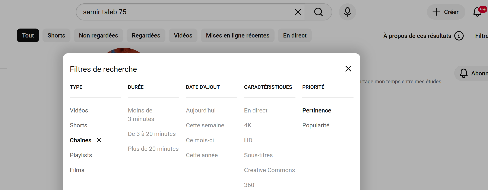
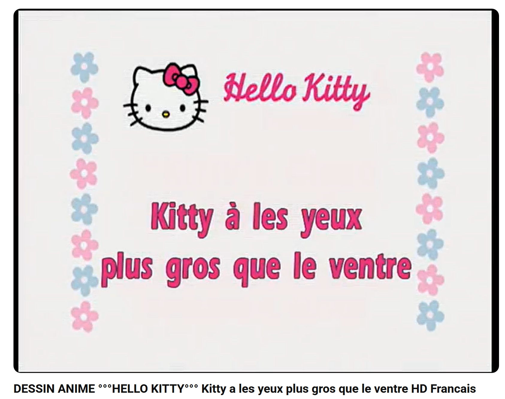
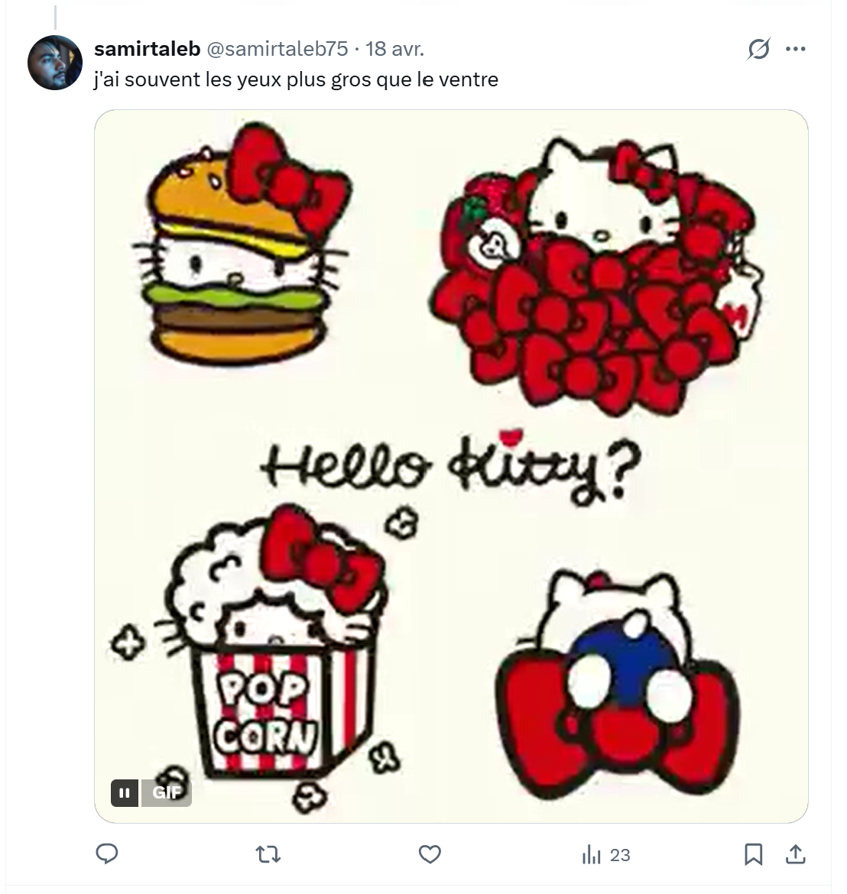

# Challenge : Hello World

## Informations du challenge

| Catégorie | Difficulté | Points | Auteur |
|-----------|------------|--------|--------|
| Osint | Facile | 100 | B3cha |

**Preuve :** `Poulet-au-riz-curry` (insensible à la casse)

---

## Résumé

Ce challenge nécessite de retrouver la chaîne **YouTube** de Samir et de visionner l'épisode du dessin animé `Hello Kitty` : **Hello Kitty a les yeux plus gros que le ventre**.

### Recherche de la chaîne YouTube de Samir

Lors du challenge `Double nationalité`, nous avons trouvé que Samir possède également la nationalité **algérienne**.
Après plusieurs recherches sur les sites culinaires, on décide de regarder côté YouTube. On commence par rechercher avec les mots-clés `Samir TALEB`, même en filtrant par **chaîne**, sans succès. On décide de rajouter le chiffre 75, département d'hébergement de Samir (d'après le challenge `Domiciliation`), tout en filtrant par **chaîne**.



On obtient un résultat : `@SamirTALEB-dz75` (**dz** pour Algérie, **75** pour Paris). Il a comme biographie :
```shell
Passionné d'informatique, et fier de mes origines, 
je partage mon temps entre mes études en développement d'application 
et mon amour pour le football et la moto.
```


Dans la chaîne YouTube de Samir, il y a une playlist avec quelques chansons en arabe et une vidéo qui sort du lot : un épisode du dessin animé Hello Kitty (pas très loin du nom du challenge `Hello World`).
https://www.youtube.com/watch?v=Um5nIQih8lI&list=PLg1MbLzNxqmbi52MiDpvcV7fFWXfZ9DXR&index=4


### Analyse de l'épisode Hello Kitty

En visionnant l'épisode de Hello Kitty, on découvre que **Hello Kitty** adore le plat `Poulet curry` ; l'image dans le dessin animé montre du riz. Il faut donc former le flag conformément au format énoncé `Pate-au-chou-farci`.



La réponse est donc : `Poulet au riz curry`, avec des tirets (-) entre chaque mot.

### Point de confirmation

En analysant les différents posts sur le réseau social X (ex-Twitter), Samir réagit sur le personnage de Hello Kitty :



## Résultat

La solution de notre challenge est le plat préféré de **Hello Kitty** ; toutes les possibilités suivantes sont admises :
1. Riz-poulet-au-curry
2. Poulet-au-curry-riz
3. Riz-au-poulet-curry
4. Poulet-au-riz-curry

✅ **Preuve :** `Poulet-au-riz-curry` (insensible à la casse)
