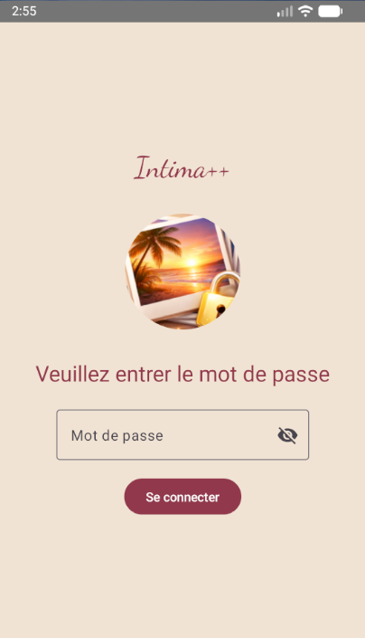
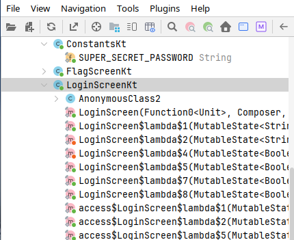
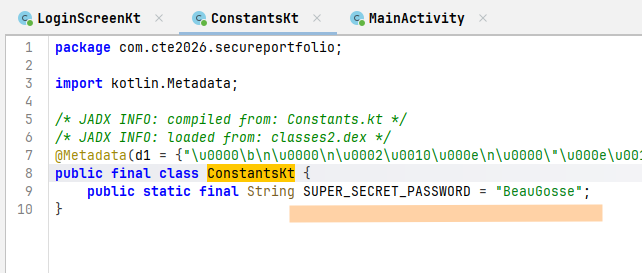
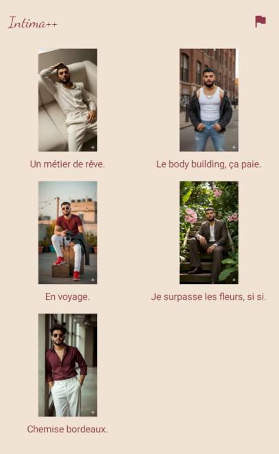
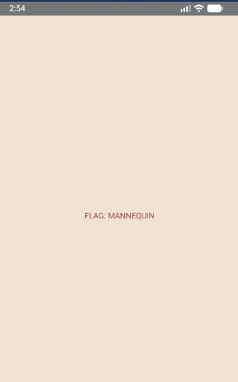

# Challenge : Intima

## Informations du challenge

| Catégorie | Difficulté | Points | Auteur |
|-----------|------------|--------|--------|
| Forensic | Facile | 150 | Cryptax |

**Preuve :** `MANNEQUIN`

---

## Résumé

Ce challenge nécessite de résoudre deux étapes pour récupérer le secret de Samir :
1. **Mot de passe** - retrouver le mot de passe pour l'application `Intima++`
2. **Métier** - déduire ou trouver le flag recherché (métier rêvé par Samir étant petit)

---

## Étape 1 : trouver le mot de passe

Pour résoudre ce challenge, il faut d'abord trouver le mot de passe pour se connecter à l'application "Intima++".



### Solution 1 : chercher le mot de passe dans le DEX

Sur Android, les applications (.apk) sont des ZIP (enfin, presque).
```
unzip intima.apk -d ./unzipped
cd unzipped
```
Une méthode simple pour trouver la solution est de regarder avec attention les chaînes de caractères présentes dans l'exécutable :
```
strings *.dex
```
Si vous êtes patient, vous y trouverez le mot de passe :)

### Solution 2 : rétro-ingénierie statique

Téléchargez JADX, ou JEB (payant, mais une version démo existe), pour décompiler une APK, et naviguez jusqu'à la classe `LoginScreenKt`, qui semble intéressante par son nom.



Lisez un peu le code de cette classe, jusqu'à tomber sur cette portion :

```kotlin
public final void invoke2() {
   if (!Intrinsics.areEqual(StringsKt.trim((CharSequence) LoginScreenKt.LoginScreen$lambda$1(mutableState)).toString(), ConstantsKt.SUPER_SECRET_PASSWORD)) {
      LoginScreenKt.LoginScreen$lambda$5(mutableState2, true);
   } else {
      onLoginSuccess.invoke();
   }
}
```

Si la saisie de l'utilisateur n'est *pas* égale à `ConstantsKt.SUPER_SECRET_PASSWORD`, on appelle `LoginScreen$lambda$5`. Sinon, on appelle `onLoginSuccess.invoke()`.
Ouvrez la classe `ConstantsKt` pour découvrir le mot de passe :



## Étape 2 : obtenir le flag

On voit de nombreuses photos de Samir :



Ces images suggèrent qu'il est *mannequin*. Il y a une petite icône avec un drapeau.
Si on clique dessus, cela confirme le flag :



## Résultat

La preuve identifiée est à déduire des différentes photos de Samir, qui ont bien entendu été générées avec une IA. La preuve est insensible à la casse.

✅ **Preuve :** `MANNEQUIN`
