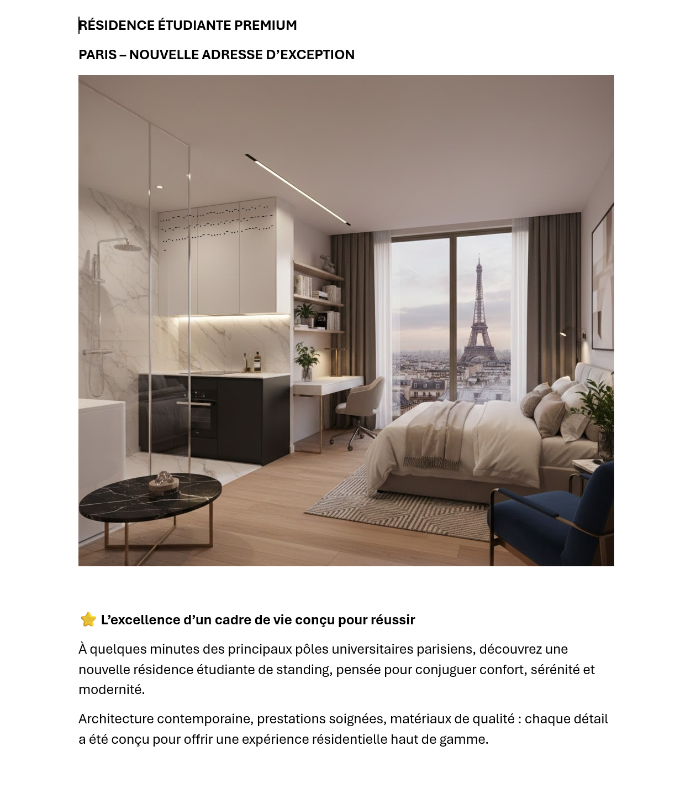
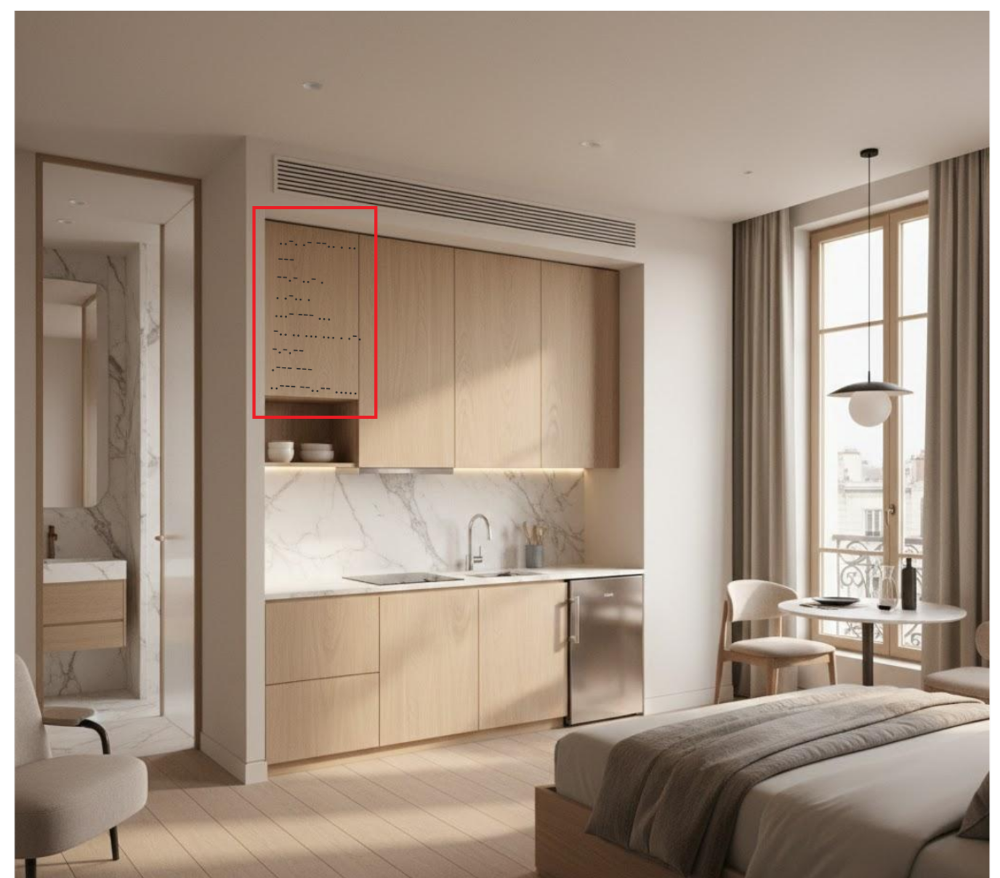
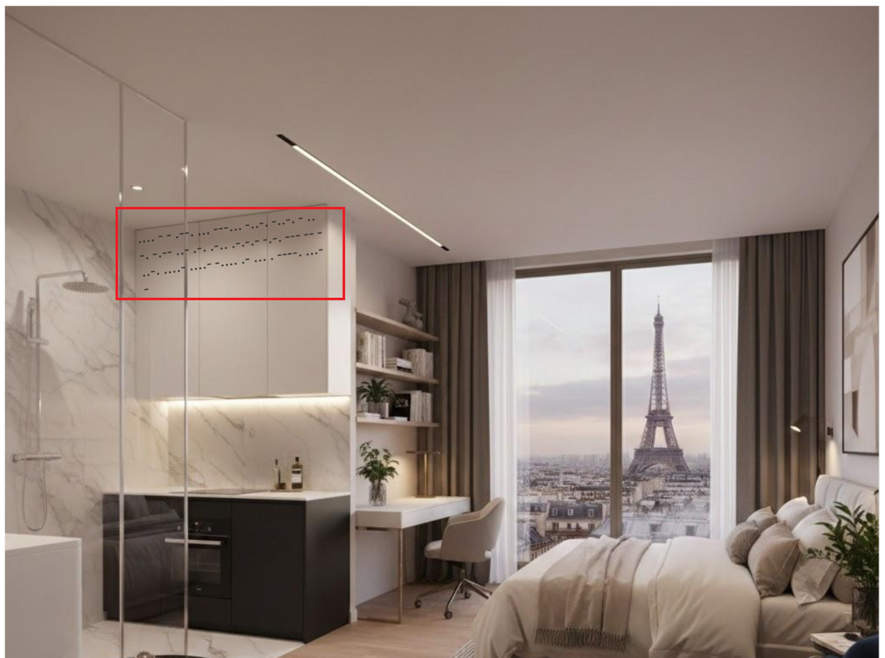
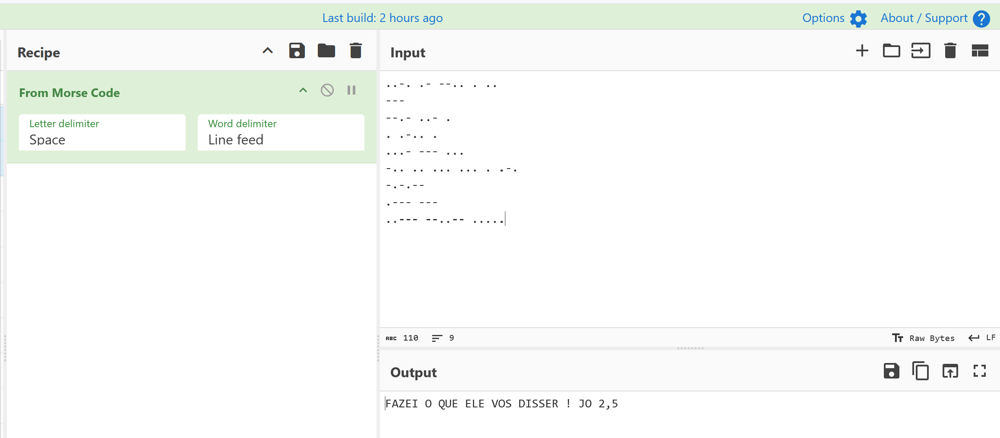
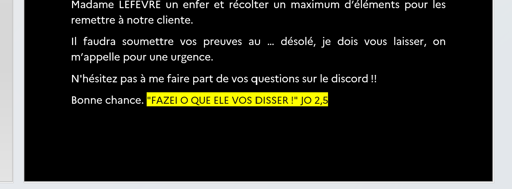

# Challenge : Mail empoisonné

## Informations du challenge

| Catégorie | Difficulté | Points | Auteur |
|-----------|------------|--------|--------|
| Stegano | Moyen | 250 | B3cha |

**Preuve :** `FAZEI O QUE ELE VOS DISSER ! JO 2,5` ou `FAZEI O QUE ELE VOS DISSER! JO 2,5` (insensible à la casse)

---

## Résumé

Ce challenge nécessite de réaliser deux principales étapes :
1. extraire le document PDF depuis le fichier pcap fourni avec l'énoncé du challenge
2. extraire le code morse depuis l'image et le décoder

---

### Extraction du fichier PDF

Le challenge est accompagné d'une capture réseau `capture.pcapng`.
La première étape consiste à installer l'outil **tcpflow** (https://github.com/simsong/tcpflow).
```shell
sudo apt-get install tcpflow
```
Puis nous allons utiliser l'outil installé pour extraire le fichier pdf :
```shell
tcpflow -r capture.pcapng -o /tmp/flow
ls -lh /tmp/flow/
cp /tmp/flow/*4444* /tmp/reconstruit.pdf
```
On obtient ainsi le fichier pdf suivant :



Le fichier complet est accessible ici : 

### Analyse du fichier pdf

Le fichier PDF représente une annonce pour un logement étudiant, probablement publiée par la fausse agence de location immo-location-pro.fr, en relation avec le challenge `Agence tout risque`.
Méfiez-vous des annonces trop alléchantes : l'image est générée par IA, donc très probablement pas celle d'un vrai appartement témoin. Le prix trop en décalage par rapport à la superficie et au quartier doit également être un `Red Flag` et retenir votre attention.
N'envoyez aucun document par message, même si l'annonce est pressante. Vos documents d'identité n'ont pas de prix, et les criminels le savent parfaitement.

L'annonce contient deux images :




Nous remarquons qu'il y a un code en langage morse affiché sur le mobilier de la cuisine.
L'un des deux textes recopiés donne ceci :

```shell
..-. .- --.. . ..
---
--.- ..- .
. .-.. .
...- --- ...
-.. .. ... ... . .-.
-.-.--
.--- ---
..--- --..-- .....
```

### Décodage du morse

Pour décoder le texte morse, nous utiliserons l'outil CyberChef :



On obtient ainsi le texte clair suivant : `FAZEI O QUE ELE VOS DISSER ! JO 2,5`.
Nous remarquons qu'il s'agit exactement du texte affiché sous la statue du Christ rédempteur à Lisbonne.

### Hints gratuits dans le dossier de mission

L'analyse du texte du dossier de mission présente, dans la dernière ligne, un texte caché : la preuve attendue.



---

## Résultat

Comme annoncé lors des posts LinkedIn de préparation, cette preuve sera nécessairement utilisée plus tard dans le CTE pour déverrouiller le Proton Drive de Miguel.

✅ **Preuve :** `FAZEI O QUE ELE VOS DISSER ! JO 2,5` ou `FAZEI O QUE ELE VOS DISSER! JO 2,5` (insensible à la casse)
