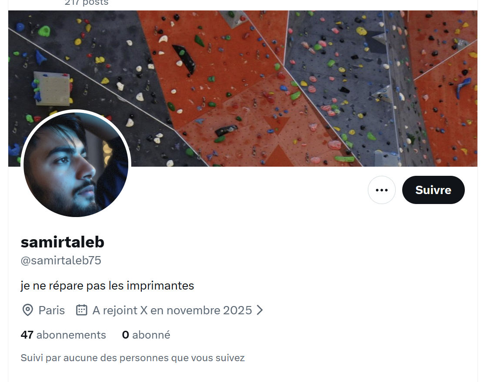
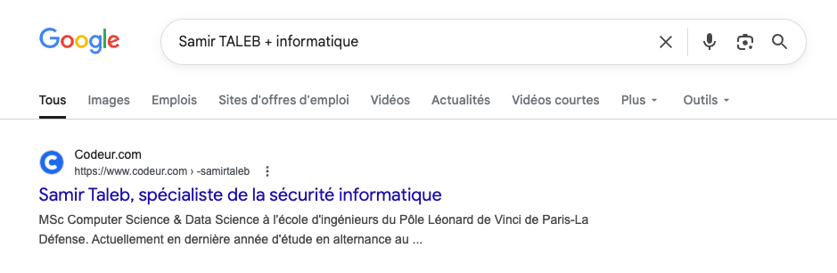
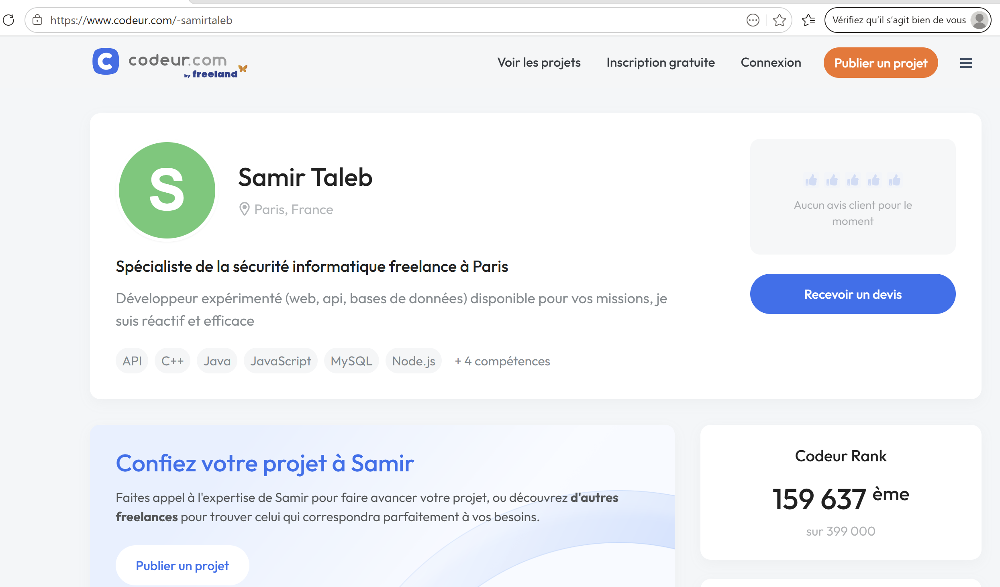
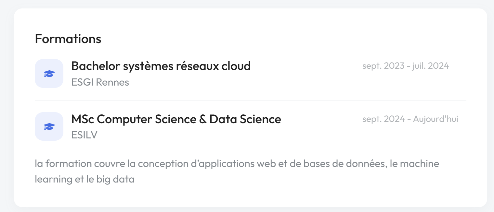
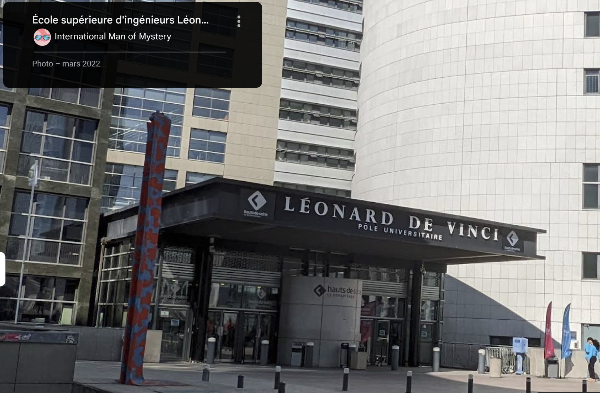

# Challenge : Profession

## Informations du challenge

| Catégorie | Difficulté | Points | Auteur |
|-----------|------------|--------|--------|
| Osint | Facile | 100 | B3cha |

**Preuve :** `étudiant en informatique` (insensible à la casse)

---

## Résumé

Ce challenge facile nécessite de retrouver le compte **codeur.com** de Samir TALEB.

---

## Menu Darkweb caché

La première intention est de rechercher sur le réseau `LinkedIn` le profil de **Samir TALEB**, sans succès.
Le compte X de Samir présente plusieurs posts parlant d'informatique :

Il faut donc chercher sur Google avec comme mot-clé : `Samir TALEB + informatique`

La première URL est la bonne : https://www.codeur.com/-samirtaleb
L'analyse du profil présente le compte d'une personne en freelance informatique :

La rubrique information indique que Samir poursuit ses études en informatique à **l'ESILV** de septembre 2024 jusqu'à aujourd'hui.

En utilisant la vue Google Street de l'ESILV (École supérieure d'ingénieurs Léonard-de-Vinci), la sculpture verticale colorée devant l'entrée de l'école rappelle bien le mur du profil X de Samir.

Il ne nous reste plus qu'à respecter le format du flag **Professeur de musique**, ce qui donne le flag : `Etudiant en informatique`.

**Nota :** `TALEB` طالب en arabe signifie **étudiant**.

---

### Résultat

✅ **Preuve :** `étudiant en informatique` ou `etudiant en informatique` (les deux sont acceptés)
