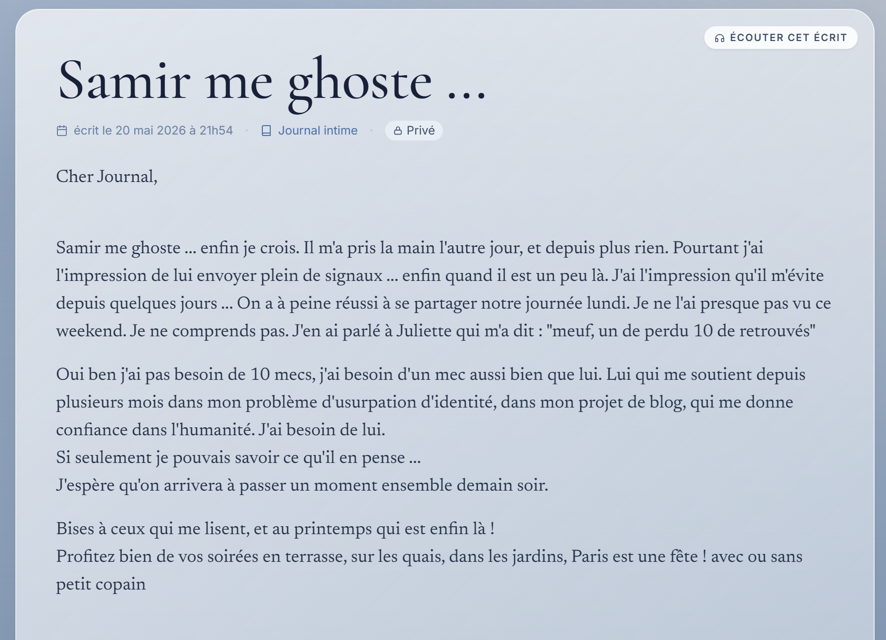

# Challenge : Soutien indéfectible

## Informations du challenge

| Catégorie | Difficulté | Points | Auteur |
|-----------|------------|--------|--------|
| Osint | Moyen | 200 | B3cha |

**Preuve :** `Samir TALEB` (insensible à la casse)

---

## Résumé

Dans ce challenge, nous devons retrouver les traces de commentaires de Samir sur les posts de **Mélanie**.
La lecture du journal intime de Mélanie sur le site `diariste.fr` permet de comprendre la relation entre Samir et Mélanie.

## Analyse des réseaux sociaux

En recherchant sur les réseaux sociaux de Mélanie, sur son compte X (https://x.com/M3LaNiL3Fevre), celle-ci répond à un post parlant d'habitat indigne.


Le post du 22 décembre 2025 émane d'un certain `Samir TALEB` (https://x.com/samirtaleb75).
Le commentaire dit :
```shell
Dix ans de procédure pour ça, Heureusement qu'on a trouvé la solution de la coloc tous les deux 
mais tout seul c'est mission impossible de se loger à Paris.
```
On comprend qu'ils sont proches. Il faut vérifier sur une autre source la relation précise qu'il y a entre Samir et Mélanie.

## Analyse du journal intime

Lors du challenge `Ca aussi c'est du vol`, nous avons trouvé le journal intime de Mélanie sur le site diariste.fr :
https://www.diariste.fr/MelanieLefevre
Celui-ci contient un article en date du 20 mai 2026 à 21h54 où Mélanie nous parle de Samir.



En recoupant les informations avec le challenge `The Vault`, l'identité confirmée de Samir est bien `Samir TALEB`.

---

## Résultat

La solution de notre challenge est :

✅ **Preuve :** `Samir TALEB`
