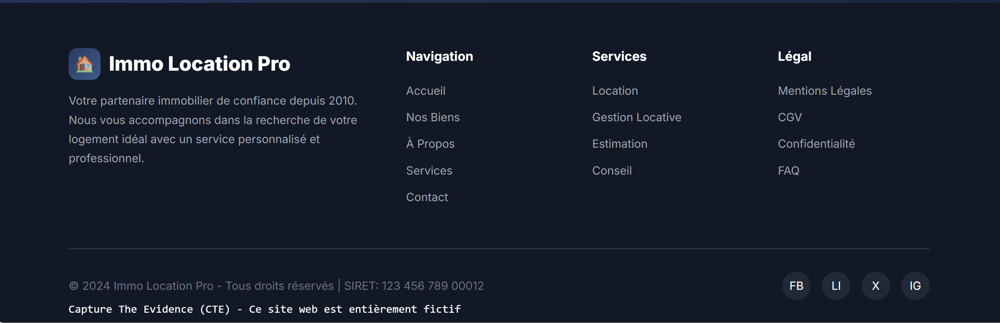

# Challenge : Agence tout risque

## Informations du challenge

| Catégorie | Difficulté | Points | Auteur |
|-----------|------------|--------|--------|
| OSINT | Facile | 200 | B3cha |

**Preuve :** `www.immo-location-pro.fr`

---

## Résumé

Ce challenge OSINT nécessite de pivoter depuis le compte X de **Mélanie** vers le commentaire de **Miguel**.

L'enjeu est d'utiliser le bon compte X de Mélanie (vu qu'elle en possède deux).

Il faut ensuite vérifier l'exactitude de l'information par une seconde source.

---

## Analyse du compte X

En cherchant sur le réseau social X (ex-Twitter), nous trouvons deux comptes qui appartiennent à **Mélanie LEFEVRE** :
1. https://x.com/M3LaNiL3Fevre
2. https://x.com/MlanieLEFE77758

Sur le premier compte, un post de Mélanie en date du 21 décembre 2025 dans lequel elle parle d'une agence immobilière fictive.

C'est une technique courante des escrocs : ils profitent des étudiants en recherche de logement à Paris (surtout que les résultats de ParcoursSup sont connus tardivement), mettant ces derniers sous pression. Certains propriétaires demandent un dossier de logement complet avant même d'avoir visité l'appartement.


Petit conseil : n'envoyez jamais vos documents à des inconnus "même si l'annonce semble très alléchante".
Apposez sur chaque document un filigrane via le service de l'État (https://filigrane.beta.gouv.fr/) en mentionnant le motif et le destinataire précis qui utilisera ce document.

Sur le post de Mélanie, il y a une réponse d'un certain `bailbail83` qui lui propose un site de location : `immo-location-pro.fr`.

En se rendant sur le site, tout est lisse, généré par IA, et le numéro de téléphone est bidon : `01 23 45 67 89`.
Dans ce cas de figure, il faut vérifier le SIRET de la société sur la ressource https://www.pappers.fr/

Rapidement, on s'aperçoit que la société n'est pas immatriculée. D'autres vérifications d'usage sont nécessaires : regardez s'il existe des avis sur ce site ou sur cette entreprise. Lisez les mentions légales ; vous devez vous transformer en cyber-enquêteur pour vérifier l'existence de cette agence.

Et surtout, n'envoyez aucun document ni virement bancaire si un doute subsiste.


Le pied de page du site nous confirme qu'il s'agit bien d'une ressource inventée pour le CTE.



On notera une technique particulière pour masquer la mention de bas de page, via le code source suivant (GG EternalBlue) :
```html
<div  class="golf">C&nbsp;p&nbsp;u&nbsp;e&nbsp;T&nbsp;e&nbsp;E&nbsp;i&nbsp;e&nbsp;c&nbsp;&nbsp;&nbsp;C&nbsp;E&nbsp;&nbsp;&nbsp;&nbsp;&nbsp;e&nbsp;s&nbsp;t&nbsp;&nbsp;&nbsp;e&nbsp;&nbsp;&nbsp;s&nbsp;&nbsp;&nbsp;n&nbsp;i&nbsp;r&nbsp;m&nbsp;n&nbsp;&nbsp;&nbsp;i&nbsp;t&nbsp;f&nbsp;</div>
			<div  class="november">&nbsp;a&nbsp;t&nbsp;r&nbsp;&nbsp;&nbsp;h&nbsp;&nbsp;&nbsp;v&nbsp;d&nbsp;n&nbsp;e&nbsp;(&nbsp;T&nbsp;)&nbsp;-&nbsp;C&nbsp;&nbsp;&nbsp;i&nbsp;e&nbsp;w&nbsp;b&nbsp;e&nbsp;t&nbsp;e&nbsp;t&nbsp;è&nbsp;e&nbsp;e&nbsp;t&nbsp;f&nbsp;c&nbsp;i</div>
```

---

## Vérifier l'information avec une seconde source

Pour attirer un maximum de victimes, les escrocs doivent communiquer massivement sur les réseaux sociaux, canal privilégié des jeunes étudiants pour chercher un logement (vous comprenez, les parents n'y comprennent rien ;-) ).

Il y a lieu de rechercher sur les réseaux (X, TikTok, Snapchat, ...) des personnes qui font la promotion du site `immo-location-pro.fr`.

Bingo ! Sur le site Mastodon.social, un post d'un certain `theodu13` fait la promotion de notre site pour une agence immobilière fictive (pot de miel) :


Nous avons donc une seconde source qui parle de l'agence immobilière ; il ne reste plus qu'à former le flag conformément à l'énoncé du challenge.

---

### Résultat

La solution de notre challenge est l'url avec `www` de notre agence immobilière : **Immo Location Pro**.

✅ **Preuve :** `www.immo-location-pro.fr`
