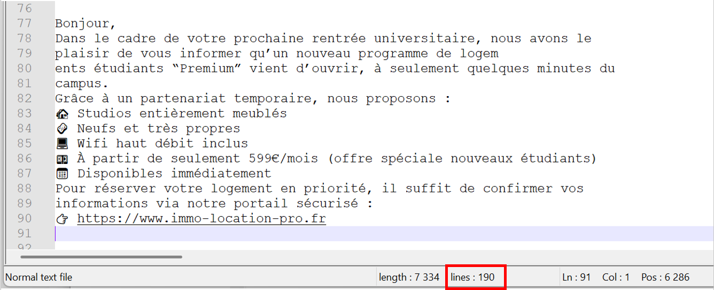
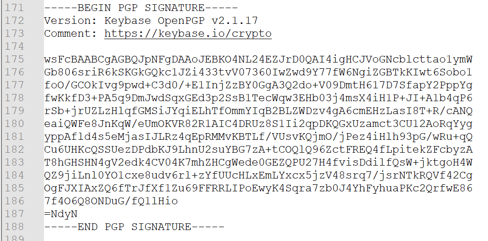
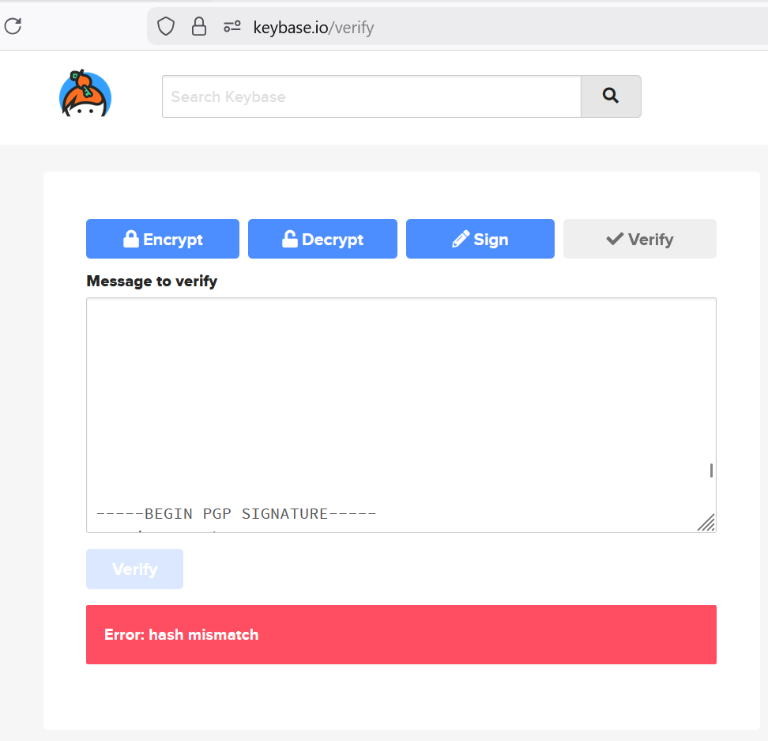
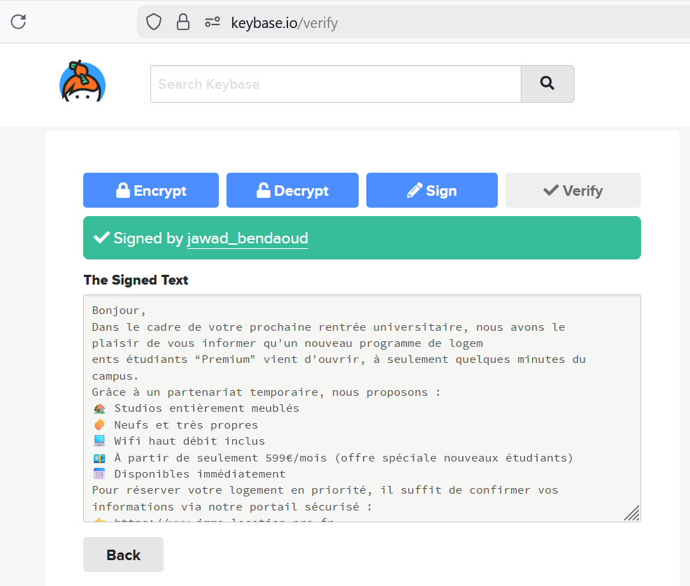
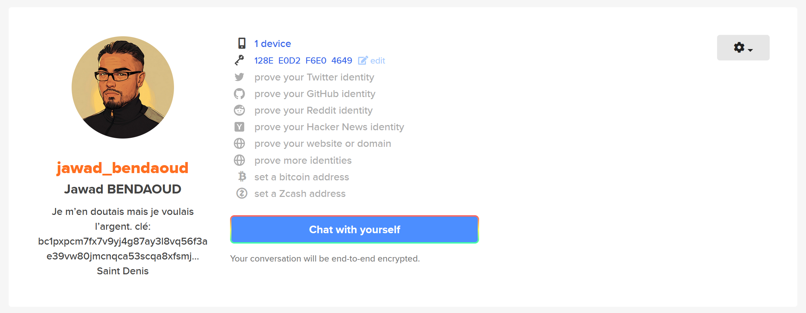

## Challenge : L'emploi

## Informations du challenge

| Catégorie | Difficulté | Points | Auteur |
|-----------|------------|--------|--------|
| Osint | Facile | 150 | B3cha |

**Preuve :** `jawad_bendaoud`

---

## Résumé

Ce challenge nécessite d'analyser la signature du mail envoyé à **Samir** :
1. Ouvrir le mail et identifier la **signature PGP en fin de mail**
2. Rechercher le propriétaire de la signature sur le site `keybase.io`

---

## Analyse du fichier .eml

Ce challenge est accompagné d'un fichier `.eml` : il s'agit d'un mail enregistré au format `.eml`.
L'intitulé du mail suggère une proposition de logement à prix attractif. Ce mail est adressé à Samir, or celui-ci est déjà en colocation avec Mélanie. C'est donc très probablement un mail qui fait partie d'une campagne de phishing.
Il est possible d'ouvrir le mail avec un éditeur de texte normal (Bloc-notes ou Notepad++) ; on distingue l'adresse mail émettrice `contact@immo-location-pro.fr` et le destinataire `samirtaleb75@protonmail.com`.
Enfin, le mail se termine par l'url du site que les escrocs incitent les personnes à consulter :
👉 https://www.immo-location-pro.fr

# Analyse du mail

On remarque, en regardant de près l'image suivante :

On remarque que le nombre de lignes `190` est nettement supérieur à la dernière ligne du fichier `90`.
En se rendant à la fin du fichier, on identifie une signature PGP faite avec l'outil `Keybase OpenPGP` : cela signifie que l'émetteur du mail a oublié de supprimer sa signature.

Le site utilisé pour générer cette signature est indiqué dans la signature : `Comment: https://keybase.io/crypto`
Regardons s'il est possible de remonter à la personne qui a envoyé ce mail à partir de sa signature.

# Analyse de la signature du mail

L'analyse est possible à l'url suivante : `https://keybase.io/verify`
En copiant le corps du mail, de la ligne :
`-----BEGIN PGP SIGNED MESSAGE-----`
jusqu'à la ligne :
`-----END PGP SIGNATURE-----`
dans la zone **Message to verify**, on obtient le message d'erreur suivant :

L'échec de vérification de signature s'explique par les nombreuses lignes blanches inutiles entre le corps du message et la signature du mail.
Il faut donc supprimer toutes ces lignes, puis relancer une vérification de signature :

### Résultat

On obtient ainsi un résultat à l'url suivante : https://keybase.io/jawad_bendaoud

Puis on se rend sur le compte keybase.io de l'utilisateur en cliquant sur son pseudo :

Il s'agit d'un certain **Jawad BENDAOUD**, personnage très connu pour avoir hébergé les terroristes du Bataclan.
Même le moins scrupuleux des bailleurs de France peut se faire usurper son identité. N'oubliez pas : c'est un jeu ! Rien n'est réel.

Nota : dans sa biographie, une clé commençant par 0x730... (intéressant).

On peut désormais renseigner notre preuve.

✅ **Preuve :** `jawad_bendaoud`
