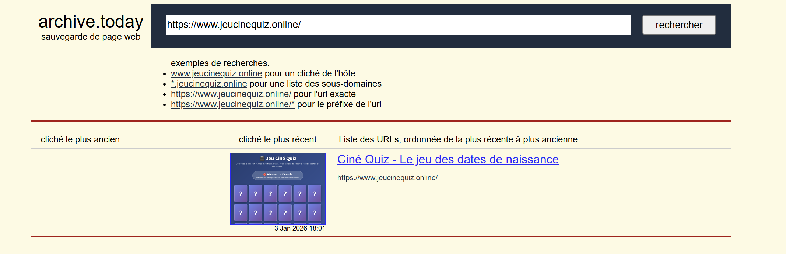
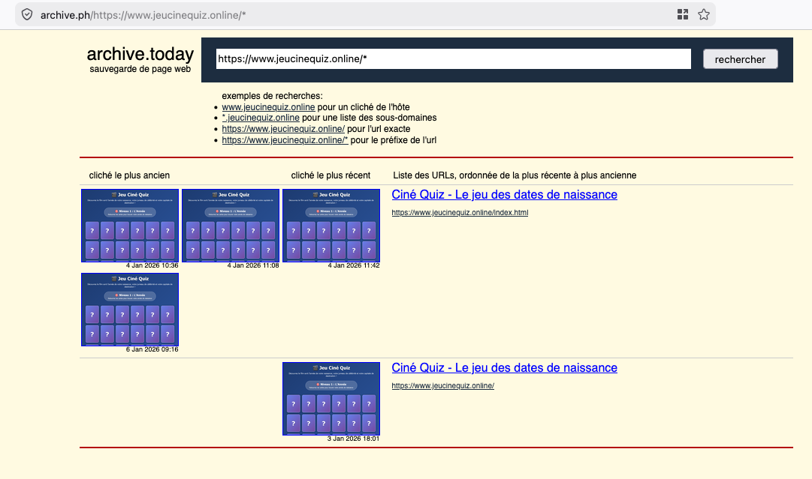
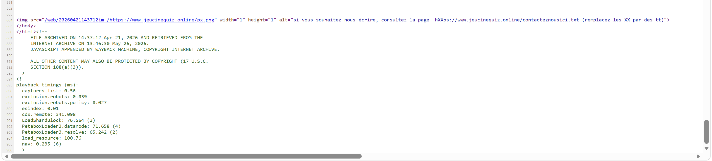
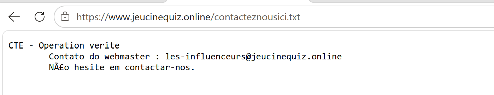
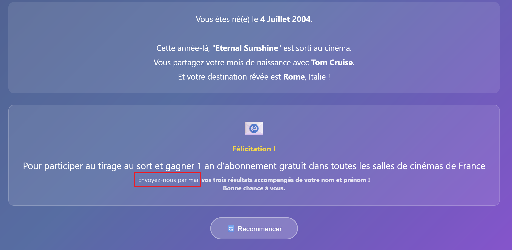
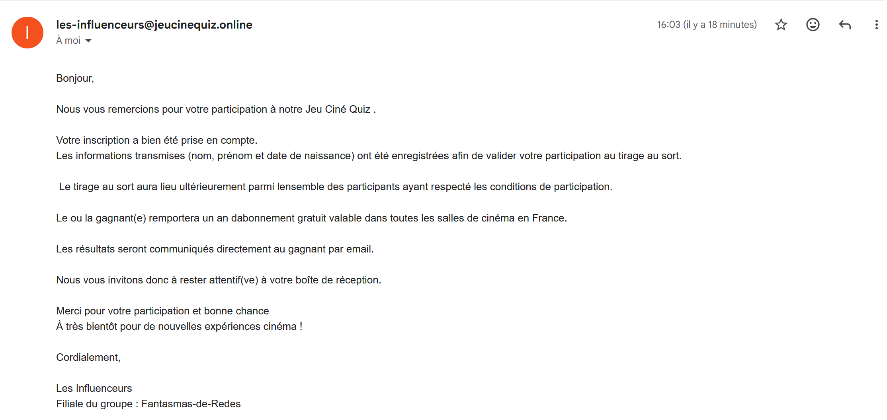
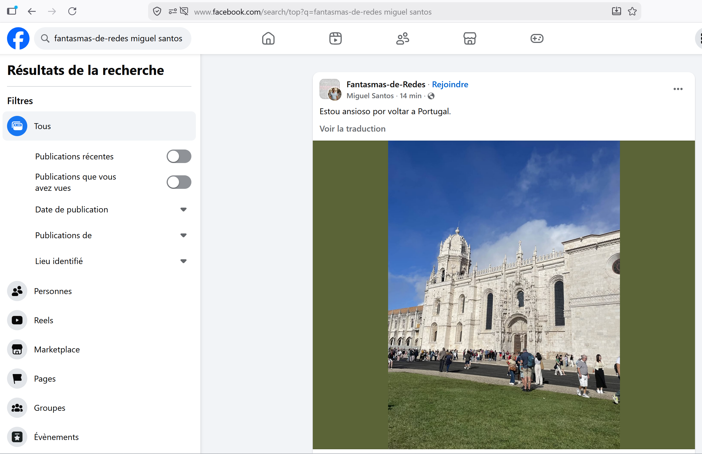

# Challenge : Affiliation

## Informations du challenge

| Catégorie | Difficulté | Points | Auteur |
|-----------|------------|--------|--------|
| Osint | Moyen | 200 | B3cha |

**Preuve :** `Fantasmas-de-Redes`

---

## Résumé

Dans ce challenge, nous découvrons pour la première fois le nom de l'organisation criminelle `Fantasmas-de-Redes`, qui est tout en haut de la pyramide.
Pour résoudre ce challenge, il faut partir du résultat du challenge `Jeu de dupes`, dans lequel l'url du jeu ciné quiz est découverte :
https://jeucinequiz.online/
L'analyse des archives du site, avec un envoi de mail, permet de trouver la réponse.

## Analyse des archives web

Lors du challenge `Jeu de dupes`, nous avons retrouvé le site utilisé par les influenceurs pour soustraire les dates de naissance de leurs victimes.
L'analyse du code source du site **jeucinequiz.online** ne donne pas grand-chose.
En recherchant sur le site `Archive.today`, nous retrouvons une archive du 3 janvier 2026 à 18:01.



L'analyse de cette archive ne permet pas de trouver grand-chose ; en cliquant sur le bouton `cliché le plus ancien`, on découvre trois autres archives du site.



Le bas de page du site indique un marquage `Capture The Evidence (CTE) - Ce site web est strictement fictif` ; cette mention n'est pas présente sur le site en ligne. Nous décidons d'analyser le code source de cette page : à la fin du fichier, quelques lignes de code sont nichées.



Il existe un fichier texte `contacteznousici.txt` placé sur un pixel, au bout de l'url https://jeucinequiz.online/contacteznousici.txt
Nous découvrons le texte suivant :



Il existe donc une adresse mail au nom des influenceurs : **les-influenceurs@jeucinequiz.online**
Nous allons maintenant exploiter cette adresse mail.

## Partie "active" du challenge

Sur la dernière page du challenge, il est mentionné **d'envoyer un mail**, sans mention de l'adresse que nous venons de trouver.
De plus, le challenge présente le tag `Actif` ; le post LinkedIn sur le site EternalBlue du vendredi 29 mai 2026 précise qu'il est possible d'interagir avec la cible si le challenge le précise explicitement.



Nous décidons d'envoyer un mail à l'adresse `les-influenceurs@jeucinequiz.online` en utilisant une adresse créée spécifiquement pour le jeu (NE JAMAIS UTILISER VOTRE ADRESSE MAIL PERSO).
Quelques secondes plus tard, nous recevons une réponse automatique :



La réponse à notre challenge est dans la signature du mail :
```shell
Les influenceurs
Filiale du groupe : Fantasmas-de-Redes
```
La preuve attendue est donc : **Fantasmas-de-Redes**

### Point de confirmation

Une recherche ciblée sur le compte Facebook de Miguel permet d'identifier qu'il est **Administrateur** d'un groupe Facebook intitulé `Fantasmas-de-Redes`.



On commence à y voir plus clair. Il est indispensable de mettre à jour notre graphe d'enquête.

---

## Résultat

La solution de notre challenge est :

✅ **Preuve :** `Fantasmas-de-Redes`
