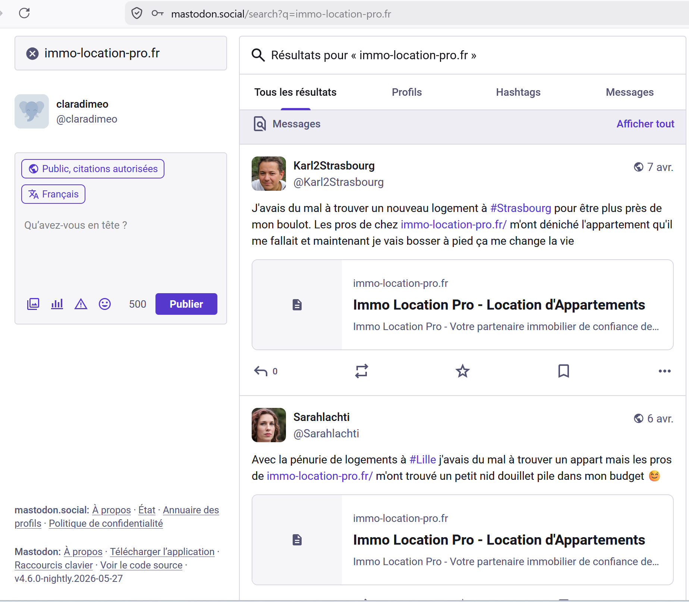
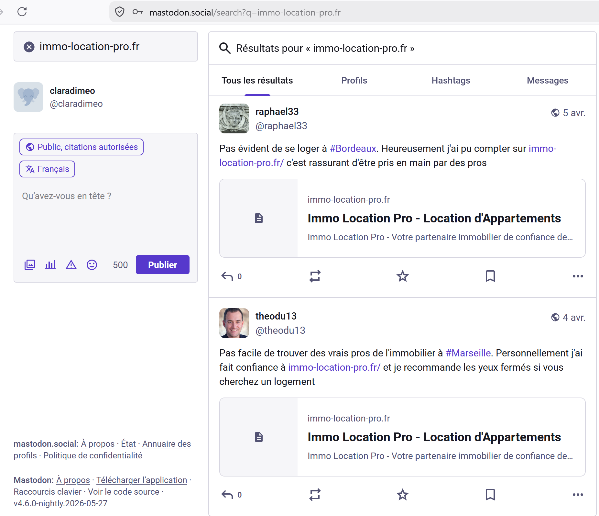
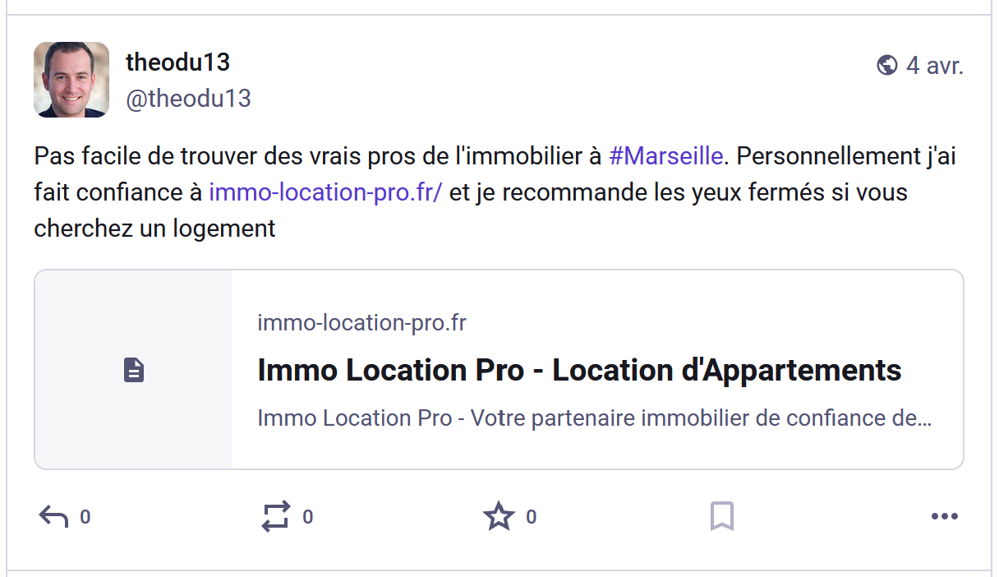
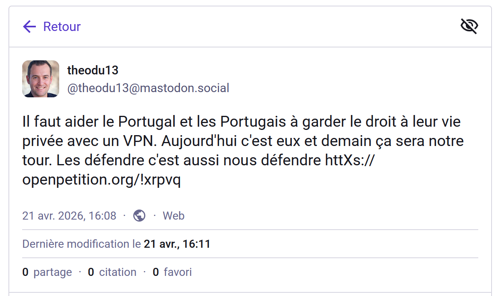
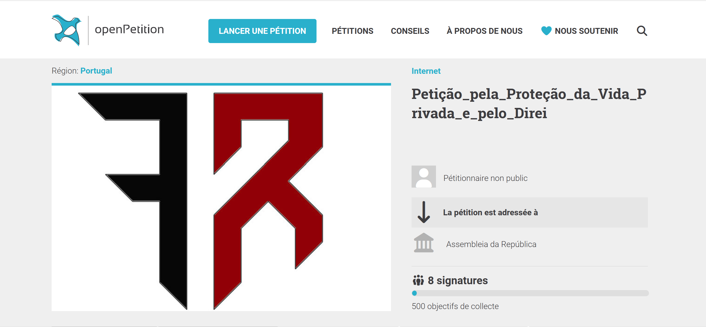
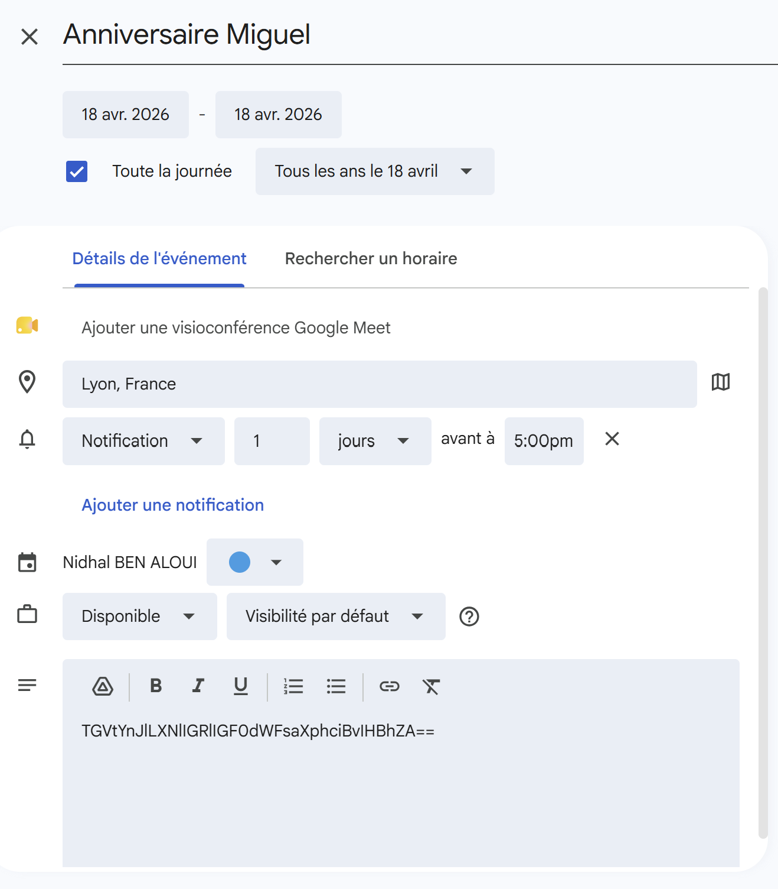
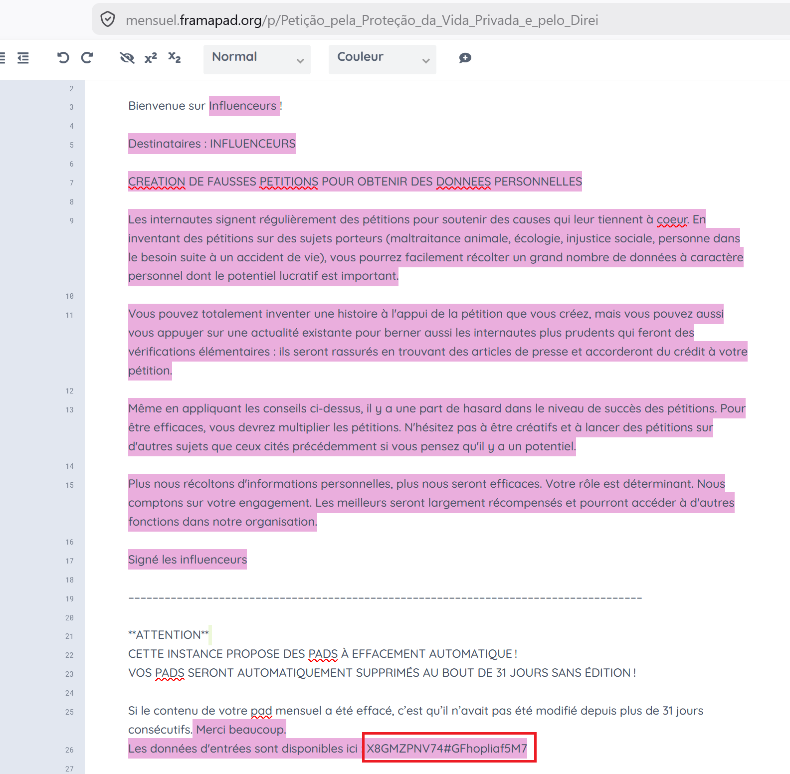
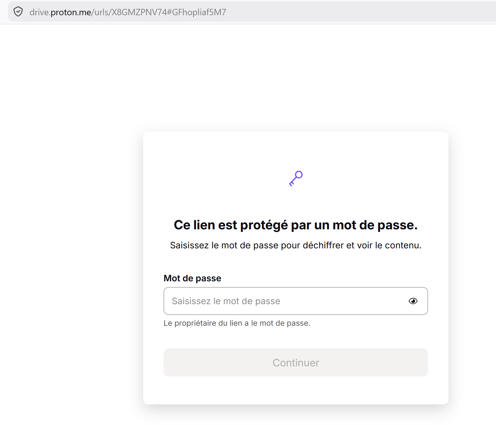

# Challenge : Lutte d'influence

## Informations du challenge

| Catégorie | Difficulté | Points | Auteur |
|-----------|------------|--------|--------|
| Osint | Moyen | 300 | B3cha |

**Preuve :** `X8GMZPNV74#GFhopliaf5M7`

---

## Résumé

La résolution de ce challenge nécessite de passer par les étapes suivantes :
1. trouver le compte mastodon.social de theodu13 https://mastodon.social/@theodu13 (membre des influenceurs)
2. trouver la pétition postée par Fantasmas-de-Redes sur le site https://www.openpetition.eu/pt/
3. identifier le framapad annuel et mensuel de Fantasmas-de-Redes et récupérer la partie de l'url du Proton Drive inscrite en bas de page.

---

## Recherche du point d'entrée

### Identifier le groupe de faux influenceurs

Lors du challenge `Agence tout risque`, nous avons retrouvé le site (`immo-location-pro.fr`) utilisé par les faux bailleurs pour récupérer les documents d'identité de leurs victimes. Ils ont nécessairement besoin de s'appuyer sur un groupe de faux influenceurs qui orientent les victimes vers ce site (comme pour le jeu ciné quiz).

Il faut donc réfléchir comme les influenceurs : sur quel réseau social peuvent-ils faire les rabatteurs ?
Nous n'avons rien trouvé sur le réseau X (ex-Twitter), par contre en faisant la recherche suivante sur le réseau `Mastodon.social` :
url de la recherche : https://mastodon.social/search?q=immo-location-pro.fr

Pour avoir les résultats probants, il faut être connecté sur ce réseau social :

- theodu13 : https://mastodon.social/@theodu13/116348164084443079
- raphael33 : https://mastodon.social/@raphael33/116351271495211182
- Sarahlachti : https://mastodon.social/@Sarahlachti/116357060227624286
- Karl2Strasbourg : https://mastodon.social/@Karl2Strasbourg/116362053321435288

Nous avons donc au moins 4 profils qui relaient les annonces empoisonnées du groupe criminel, dont celui de `Theodu13`.

En analysant le compte de `@Theodu13` (https://mastodon.social/@theodu13), on découvre un post au sujet d'un soutien à une pétition portugaise.

Dans ce post, `Theodu13` met une url désarmée qui pointe vers une pétition sur le site `openpetition` : httXs://www.openpetition.eu/pt/!xrpvq
il faut donc remplacer le caractère **X** par **p**.

### Analyse de la pétition

L'analyse de cette pétition permet de comprendre que le groupe criminel `Fantasmas-de-Redes` incite des personnes à soutenir une cause (ici la lutte contre la Commission européenne, qui souhaiterait interdire les VPN).

Les victimes sont invitées à fournir, en plus de leur signature de la pétition :
- Nom
- Prénom
- Numéro de téléphone
- Adresse e-mail

Les commentaires associés à cette pétition font appel à de nouveaux personnages de l'enquête (dont certains vous rappelleront l'édition 1 du CTE).

Le **titre de la pétition** attire particulièrement notre attention : `Petição_pela_Proteção_da_Vida_Privada_e_pelo_Direi`
Cette chaîne de caractères pourrait bien être la fin d'une autre url, celle d'une ressource qu'il reste encore à trouver.

### Identification du Framapad

L'énoncé du challenge parle d'un canal d'échange de données, très certainement un drive, mais comment le trouver ?
Heureusement, **Miguel** nous a laissé un indice sur son Google Agenda, qu'il faut trouver avec son adresse mail `miguel.100tos@gmail.com`.

Une annotation figure sur son rappel d'anniversaire le 18 avril (`TGVtYnJlLXNlIGRlIGF0dWFsaXphciBvIHBhZA==`), visiblement du texte en base64 ; le décodage nous donne : `Lembre-se de atualizar o pad.` (traduction en FR : N'oubliez pas de mettre à jour le bloc-notes (ou **pad**)).

Il faut donc chercher soit un **Framapad**, soit un **CryptPad**.

En complétant l'url d'accès à un Framapad : `https://mensuel.framapad.org/p/` + le titre de la pétition `Petição_pela_Proteção_da_Vida_Privada_e_pelo_Direi`

L'url complète vers le pad est : https://mensuel.framapad.org/p/Petição_pela_Proteção_da_Vida_Privada_e_pelo_Direi/

On distingue en bas de page : **les données d'entrée sont disponibles ici :** `X8GMZPNV74#GFhopliaf5M7`. Comme dans l'énoncé on parle d'espace de partage, il s'agit soit d'un Google Drive, soit d'un Proton Drive :

https://drive.proton.me/urls/X8GMZPNV74#GFhopliaf5M7

La preuve attendue est donc : **X8GMZPNV74#GFhopliaf5M7**

### Élément d'enquête

La recherche sur le site `framapad.org` permet d'identifier un autre bloc-notes **annuel** appartenant aux `Influenceurs` :

https://annuel.framapad.org/p/les-influenceurs-aint?lang=fr

Malheureusement, celui-ci ne contient rien d'intéressant. Cela peut probablement indiquer qu'il y a une autre ressource similaire contenant les informations sur cette entité.

**CONSEILS**

Soyez très vigilant lorsque vous participez à une pétition, ne fournissez pas toutes vos données nominatives.
Impossible de savoir comment celles-ci seront utilisées.

---

## Résultat

La solution de notre challenge est la dernière partie de l'url Proton Drive identifiée sur le framapad :

✅ **Preuve :** `X8GMZPNV74#GFhopliaf5M7`
