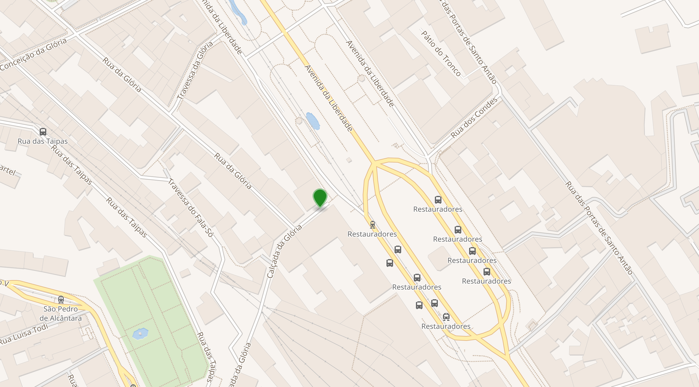
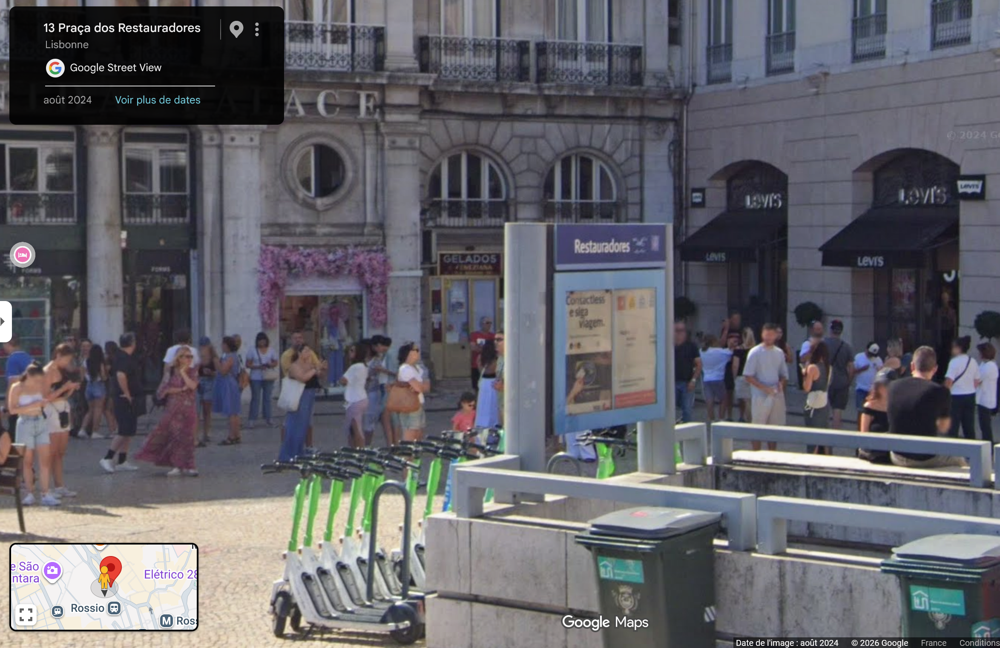

# Challenge : Accident tragique

## Informations du challenge

| Catégorie | Difficulté | Points | Auteur |
|-----------|------------|--------|--------|
| Osint | Facile | 100 | B3cha |

**Preuve :** `Restauradores`

---

## Résumé

Dans ce challenge, il faut identifier la ou les photos de statuettes en bronze sur le compte `Pinterest` de Miguel.
Puis procéder à une recherche par image inversée pour identifier l'emplacement de ces statuettes.
Enfin, des recherches Google Street permettent de trouver le nom de la station de métro.

## Identification des statuettes à partir du compte Pinterest de Miguel

Lors d'un précédent challenge, nous avons pu déterminer que **Miguel** possède un compte `Pinterest` :
https://fr.pinterest.com/miguel100tos
Sur ce compte, des photos de statuettes en bronze postées par Miguel montrent des personnages en train de manipuler des instruments.

Une recherche rapide sur Google d'un accident tragique au Portugal nous identifie instantanément le lien suivant :
https://fr.wikipedia.org/wiki/Accident_du_funiculaire_de_Gl%C3%B3ria
Cette page Wikipédia indique les coordonnées GPS précises du lieu de l'accident : 38° 42′ 58″ nord, 9° 08′ 34″ ouest.
Il suffit de zoomer sur la carte proposée sur Wikipédia :

La carte présente le nom de la station de métro : **Restauradores**

## Confirmation sur place

En se rendant sur place via Google Street :
https://www.google.com/maps/place/38%C2%B042'54.8%22N+9%C2%B008'28.4%22W/@38.7152445,-9.1413446,3a,57.2y,196.06h,84.48t/data=!3m7!1e1!3m5!1sJmuMS9b7E9vGKUKigY1BpA!2e0!6shttps:%2F%2Fstreetviewpixels-pa.googleapis.com%2Fv1%2Fthumbnail%3Fcb_client%3Dmaps_sv.tactile%26w%3D900%26h%3D600%26pitch%3D5.515482483721712%26panoid%3DJmuMS9b7E9vGKUKigY1BpA%26yaw%3D196.056408747579!7i16384!8i8192!4m4!3m3!8m2!3d38.715225!4d-9.141234?entry=ttu&g_ep=EgoyMDI2MDUyNy4wIKXMDSoASAFQAw%3D%3D

Juste en face du magasin **Levis**, les statuettes ne sont plus présentes, mais nous sommes bien au bon endroit.

Nota : pourquoi ce nom de station est-il si important ?
Parce qu'il sera utilisé plus tard pour résoudre le challenge `Avoirs criminels 1`.

---

## Résultat

La solution de notre challenge est le nom de la station de métro située à 50 mètres de l'accident du funiculaire à Lisbonne.

✅ **Preuve :** `Restauradores`
