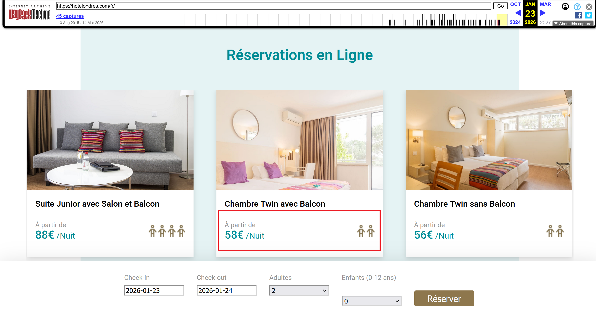
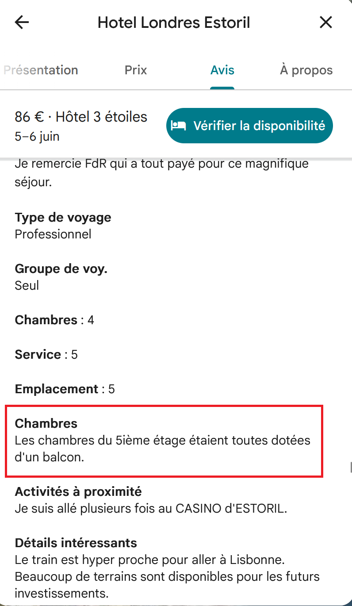
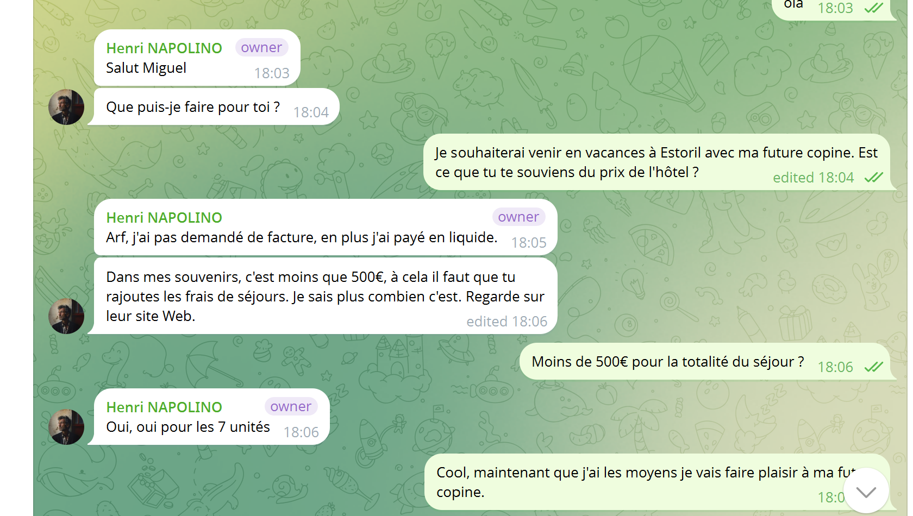

# Challenge : Aux frais de la princesse

## Informations du challenge

| Catégorie | Difficulté | Points | Auteur |
|-----------|------------|--------|--------|
| ImInt & GoogleInt | Facile | 200 | B3cha |

**Preuve :** `406` (sans symbole monétaire)

---

## Résumé

Dans ce challenge, il faut trouver le coût du séjour entier de Miguel à Estoril. Les informations de la chambre réservée par Miguel sont accessibles lors du challenge `Point de chute`.
Les prix sont présents sur l'archive Wayback Machine du site de l'hôtel : https://hotelondres.com/fr/
Les informations sur l'hôtel sont également présentes sur la carte d'accès accessible lors du challenge `Point de chute`.

## Identification des tarifs de la chambre

Lors du challenge `Point de chute`, nous avons identifié les dates de séjour de **Miguel**, du 18 octobre 2025 au 25 octobre 2025.
Soit 7 nuitées.
Les tarifs des chambres sont affichés sur le site web de l'hôtel à l'url suivante :
https://hotelondres.com/fr/.png
Une archive Wayback Machine du 23 janvier 2026 préserve les valeurs des prix :

Afin de savoir quel type de chambre Miguel a réservé, il faut lire l'avis Google de Miguel sur l'hôtel :

Dans ce post, il cite `Les chambres du 5ième étage étaient toutes dotées d'un balcon`, ce qui indique que la chambre de Miguel est une chambre double avec balcon, au prix de `58€ / Nuit`.
Le prix total du séjour s'élèverait donc à 7 × 58€ = **406€**.

## Confirmation du montant

L'analyse des échanges entre Miguel et Henry sur le compte Telegram de `Fantasmas-de-Redes` indique que le montant total du séjour n'excède pas 500€.

Le montant total de `406` est donc la bonne réponse.

---

## Résultat

La solution de notre challenge est située sur l'archive web du site de l'hôtel `Londres Estoril`.

✅ **Preuve :** `406`
