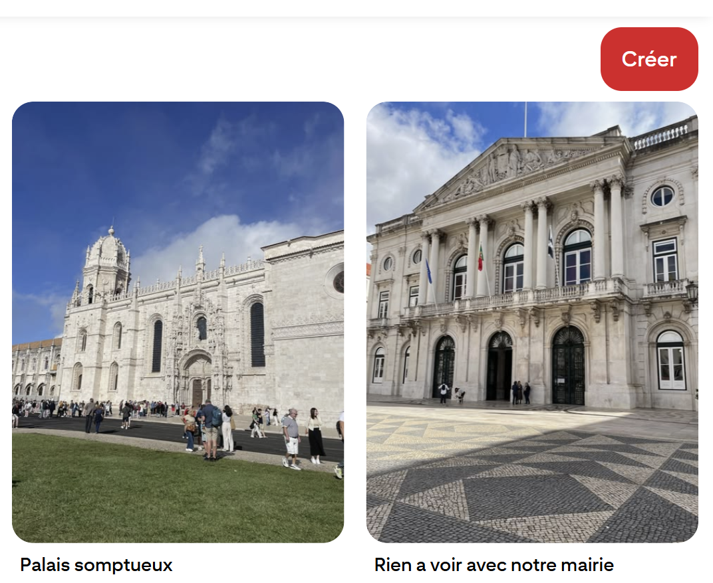
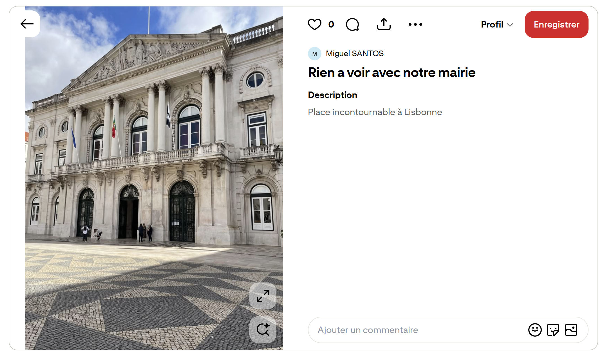
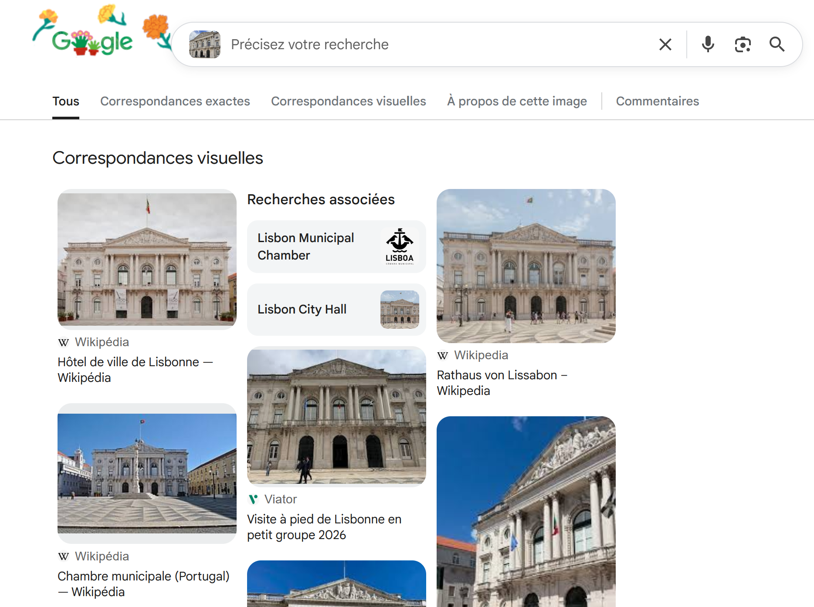

# Challenge : Bâtiment officiel

## Informations du challenge

| Catégorie | Difficulté | Points | Auteur |
|-----------|------------|--------|--------|
| Osint | Facile | 100 | B3cha |

**Preuve :** `RUA-DO-ARSENAL` (insensible à la casse)

---

## Résumé

Dans ce challenge, il faut d'abord trouver le compte `Pinterest` de Miguel contenant la photo de départ, puis identifier la photo du bâtiment officiel.
Il faut ensuite effectuer une recherche par image inversée pour localiser le bâtiment.

## Recherche de l'image de départ

En recherchant sur les réseaux sociaux de Miguel, sur son compte `Pinterest` (https://fr.pinterest.com/miguel100tos), deux photos d'un monument pourraient correspondre au challenge.

Le texte de la photo intitulée `Rien à voir avec notre mairie` indique **Place incontournable à Lisbonne**.

Ce passage fait partie du parcours de sécurité imposé à Miguel pour s'assurer qu'il n'est pas suivi.
Il faut donc inspecter les éléments de la page et récupérer l'image originale pour l'utiliser en recherche inversée :

## Identification du bâtiment

Nous procédons à une recherche par image inversée sur Google :

Le premier résultat indique **Mairie de Lisbonne**.
Maintenant, il faut se transporter sur les lieux via Google Street View et regarder le nom de la rue la plus proche.

## Localisation de la photo

En recherchant **Mairie de Lisbonne** sur Google Maps, on retrouve en vue Street View le même plan de photo :

Sur la photo, le nom de la rue est indiqué : `Rua do Arsenal`.
L'exemple de preuve `RUA-DO-MANCHESTER` est en portugais, pour inciter les joueurs à conserver la même langue que la rue.

---

## Résultat

La solution de notre challenge est le nom de la rue où est située la mairie de Lisbonne.

✅ **Preuve :** `RUA-DO-ARSENAL` (insensible à la casse)
