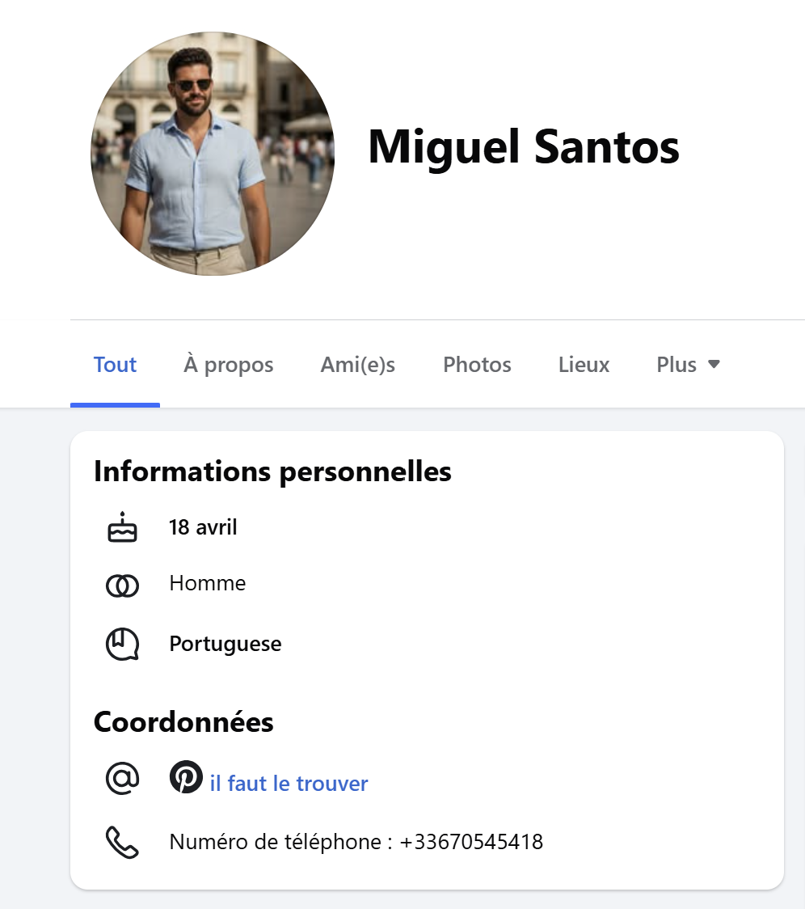
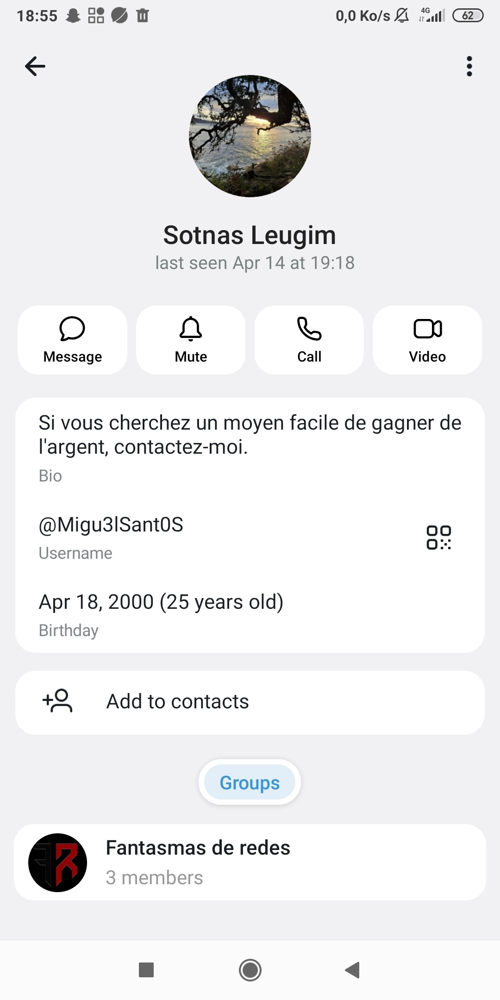

# Challenge : Biodata

## Informations du challenge

| Catégorie | Difficulté | Points | Auteur |
|-----------|------------|--------|--------|
| Osint | Facile | 100 | B3cha |

**Preuve :** `18 avril 2000` (sensible à la casse)

---

## Résumé

Dans ce challenge, il faut identifier le début de la date de naissance de Miguel grâce à son compte Facebook, puis, avec le numéro de Miguel `+33670545418`, retrouver le compte Telegram de Miguel qui affiche sa date de naissance complète.

## Identification du compte Facebook

En recherchant sur les réseaux sociaux de Miguel, sur son premier compte Facebook (https://www.facebook.com/profile.php?id=61582916518941), dans la rubrique **Informations personnelles** :

Une première partie de sa date de naissance indique : `18 avril`. Il ne nous manque plus que l'année de naissance.

## Analyse du compte Telegram

Pour voir si la personne possède un compte `Telegram` associé à son numéro de téléphone, il suffit de compléter l'url `https://t.me/` + `+33670545418`.
L'url est valide et indique le compte suivant : `t.me/@Migu3lSant0S`. Le nom du profil est **Sotnas Leugim**, qui n'est rien d'autre que **Miguel Santos** écrit de droite à gauche.
Le profil détaillé du compte Telegram de Miguel affiche la date de naissance complète.

Il est ainsi possible de compléter la date de naissance identifiée sur le compte Facebook : **18 avril 2000**.
Les photos d'identité de Miguel confirment sa tranche d'âge.
Pour un autre challenge, on remarque qu'il appartient à un groupe Telegram `Fantasmas-de-Redes`.

---

## Résultat

La solution de notre challenge est :

✅ **Preuve :** `18 avril 2000`
