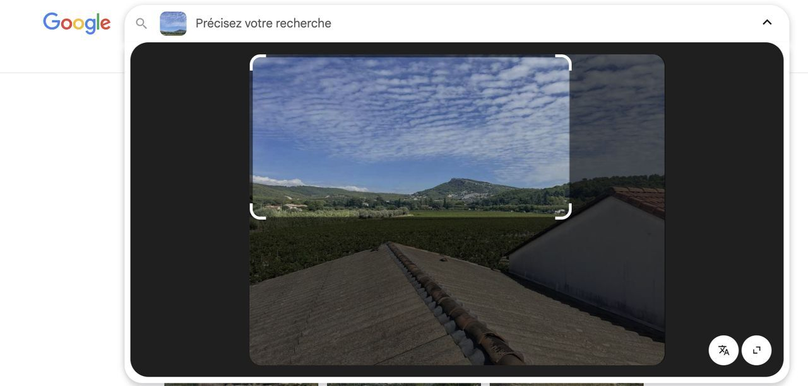
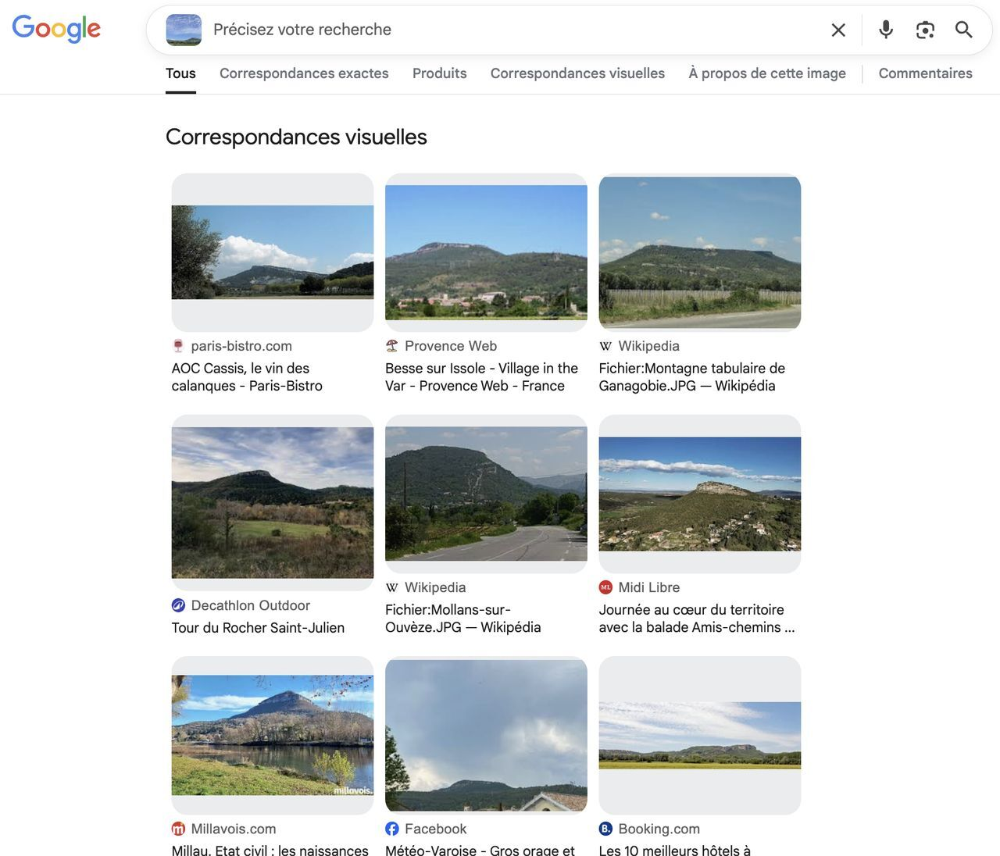
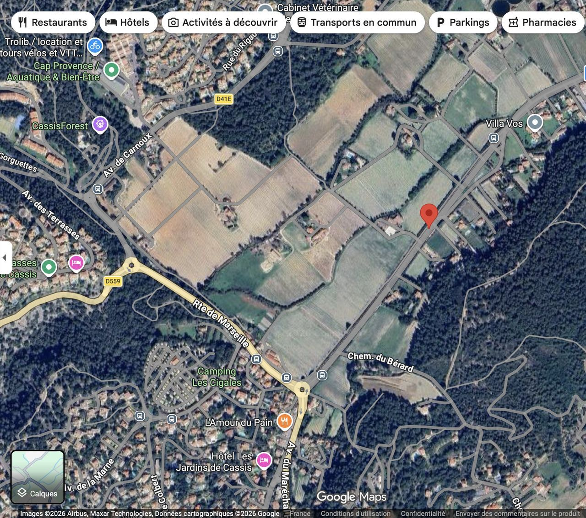
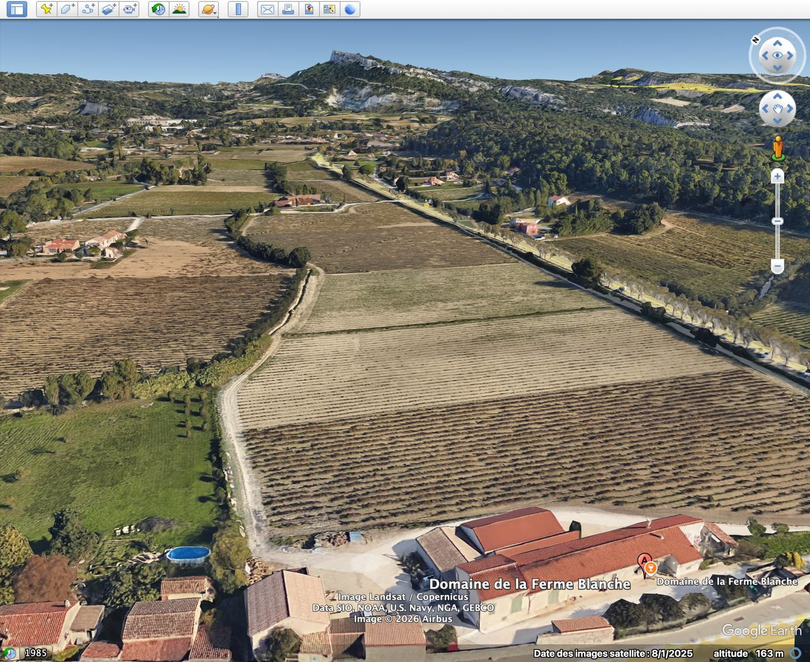
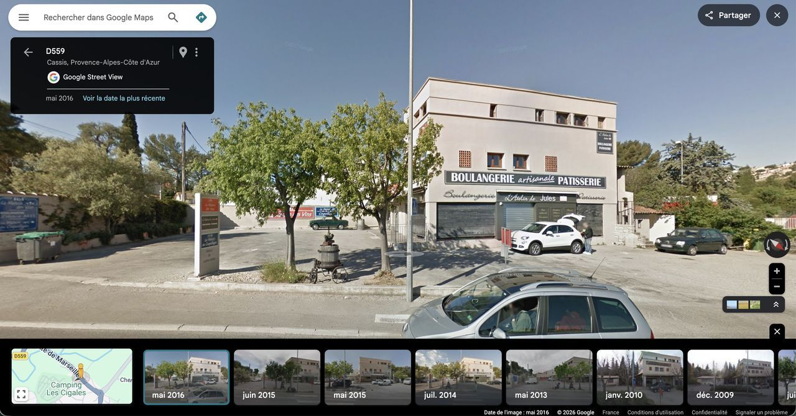

# Challenge : Briefing d'équipe

## Informations du challenge

| Catégorie | Difficulté | Points | Auteur |
|-----------|------------|--------|--------|
| Osint | Facile | 150 | Hekct |

**Preuve :** `Atelier de Jules`

## Résumé

Ce challenge nécessite de retrouver :
1. le lieu de rassemblement à partir de la vidéo fournie sur le réseau social TikTok de Miguel (https://www.tiktok.com/@miguel.100t0s)
2. puis, à proximité, de rechercher la boulangerie du passé.

### Étape 1 : Restreindre la zone de recherche

La vidéo montre des vignes et, au premier plan, des engins agricoles et plusieurs bâtiments. Les bâtiments au premier plan sont peu caractéristiques, mais la barre rocheuse oblique recouverte de végétation visible à l'horizon au début de la vidéo est intéressante. Le premier indice nous suggère, si nécessaire, la marche à suivre : "Le recadrage d'une image peut orienter un moteur de recherche vers un élément spécifique du décor".
On effectue une recherche d'image inversée sur Google, recadrée sur cet élément du décor.

Le recadrage affiche des résultats différents de ceux portant sur l'image complète.

Parmi les premiers résultats proposés par le moteur figure une publication sur un vignoble de Cassis (https://www.paris-bistro.com/vin/vigne/vins-provence/aoc-cassis-le-vin-des-calanques).
La perspective sur la photo est proche de celle de la vidéo. Cette photo illustrait un reportage réalisé au Clos d'Albizzi en 2012. L'adresse de ce vignoble (1 Av. des Albizzi, 13260 Cassis) constitue un bon point de départ pour explorer les environs.

### Étape 2 : Localisation fine des bâtiments

Un bruit évocateur de circulation automobile est audible sur la vidéo. On recherche, en vue satellite sur Street View ou avec Google Earth, des bâtiments à proximité d'une route dont la disposition et l'orientation par rapport à la barre rocheuse correspondent.

On localise le lieu à quelques centaines de mètres seulement de notre point de départ, au Domaine de la Ferme Blanche, sur la route de Marseille (RD 559).

### Étape 3 : Identification de l'ancien nom de la boulangerie

En faisant pivoter la vue Street View, on découvre une boulangerie Paul à quelques mètres, de l'autre côté de la route. Elle portait peut-être un autre nom il y a dix ans. Au besoin, l'indice "Le temps passe, les voitures repassent" nous rappelle que les Google cars repassent périodiquement aux mêmes endroits.
On consulte les vues plus anciennes sur Street View et on relève le nom recherché, inchangé entre 2015 et 2017, sur la pancarte à l'entrée du parking des commerces : l'Atelier de Jules.

## Résultat

La solution de notre challenge est donc **l'Atelier de Jules**.

✅ **Preuve :** `Atelier de Jules` ou `l'Atelier de Jules` (les deux sont acceptés).
