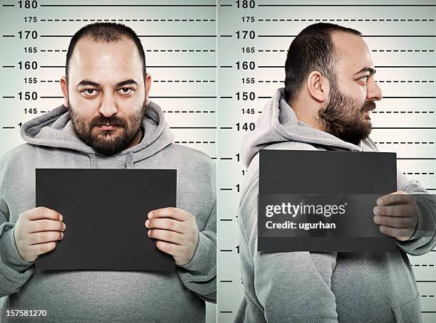
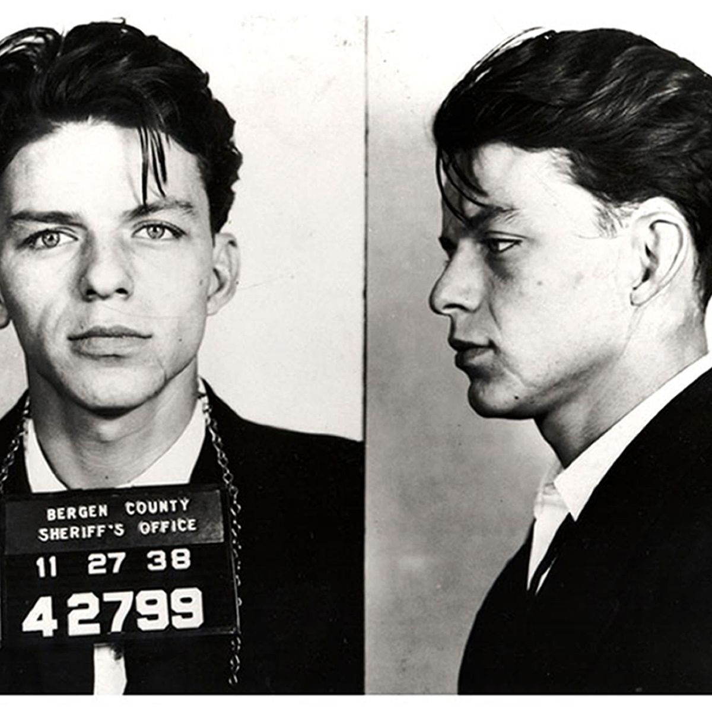

# Challenge : Distance de sécurité

## Informations du challenge

| Catégorie | Difficulté | Points | Auteur |
|-----------|------------|--------|--------|
| IA | Difficile | 500 | Sp3rctralFlow & Map_hack |

**Preuve :** `CTF{EMBEDDING-MASTER}.yqLZQvvXjkfpc8p1VDxtrfQ3jBBAfxClS_IupUgvhoI=.ZmluYWw6MTc3Mjc5NDQ5MQ==`

---

## Résumé

Ce challenge expose une API de reconnaissance faciale et d'embeddings vectoriels. L'objectif est de retrouver un vecteur secret de dimension 192 et d'envoyer 1000 vecteurs alignés mais non colinéaires pour obtenir le flag.

Ce writeup présente **deux méthodes de résolution** :

- **Solution 1 (officielle)** — approche algorithmique classique utilisant CMA-ES, moindres carrés et orthogonalisation de Gram-Schmidt
- **Solution 2 (alternative)** — résolution assistée par **Claude Code**, où l'IA explore, analyse et résout le challenge de manière autonome à partir d'un simple prompt

### Solution 1 : Approche CMA-ES (officielle)

1. **Authentification par mug shot** - upload d'une photo d'identité judiciaire pour obtenir un token
2. **Exploration évolutionnaire (CMA-ES)** - recherche du vecteur cible par optimisation stochastique
3. **Résolution par moindres carrés** - calcul du centre exact à partir des vecteurs collectés
4. **Streak de précision** - génération de 1000 vecteurs dans un cône autour du centre

### Solution 2 : Claude Code comme co-pilote CTF

1. **Exploration manuelle** - découverte des endpoints et tâtonnement sur l'image d'authentification
2. **Brainstorm avec Claude** - suggestion du mugshot pour débloquer l'étape 1
3. **Délégation à Claude Code** - l'IA explore l'API, déduit la métrique cosinus, reconstruit le vecteur cible dimension par dimension, et obtient le flag de manière autonome

---

# Solution 1 : Approche CMA-ES (solution officielle de l'auteur)

## Étape 1 : Authentification (`/auth/`)

### Découverte

Le challenge expose une API FastAPI. L'endpoint `/docs` révèle une interface Swagger avec trois routes :

```
POST /auth/       — upload d'image, pas de header requis
POST /debug/      — upload d'image + header X-Flag
POST /embedding/  — JSON body + header X-Flag
```

L'endpoint `/auth/` attend un fichier image et retourne un token de session.

### Analyse

L'API utilise un modèle de reconnaissance faciale. En testant différentes images :
- Une image noire, blanche ou aléatoire -> rejet
- Une photo de visage classique -> rejet

Le contexte du challenge oriente vers une **photo de type mug shot** (photo d'identité judiciaire).

### Exploitation

On utilise un mug shot célèbre (Jim Morrison, 1970, Dade County) :

Exemples de photos mugshot acceptées par l'API :




```bash
curl -s http://127.0.0.1:1985/auth/ -F "file=@truetest.jpeg"
```

### Résultat

```json
{"flag": "ZGVidWc6MTc2ODY4NDc2Nw==.znllPo1hb8qCQMf3I90WQp0MYcrT6unzLANLSo678SE="}
```

Le préfixe base64 décode en `debug:<timestamp>` — c'est un **token de session temporaire**, pas le flag final.

### Ce qui ne fonctionne PAS

- Image noire ou blanche -> pas de token
- Image aléatoire (carré rouge) -> rejet
- Photo de visage standard (pas un mug shot) -> rejet

---

## Étape 2 : Découverte de l'endpoint `/embedding/`

### Analyse

```bash
curl -s http://127.0.0.1:1985/embedding/ -H "X-Flag: $TOKEN" \
  -H "Content-Type: application/json" -d '{}'
```

**Réponse :** `{"detail": "Embedding size mismatch (expected 192)"}`

L'API attend un vecteur de dimension **192**. Elle retourne pour chaque vecteur envoyé :
- `zone` : indicateur de proximité (0 = alignement parfait)
- `precision` : similarité cosinus brute
- `streak` : nombre d'envois consécutifs en zone 0
- `flag` : retourné uniquement quand le streak atteint 1000

---

## Étape 3 : Exploration par CMA-ES

### Analyse

Plutôt que de sonder les 192 dimensions une par une, on utilise **CMA-ES** (Covariance Matrix Adaptation Evolution Strategy), un algorithme d'optimisation évolutionnaire adapté aux espaces continus de haute dimension.

L'idée : générer des populations de vecteurs, évaluer leur `zone`, et laisser CMA-ES converger vers la zone 0.

### Exploitation

```python
import cma
import torch
import torch.nn.functional as F

DIM = 192
TARGET_COUNT = int(DIM * 1.5)  # 288 vecteurs a collecter

es = cma.CMAEvolutionStrategy(torch.randn(DIM).tolist(), 0.5)

valid_vectors = []
valid_scores = []

while len(valid_vectors) < TARGET_COUNT:
    solutions = es.ask()
    scores_cma = []

    for s in solutions:
        s_t = torch.tensor(s, dtype=torch.float32)
        zone, precision, streak, flag = get_full_data(s_t)

        val_cma = float(zone) if (zone is not None and zone >= 0) else 10.0
        scores_cma.append(val_cma)

        # Collecter les vecteurs qui atteignent zone 0
        if zone == 0 and precision is not None:
            v_norm = F.normalize(s_t, p=2, dim=0)
            valid_vectors.append(v_norm.detach())
            valid_scores.append(float(precision))

    es.tell(solutions, scores_cma)
```

### Résultat

CMA-ES converge en quelques générations. On collecte **288 vecteurs** en zone 0 avec leurs scores de précision respectifs.

---

## Étape 4 : Résolution par moindres carrés

### Analyse

Les 288 vecteurs collectés sont tous proches du vecteur cible, mais à des angles légèrement différents. Leur précision (cosinus brut) forme un système d'équations surdéterminé :

```
precision_i = cos(vecteur_i, cible)
```

On peut retrouver le vecteur cible exact par régression linéaire (moindres carrés).

### Exploitation

```python
T = torch.stack(valid_vectors)       # matrice 288 x 192
S = torch.tensor(valid_scores).unsqueeze(1)  # vecteur 288 x 1

res = torch.linalg.lstsq(T, S)
zero_zone_vec = F.normalize(res.solution.squeeze()[:DIM], p=2, dim=0)
```

### Résultat

```
Centre calcule - Zone: 0 | Cosine Raw: 0.999998
```

Le vecteur cible est retrouvé avec une précision quasi parfaite.

---

## Étape 5 : Le piège de la colinéarité

### Découverte

En renvoyant le même vecteur une deuxième fois :

```json
{"detail": "Embedding too similar or colinear, streak reset"}
```

Le serveur détecte les vecteurs identiques ou colinéaires et **reset le streak à zéro**. Il faut donc envoyer 1000 vecteurs **distincts** mais tous en zone 0.

---

## Étape 6 : Génération de vecteurs dans un cône

### Analyse

Pour contourner la détection de colinéarité, on génère des vecteurs à un **angle fixe** (~1.9 degrés) du vecteur cible. En dimension 192, l'espace des directions orthogonales est immense — on peut générer des milliers de vecteurs distincts sans risque de collision.

### Exploitation

```python
def generate_flag_points(target, num_points=1000, angle_to_target_deg=1.9):
    dim = target.shape[0]
    alpha = math.radians(angle_to_target_deg)

    for _ in range(num_points):
        # Direction aleatoire
        noise = torch.randn(dim)
        # Orthogonalisation (Gram-Schmidt)
        ortho = F.normalize(noise - torch.dot(noise, target) * target, dim=0)
        # Melange pour l'angle cible
        p = math.cos(alpha) * target + math.sin(alpha) * ortho
        yield F.normalize(p, p=2, dim=0)
```

Le principe :
1. Générer un bruit aléatoire
2. Le rendre orthogonal au vecteur cible (Gram-Schmidt)
3. Combiner le vecteur cible et la direction orthogonale avec l'angle voulu
4. Normaliser

Chaque vecteur généré est à exactement ~1.9 degrés du centre, donc en zone 0, mais dans une direction différente.

### Résultat

```
Hit 1/1000   | Streak: 1   | Zone: 0 | Cos: 0.999945
Hit 100/1000 | Streak: 100 | Zone: 0 | Cos: 0.999951
Hit 500/1000 | Streak: 500 | Zone: 0 | Cos: 0.999948
Hit 999/1000 | Streak: 999 | Zone: 0 | Cos: 0.999950
Hit 1000/1000| Streak: 1000| Zone: 0 | Cos: 0.999947
```

```json
{
  "zone": 0,
  "streak": 1000,
  "precision": 0.999947,
  "status": "aligned",
  "flag": "CTF{EMBEDDING-MASTER}.yqLZQvvXjkfpc8p1VDxtrfQ3jBBAfxClS_IupUgvhoI=.ZmluYWw6MTc3Mjc5NDQ5MQ=="
}
```

---

## Preuve à trouver

```
CTF{EMBEDDING-MASTER}.yqLZQvvXjkfpc8p1VDxtrfQ3jBBAfxClS_IupUgvhoI=.ZmluYWw6MTc3Mjc5NDQ5MQ==       

```

---

## Résumé de l'approche

```
/auth/ (mug shot)              ->  token de session
                                       |
CMA-ES (optimisation)         ->  288 vecteurs en zone 0
                                       |
Moindres carrés (lstsq)       ->  vecteur cible exact
                                       |
Cône de vecteurs (Gram-Schmidt) ->  1000 vecteurs distincts en zone 0
                                       |
                                  CTF{EMBEDDING-MASTER}.xxxxxx
```

**Concepts clés :**
- **CMA-ES** : algorithme évolutionnaire pour explorer un espace continu de dimension 192 sans connaître la métrique exacte
- **Moindres carrés** : retrouver le vecteur cible à partir d'un système surdéterminé de similarités cosinus
- **Orthogonalisation de Gram-Schmidt** : générer des vecteurs à angle fixe du centre, garantissant diversité et alignement
- **Haute dimension** : en dim 192, l'espace orthogonal est immense, ce qui rend la génération de vecteurs non colinéaires triviale

---

# Solution 2 : Résolution assistée par Claude Code

### Contexte

Cette section documente une approche différente du challenge, où **Claude Code** (l'assistant CLI d'Anthropic) a été utilisé comme co-pilote pour explorer, analyser et résoudre le challenge de manière itérative.

### Étape 1 : Exploration manuelle de l'API

En accédant à l'IP du challenge, la page racine retourne un `404`. L'exploration révèle l'endpoint `/docs`, qui expose une interface Swagger avec les 3 endpoints de l'API :

```
POST /auth/       — upload d'image
POST /debug/      — upload d'image + header X-Flag
POST /embedding/  — JSON body + header X-Flag
```

Le premier endpoint `/auth/` attend une photo. La description mentionne que le système est **"capable de deviner l'avenir de Miguel"** et que ce dernier est un criminel.

### Étape 2 : trouver la bonne image (tâtonnement + aide de Claude)

Intuitivement, le lien avec un criminel oriente vers l'univers judiciaire. Plusieurs types d'images ont été testés manuellement, sans succès :

| Image testée | Résultat |
|-------------|----------|
| Photo de prison | `false` |
| Menottes | `false` |
| Prisonnier | `false` |
| Tribunal | `false` |
| Police | `false` |

Face au blocage, **Claude** (en mode conversationnel) a été sollicité pour brainstormer. Il a proposé une liste d'images liées à la justice criminelle :

- Le marteau du juge (gavel)
- Un verdict écrit / jugement de condamnation
- Une combinaison orange (tenue de prisonnier US)
- Un **mugshot** (photo d'identité judiciaire)
- Une cellule de prison (intérieur)
- Une injection létale / couloir de la mort
- Une balance de la justice
- Un dossier judiciaire / casier

C'est la suggestion du **mugshot** qui a fonctionné. L'upload d'une photo de type mugshot retourne un premier flag (en réalité un token de session `debug:<timestamp>`), validant l'étape d'authentification.

### Étape 3 : Délégation à Claude Code pour le flag final

Les deux autres endpoints (`/debug/` et `/embedding/`) parlent de **zones** et d'**embeddings** — des concepts plus complexes nécessitant de l'expérimentation programmatique.

**Préparation de l'environnement :**

Un dossier de travail a été créé contenant :
- La photo mugshot qui permet d'obtenir le token
- Le descriptif du challenge

**Le prompt donné à Claude Code :**

> *"Pour un CTF je dois trouver un master flag. J'ai accès à cette URL ou il y a 3 endpoints. Pour le premier, une photo mugshot permet d'avoir un premier flag mais j'ai besoin d'aide pour la suite. Explore l'environnement et essaie de trouver le flag. Tu noteras tes travaux dans un fichier writeup."*

### Ce que Claude Code a fait (détail des actions)

Claude Code a procédé de manière **autonome et itérative**, en écrivant et exécutant du code Python directement depuis le terminal. Voici le détail de chaque phase :

#### Phase 1 : Exploration des endpoints

Claude Code a commencé par envoyer des requêtes `curl` pour cartographier l'API :

- Appel à `/auth/` avec la photo mugshot fournie → obtention du token de session
- Appel à `/debug/` avec le token et différentes images → découverte de la réponse `{"zone": 5}` (un entier qui varie selon l'image)
- Appel à `/embedding/` avec un body vide → message d'erreur révélant la dimension attendue : `"Embedding size mismatch (expected 192)"`

Claude Code a immédiatement compris qu'il s'agissait d'un problème de **similarité vectorielle** dans un espace de dimension **192**.

#### Phase 2 : comprendre la métrique (déduction de la distance cosinus)

Claude Code a écrit un script Python pour tester systématiquement des vecteurs et observer les réponses :

**Test 1 — Vecteur nul :**
```
zeros(192)  -> zone = 10.0, status = "searching"
```

**Test 2 — Vecteurs unitaires de la base canonique :**
```
e_0   = [1,0,...,0]  -> zone = 9.23
e_114 = [0,...,1,...,0] -> zone = 7.47
e_144 = [0,...,1,...,0] -> zone = -1.0  (valeur sentinelle !)
```

**Test 3 — Même vecteur, magnitudes différentes :**
```
e_0 * 1.0   -> zone = 9.227
e_0 * 2.0   -> zone = 9.227
e_0 * 5.0   -> zone = 9.227
e_0 * 10.0  -> zone = 9.227
```

**Déduction de Claude Code :** la magnitude ne change rien, donc la métrique est **angulaire**. Claude Code a formulé l'hypothèse :

```
zone = 10 * (1 - cos_similarity(query, target))
```

Et a déduit que `zone = -1` est une valeur sentinelle signalant un cosinus négatif (la composante du vecteur cible est de signe opposé).

#### Phase 3 : reconstruction du vecteur cible (sondage dimension par dimension)

Claude Code a réalisé que, pour un vecteur unitaire e_i, la similarité cosinus avec la cible T donne directement :

```
cos(e_i, T) = T_i / ||T||
```

Donc chaque composante du vecteur cible peut être extraite individuellement :

```
T_i / ||T|| = 1 - zone_i / 10
```

Claude Code a écrit un script qui sonde les **192 dimensions** en deux passes :

1. **Passe positive** : envoyer `e_i = [0,...,1,...,0]` pour chaque dimension. Si `zone > 0`, la composante est positive
2. **Passe négative** : pour les dimensions qui retournent `zone = -1`, envoyer `e_i = [0,...,-1,...,0]`. La zone retournée donne la valeur absolue de la composante

**Résultat :** 88 dimensions positives, 104 négatives. Toutes les 192 composantes sont non nulles. Le vecteur cible est reconstruit et normalisé :

```python
target[dim] = sign * (1 - zone / 10)
target_norm = target / np.linalg.norm(target)
```

**Vérification :**
```json
{"zone": 0, "streak": 1, "precision": 0.9999480, "status": "aligned"}
```

Zone = 0 ! Le vecteur cible est trouvé.

#### Phase 4 : découverte du piège de la colinéarité

Claude Code a tenté de renvoyer le même vecteur pour faire monter le streak :

```json
{"detail": "Embedding too similar or colinear, streak reset"}
```

Le serveur détecte les vecteurs identiques ou colinéaires et reset le streak à zéro.

**Tentatives échouées de Claude Code :**

| Stratégie testée | Résultat |
|-----------------|----------|
| Même vecteur, magnitudes différentes | Rejeté — cosinus toujours = 1.0 entre vecteurs colinéaires |
| Ré-authentification entre chaque requête | Streak reste à 1 (nouveau token = nouvelle session) |
| Perturbations très faibles (epsilon = 0.0005) | Rejeté — vecteurs encore trop proches après normalisation |

#### Phase 5 : calibrage du bruit gaussien

Claude Code a testé différents niveaux de bruit pour trouver le bon équilibre :

```python
for noise_scale in [0.0001, 0.0005, 0.001, 0.002, 0.003, 0.005]:
    noise = np.random.randn(192) * noise_scale
    vec = target_norm + noise
    vec = vec / np.linalg.norm(vec)
```

| Bruit (sigma) | Zone | Streak | Précision |
|---------------|------|--------|-----------|
| 0.0001 | 0 | 1 | 0.99995 |
| 0.0005 | 0 | **2** | 0.99992 |
| 0.001 | 0 | **3** | 0.99984 |
| 0.002 | 0 | **4** | 0.99954 |
| 0.003 | 0 | **5** | 0.99904 |
| 0.005 | 0 | **6** | 0.99743 |

**Conclusion de Claude Code :** un bruit de **sigma = 0.003** est optimal — assez fort pour éviter la détection de colinéarité, assez faible pour rester en zone 0.

#### Phase 6 : obtention du flag (streak à 1000)

Claude Code a écrit le script final avec des seeds différentes pour garantir l'unicité de chaque vecteur :

```python
flag = post_auth()  # Un seul token pour toute la session

for i in range(1100):  # Marge de securite
    np.random.seed(i * 7 + 13)
    noise = np.random.randn(192) * 0.003
    vec = target_norm + noise
    vec = vec / np.linalg.norm(vec)
    result = query_embedding(flag, vec)
```

```
streak=100  — precision ~0.999
streak=500  — precision ~0.999
streak=900  — precision ~0.999
streak=1000 — FLAG !
```

```json
{
  "zone": 0,
  "streak": 1000,
  "precision": 0.9991230368614197,
  "status": "aligned",
  "flag": "CTF{EMBEDDING-MASTER}.yqLZQvvXjkfpc8p1VDxtrfQ3jBBAfxClS_IupUgvhoI=.ZmluYWw6MTc3Mjc5NDQ5MQ=="
}
```

Le processus complet a nécessité **plusieurs itérations et ajustements**. Claude Code notait ses découvertes, hypothèses et échecs dans un fichier writeup au fur et à mesure, permettant de garder une trace structurée du raisonnement.

### Intérêt de cette approche

| Critère | Méthode officielle (CMA-ES) | Méthode Claude Code |
|---------|----------------------------|---------------------|
| Expertise requise | Connaissance de CMA-ES, moindres carrés, Gram-Schmidt | Savoir formuler un bon prompt |
| Nombre de requêtes API | ~300 (exploration) + 1000 (streak) | ~400 (sondage) + 1000 (streak) |
| Autonomie | Script à écrire soi-même | Claude Code écrit et exécute le code |
| Compréhension | Nécessite de comprendre la théorie | Claude Code explique au fur et à mesure |

L'approche avec Claude Code démontre qu'un assistant IA peut servir d'**outil offensif dans un CTF** : exploration automatique, formulation d'hypothèses, écriture de scripts d'exploitation, et itération rapide face aux échecs — le tout à partir d'un prompt en langage naturel.
