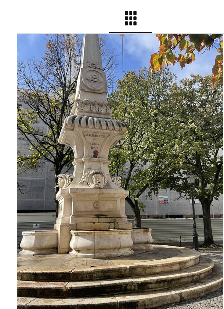
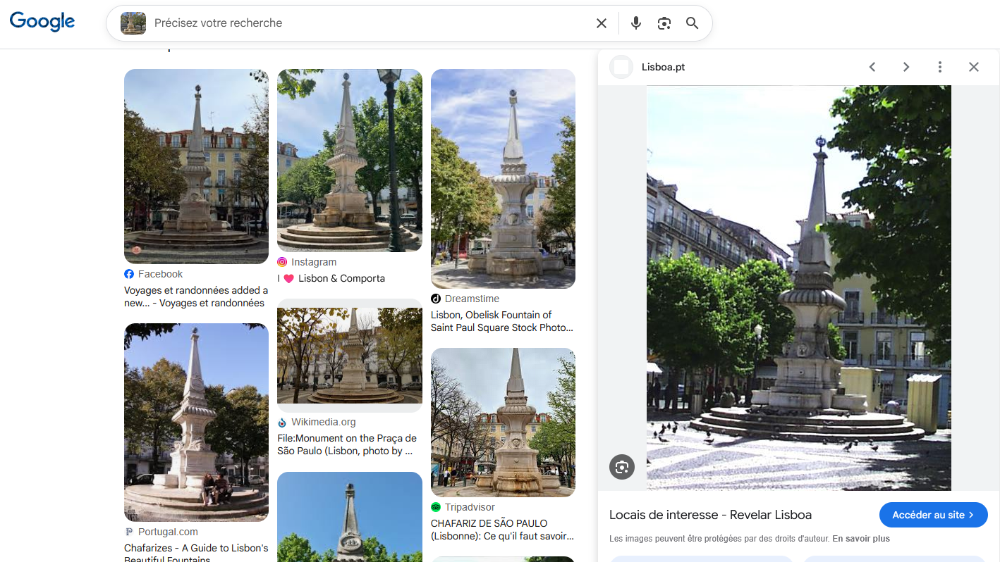
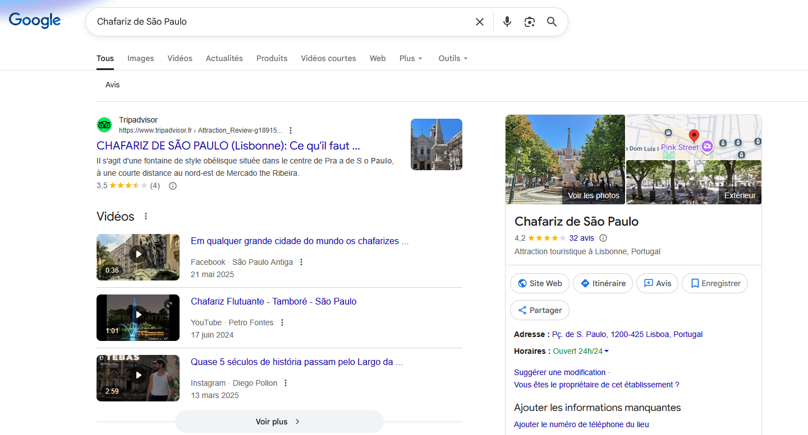
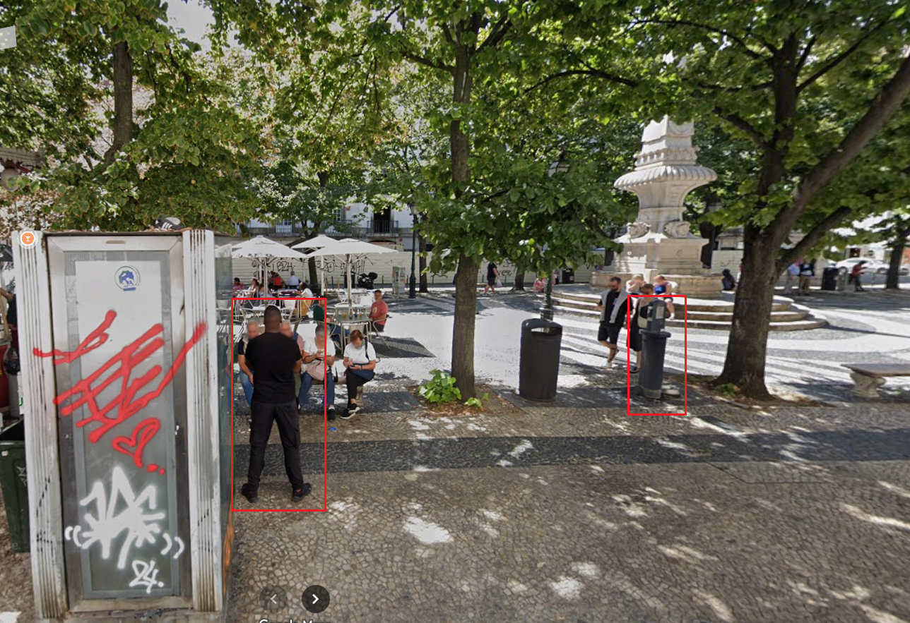
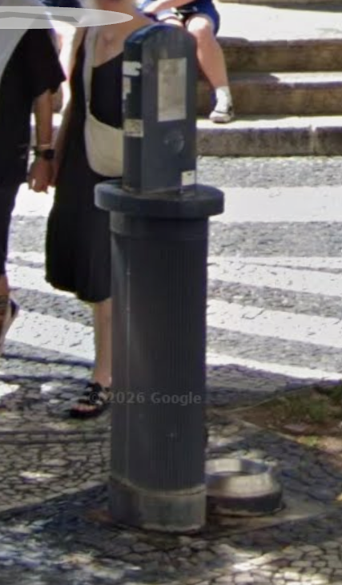
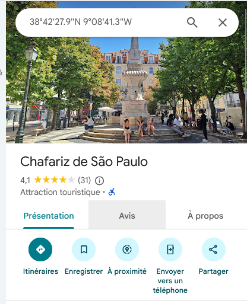
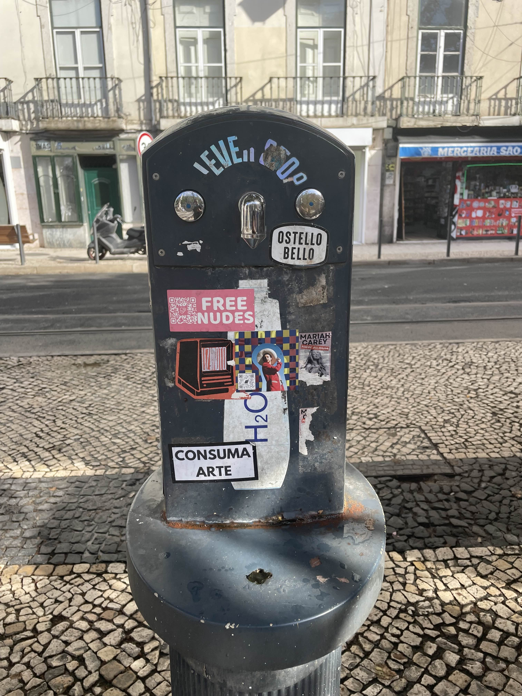
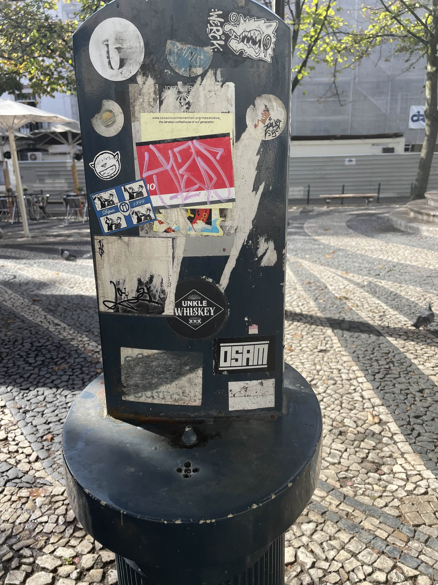
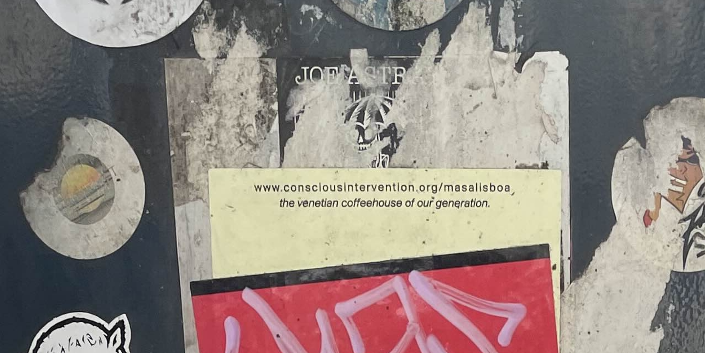

# Challenge : Étancher sa soif

## Informations du challenge

| Catégorie | Difficulté | Points | Auteur |
|-----------|------------|--------|--------|
| Osint | Facile | 100 | B3cha |

**Preuve :** `[www.conscionsintervention.org/masalisboa](https://www.conscionsintervention.org/masalisboa)` (insensible à la casse)

---

## Résumé

Ce challenge est très facile :
1. **Chafariz de São Paulo** - localisation de la place à Lisbonne
2. **Point d'eau** - identifier le point d'eau face à la fontaine
3. **Photo du point d'eau** - retrouver l'avis de Miguel sur le point d'eau

---

## Étape 1 : localisation de la place

### Image inversée Google

D'après l'énoncé, Miguel s'est rendu à cette fontaine à eau. On regarde sur son compte Instagram (https://www.instagram.com/miguel.100tos/) :
il y a la photo d'une ancienne fontaine à eau :

Copions ou enregistrons cette photo en local, puis lançons une recherche par image inversée sur Google :

### Résultat

Les résultats indiquent : `Chafariz de São Paulo`, une place très réputée à Lisbonne.

---

## Étape 2 : recherche du point d'eau

### Méthodologie

Le plus simple est de se rendre sur place (Google Street View) et de faire le tour de la place.
Une vue de 2025 en particulier attire notre attention : un homme en noir est clairement apparent (le suiveur de Miguel ?).

À sa droite, on distingue clairement un point d'eau.

Malheureusement, malgré les différentes tentatives de zoom, il est impossible d'apercevoir ce qui est écrit sur le point d'eau.
Il faut donc trouver une autre ressource qui présente une meilleure photo du point d'eau.

### Recherche d'un zoom du point d'eau

Première idée : regarder s'il y a d'autres photos de la fontaine ancienne sur Google `Chafariz de São Paulo`.

Ça tombe bien, il y a plusieurs photos du lieu, mais pas la photo précise de notre point d'eau.
Intéressons-nous aux différents avis Google publiés sur le lieu `Chafariz de São Paulo`.
Bonne pioche : notre Miguel SANTOS a posté un avis :

On retrouve deux images de très haute qualité de notre point d'eau (la première en vue rue) :

La seconde, en vue fontaine, présente un autocollant avec une url :

Il ne reste plus qu'à zoomer sur l'autocollant blanc :

---

### Résultat

L'autocollant présente l'url de `the venetian coffeehouse of our generation` :

✅ **Preuve :** `[www.conscionsintervention.org/masalisboa](https://www.conscionsintervention.org/masalisboa)`
