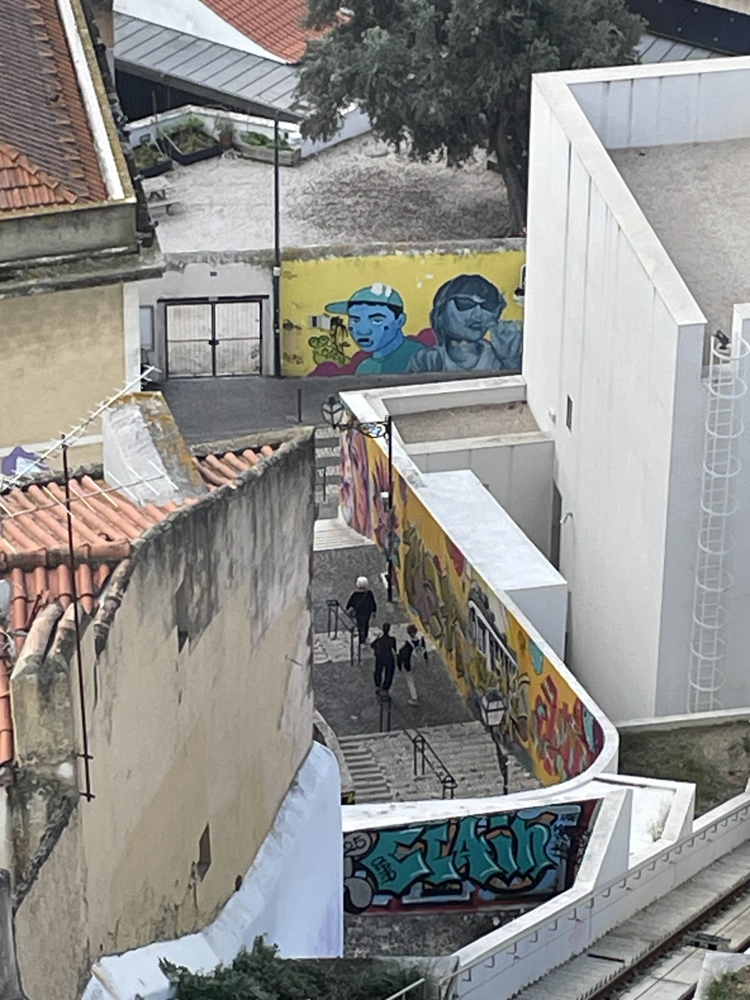
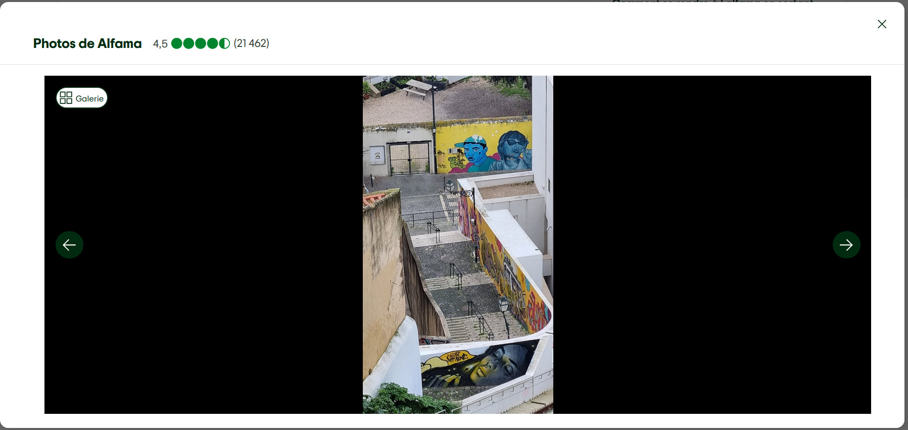
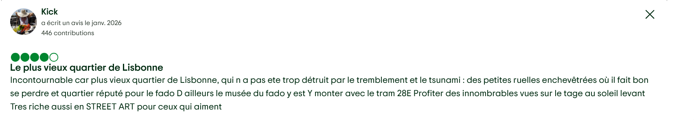
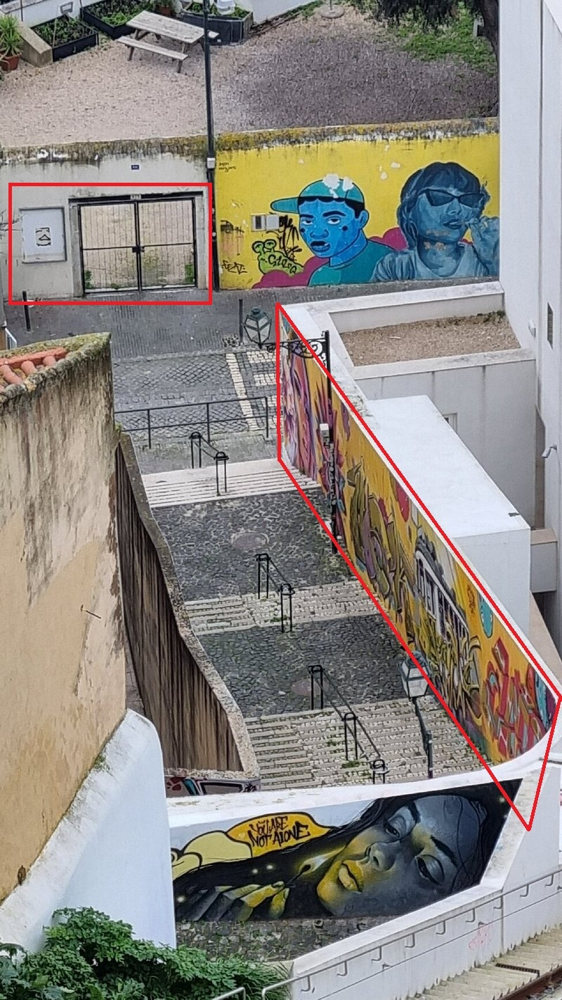
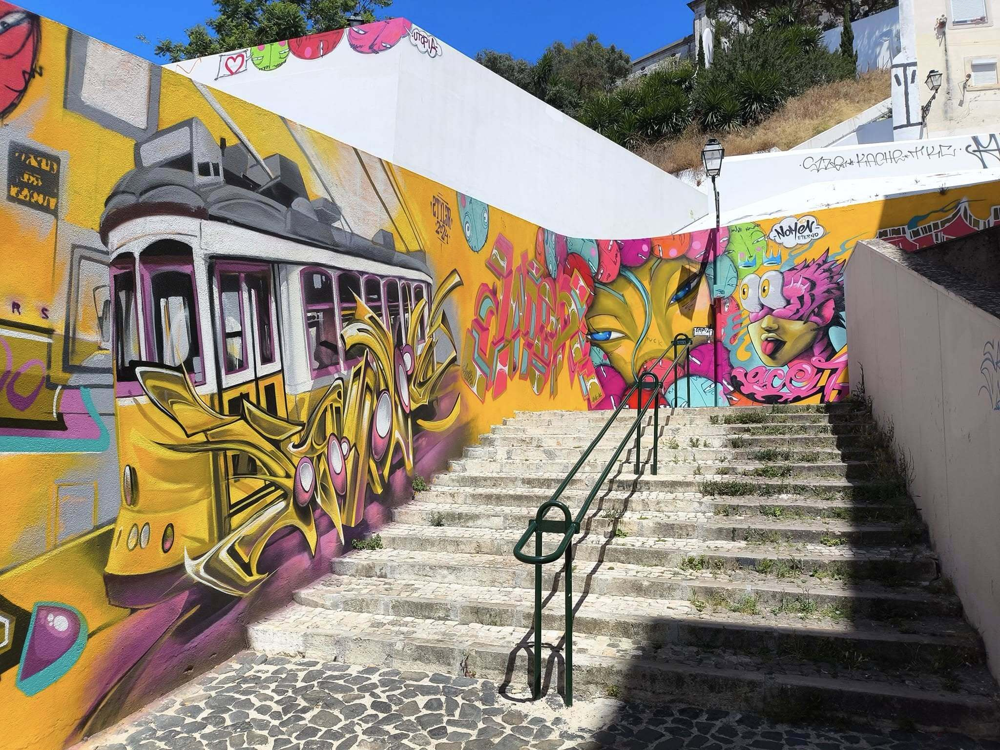
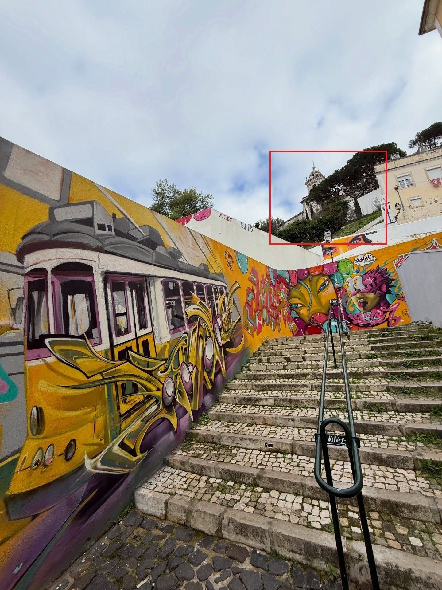
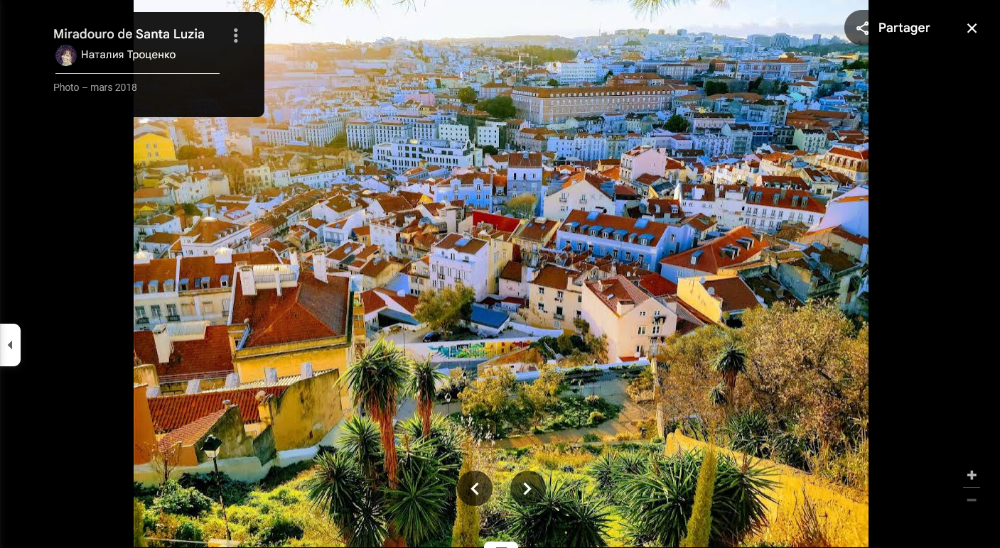
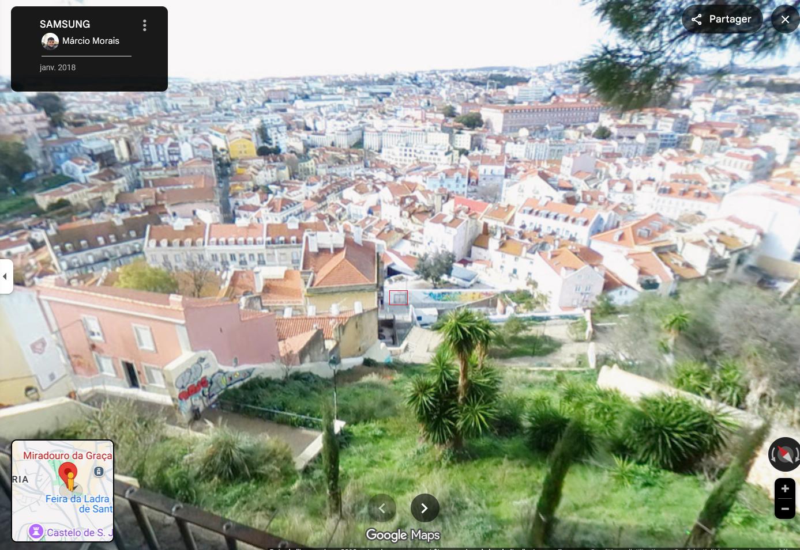
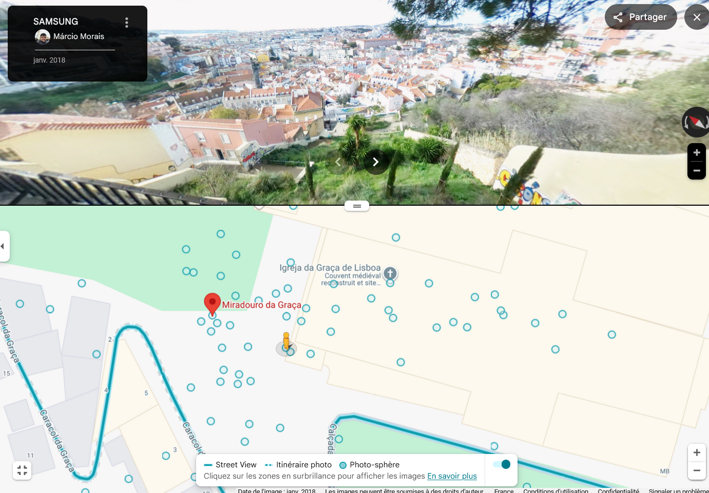

## Challenge : Il est fort Vauban

## Informations du challenge

| Catégorie | Difficulté | Points | Auteur |
|-----------|------------|--------|--------|
| Osint | Moyen | 200 | B3cha |

**Preuve :** `38.71641077664793,-9.131437862801446`

## Résumé

Ce challenge nécessite de retrouver un point d'observation célèbre à Lisbonne, le **Miradouro da Graça** :
1. Identifier la photo d'une peinture de rue postée sur le compte `Instagram` de Miguel
2. Retrouver le point de prise de vue de cette photo

## Étape 1 : Identification de la photo du challenge

### Identification

Sur le compte Instagram de Miguel (https://www.instagram.com/miguel.100tos/), il y a une photo représentant une œuvre d'art de rue.

Il faut donc procéder à une recherche d'image inversée sur Google Images ; on trouve un résultat intéressant sur `Tripadvisor` :

Avec le commentaire qui nous situe dans le plus vieux quartier de Lisbonne :

Des résultats intéressants, dont une image en particulier, permettent d'identifier des marqueurs :
1. une porte située sur la gauche de la peinture
2. une seconde peinture plus grande, de couleur jaune et orange

## Étape 2 : Recherche du point de prise de vue d'origine

Nous allons pivoter sur cette seconde peinture pour essayer de localiser ce lieu et avoir une vue de bas en haut.
Un compte Facebook affiche cette seconde peinture avec une meilleure prise de vue et surtout un cadre de fond.
https://www.facebook.com/photo/?fbid=1013758237107410&set=pb.100054197303925.-2207520000

Ainsi qu'une vidéo plus complète sur le compte Instagram `liga.photo` :
https://www.instagram.com/p/DRJzXN_CAgw/?img_index=1

Au second plan de cette image, une sorte de chapelle est apparente. En faisant une recherche par image inversée sur cette seconde peinture, nous obtenons l'image suivante :

La source indique que cette image (au même plan de vue que la photo de Miguel) a pour lieu le `Miradouro da Graça`.

En se transportant sur les lieux via Google Maps pour faire une double vérification, on obtient deux prises de vue :

Un spot de prise de vue spécifique nous positionne à l'endroit précis où Miguel a pris cette photo sur place :

https://www.google.com/maps/place/Point+de+vue+de+Gra%C3%A7a/@38.7163986,-9.1314404,3a,66.8y,41.48h,62.5t/data=!3m7!1e1!3m5!1sCIHM0ogKEICAgIDEs5Hg2wE!2e10!6shttps:%2F%2Flh3.googleusercontent.com%2Fgpms-cs-s%2FAFfmt2aov_xLRc7hAFJBQWCVTRPFVwTOM9Wta6KV9mGDznkwVMpujfVyvyzBy2i_28qQ3ImVNZKf9sP-4CaJdqqMigBa_Mp6N7UDEsfVCd-d_fuLQbVuQ0fpup_3S8yapCRc3yw3FaLyYA%3Dw900-h600-k-no-pi27.502114939507713-ya41.479036067201896-ro0-fo100!7i5472!8i2736!4m14!1m7!3m6!1s0xd19330071a40f11:0xa2bd471a63e3c650!2sGra%C3%A7a+Funicular+(Upper+Station+-+Gra%C3%A7a)!8m2!3d38.716377!4d-9.131521!16s%2Fg%2F11vyj39734!3m5!1s0xd193389ab8d3963:0x46c80fef319cf9f0!8m2!3d38.7164509!4d-9.1315937!16s%2Fg%2F11_p4_gll?hl=fr&entry=ttu&g_ep=EgoyMDI2MDEyMS4wIKXMDSoKLDEwMDc5MjA3MUgBUAM%3D

## Résultat

La solution de notre challenge est : `Point de vue de Graça`

✅ **Preuve :** `38.71641077664793,-9.131437862801446`
