# Challenge : Jeune recrue

## Informations du challenge

| Catégorie | Difficulté | Points | Auteur |
|-----------|------------|--------|--------|
| Osint | Facile | 100 | Debunk |

**Preuve :** `quilroy`

Suite au challenge intitulé `Briefing d'équipe`, nous avons récupéré le nom du lieu où la réunion s'est tenue : `Domaine de la ferme blanche`.
En effectuant une recherche inversée des images et vidéos postées sur le compte Instagram de `Miguel`, les recherches n'aboutissent à aucune nouvelle information.
La seule information pertinente ? La localisation du domaine de la Ferme Blanche : **Domaine de la ferme blanche, Vignobles Imbert, RD 559, 13260 Cassis.**
En recherchant l'adresse du domaine sur plusieurs réseaux sociaux, aucun résultat pertinent ne ressort, sauf sur Instagram en recherchant les photos par la localisation (l'endroit où la photo a été prise, donc ici : Domaine de la ferme blanche, Vignobles Imbert, RD 559, 13260 Cassis).

`À noter que cette technique fonctionne uniquement sur SMARTPHONE, car il est impossible de rechercher les lieux tagués sur la version WEB d'Instagram sur PC.`

## Recherche sur Instagram (fonction recherche par lieux désactivée)

Nous remarquons que nous ne pouvons pas faire de recherche par `Lieux` dans la version WEB d'Instagram :

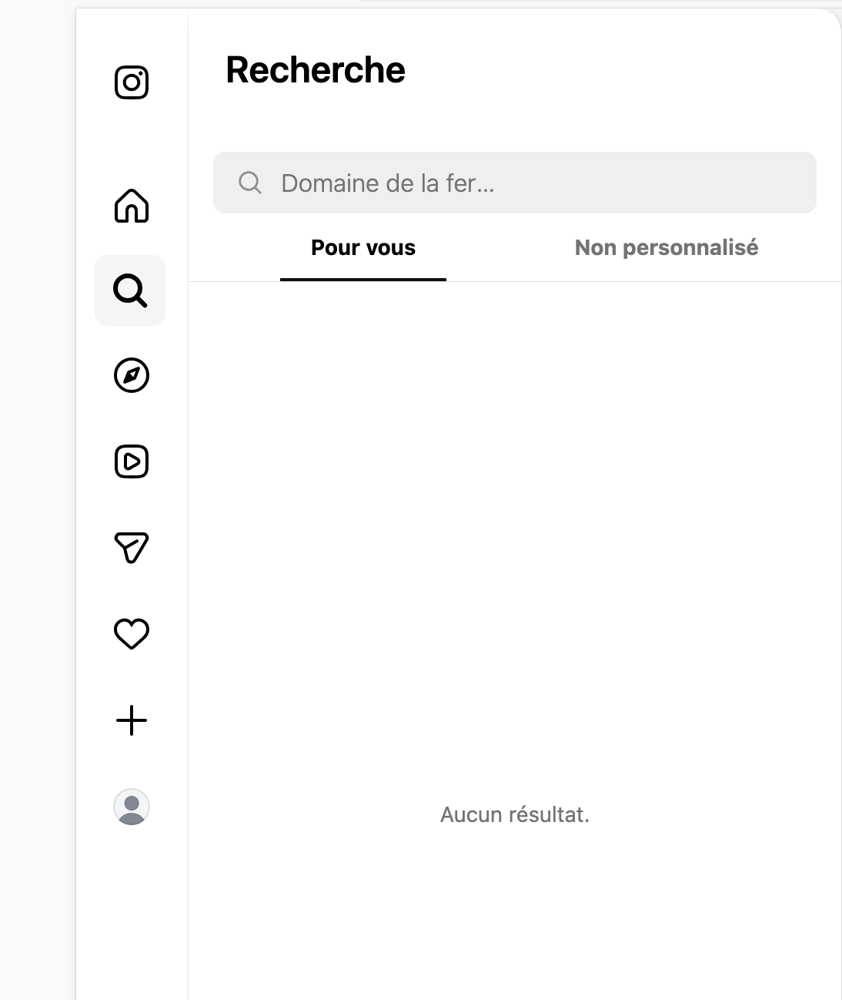

En revanche, avec la version mobile, la recherche par `Lieux` est possible ; nous recherchons donc l'adresse `Domaine de la ferme blanche` et nous sélectionnons `Lieux` :

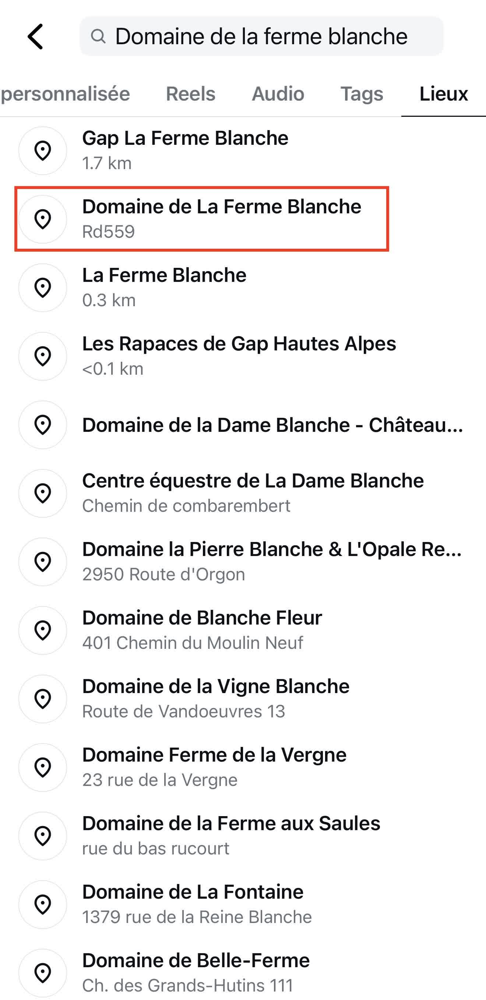

Après la validation de l'adresse, nous remarquons deux types de posts Instagram : `Populaire` et `Récent`. La catégorie `Populaire` est celle qui nous intéresse :

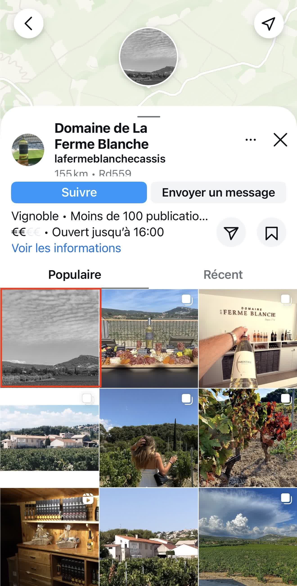

Et enfin nous sélectionnons le post qui contient une photo qui ressemble très fortement au `lieu de la réunion` :

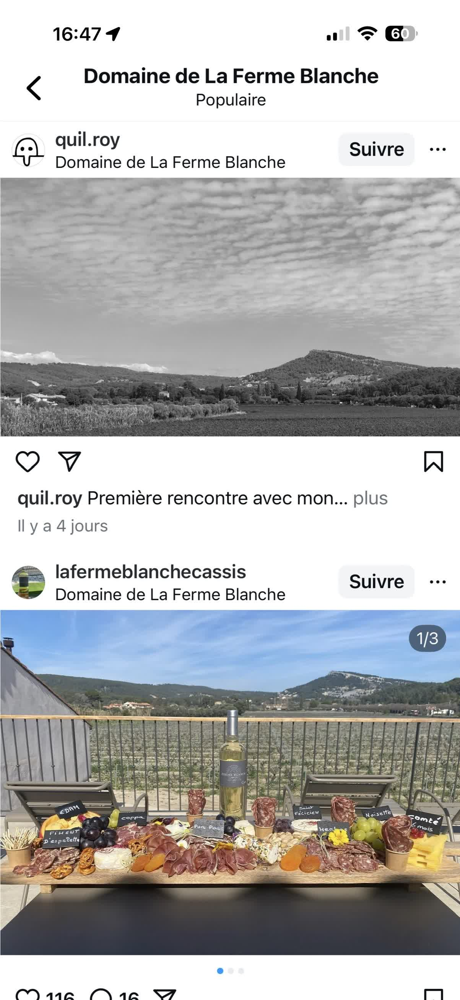

Nous pouvons donc maintenant récupérer le nom du compte Instagram, qui est le pseudo de notre jeune recrue !
Pour contourner le bouton ayant disparu, il est néanmoins possible de faire une dork associée :
`site:https://www.instagram.com/explore/locations/ "la ferme blanche"`

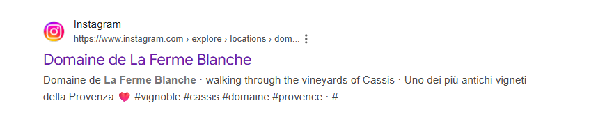

On tombe directement sur le lieu des images géotaguées ; en sélectionnant le bouton `Récent`, il est possible d'atteindre la photo
du pentester indélicat.

## Résolution via navigateur WEB

Dans la barre de recherche `Instagram` (version web), procéder à une recherche par **la ferme blanche** :

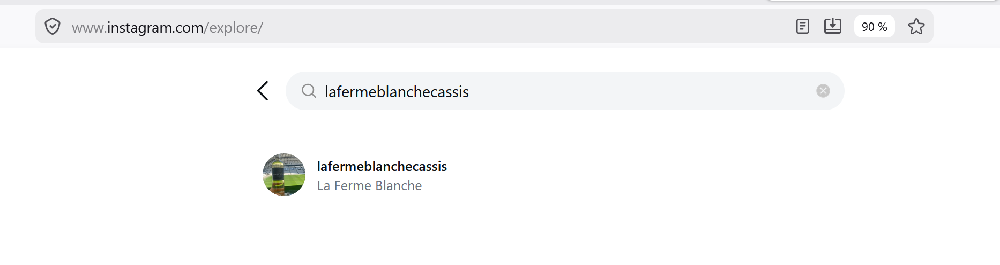

On arrive sur leur compte Instagram :

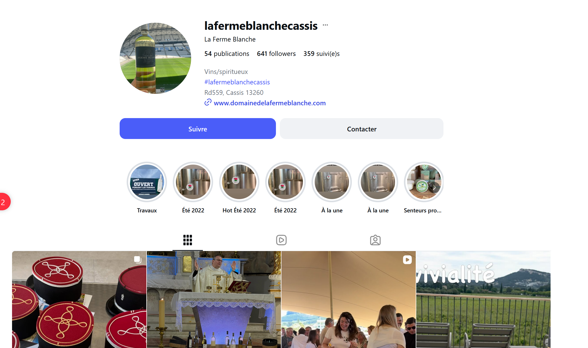

Il faut parcourir toutes les images jusqu'à arriver à celle avec la bouteille de vin blanc :

Sur la photo en question, sous le nom, l'image est géotaguée :

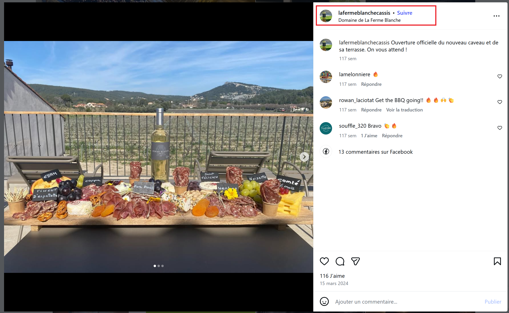

On arrive sur la carte des images géotaguées sur ce lieu :

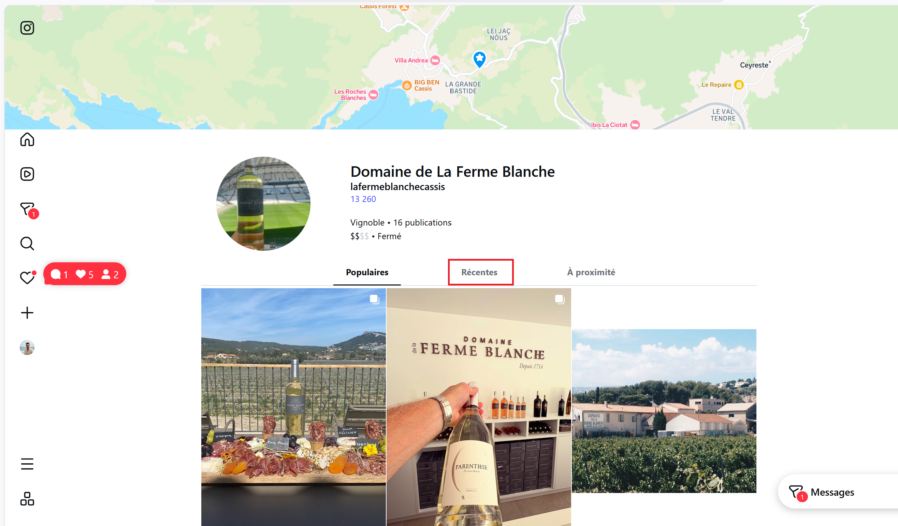

Dans les photos récentes, une en noir et blanc attire notre attention (la même que celle identifiée dans le challenge `Briefing d'équipe`).

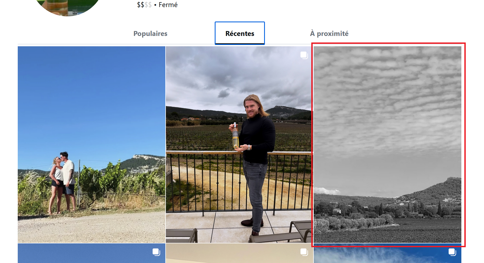
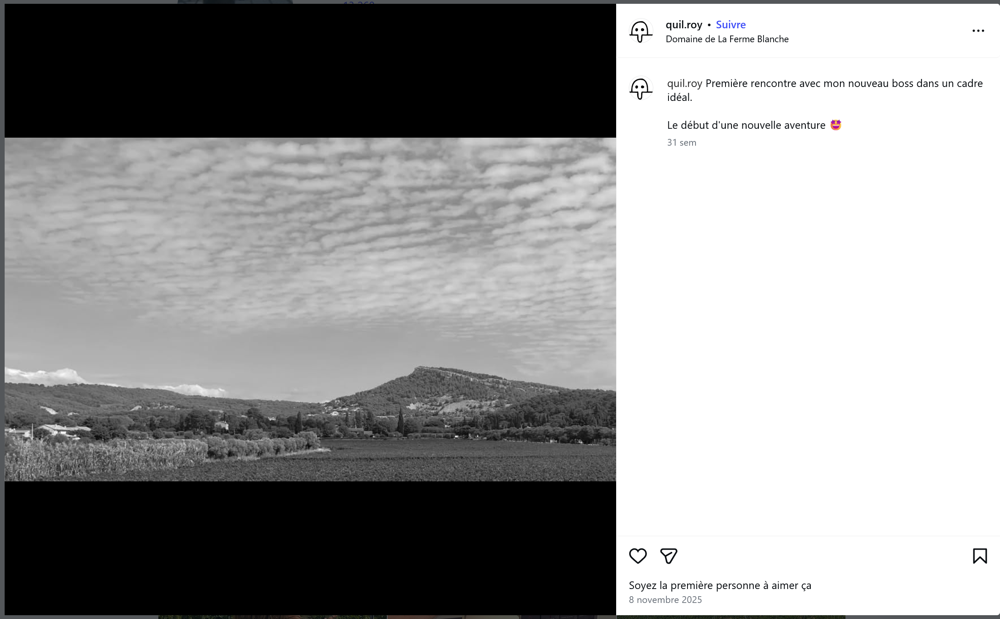

Nous avons notre jeune pentester (déjà connu des services lors du CTE v1).

## Résultat

Pour mémoire, lors de la précédente enquête du CTE, nous avions déjà un individu qui se fait appeler `quilroy` ou `quil.roy` et qui n'a pas
été arrêté.

✅ **Preuve :** `quilroy` ou `quil.roy` (les deux sont acceptés).
