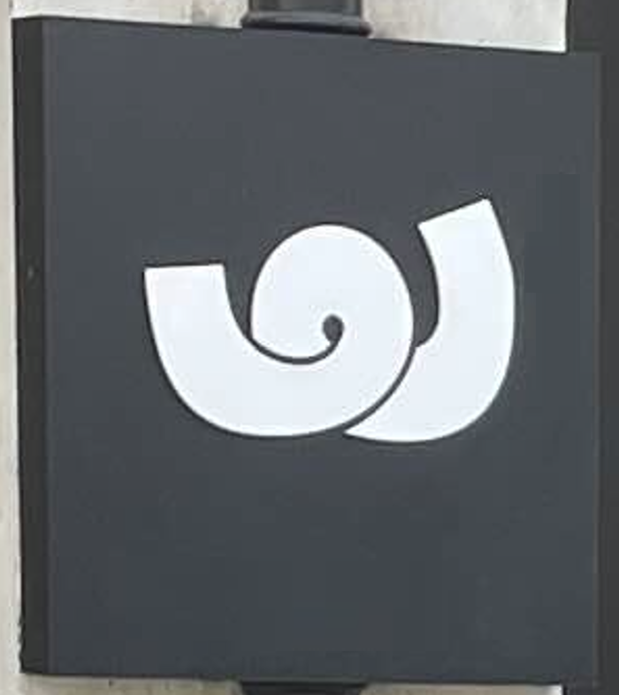
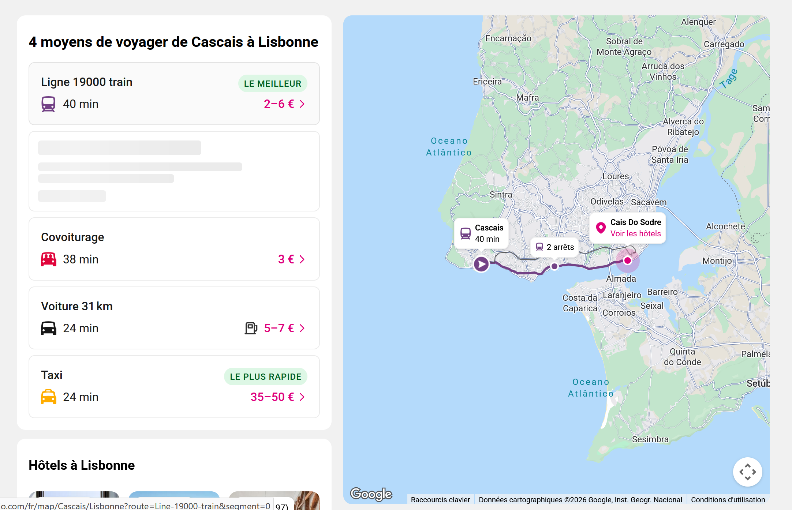
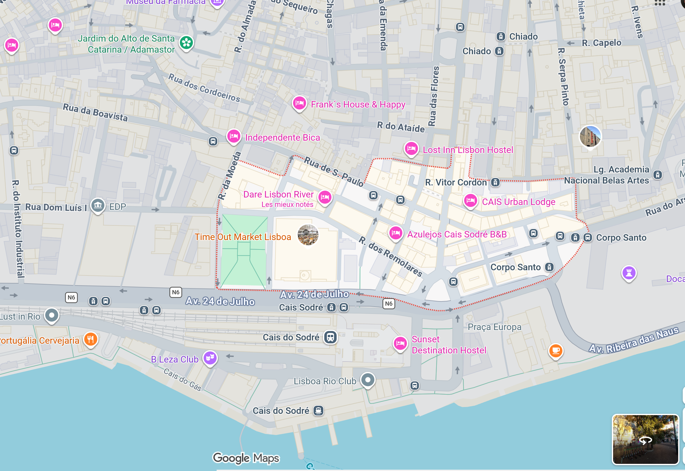
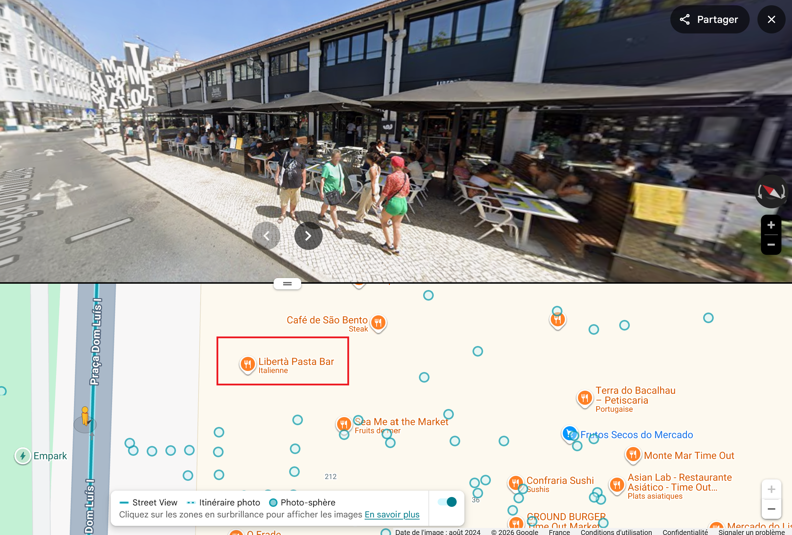

# Challenge : Lieu d'échange

## Informations du challenge

| Catégorie | Difficulté | Points | Auteur |
|-----------|------------|--------|--------|
| Osint | Moyen | 200 | B3cha |

**Preuve :** `Libertà Pasta Bar` (insensible à la casse)

---

## Résumé

Dans ce challenge, il faut déduire le lieu du rendez-vous entre **Miguel** et **Henri** pour ensuite arpenter les rues et trouver le restaurant.
Les recherches en image inversée sur Google ne donnent pas de résultats probants.

## Déduction du lieu de rendez-vous

Nous démarrons notre challenge avec le logo du restaurant à rechercher :

Dans le challenge `Rendez-vous imminent`, **Miguel** avait rendez-vous avec **Henri** à Lisbonne.
On voit **Miguel** en train d'attendre sur le quai du train.

Une recherche sur le bâtiment visible permet d'identifier clairement la gare d'Estoril (côté direction Cascais - Lisbonne).
Les recherches sur le site https://www.rome2rio.com/fr/ permettent de trouver la gare d'arrivée.

En positionnant le parcours de sécurité demandé à Miguel, les points s'alignent pour former un parcours partant de la gare `Cais do Sodre`.
Nous démarrons donc tout logiquement nos recherches à partir de ce point de départ.

## Recherche rue par rue

En sortant de la gare, deux directions sont possibles : partir à droite ou partir à gauche.
En se souvenant du challenge `Proche du ciel`, l'avion est exposé du côté gauche de la gare.
On remarque sur la carte, juste face à la gare, des halles avec des commerces.

Commençons par inspecter les lieux : avant de visiter l'intérieur, nous allons faire un tour de l'extérieur.
On se retrouve nez à nez avec le restaurant qui a le même logo que celui que nous recherchons :

Il s'agit d'un restaurant **italien**, rien d'étonnant quand on connaît les origines italiennes de **Henri NAPOLINO**.

Sur la photo, le nom de l'établissement est : `Libertà Pasta Bar`. Après une boucle de sécurité, Henri et ses hommes surveillaient Miguel depuis sa descente du train. Il a fait une boucle pour revenir au point de départ (proche de la gare `Cais do Sodre`).

---

## Résultat

La solution de notre challenge est le nom du restaurant situé dans les halles face à la gare de train `Cais do Sodré`.

✅ **Preuve :** `Libertà Pasta Bar` (insensible à la casse)
