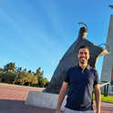
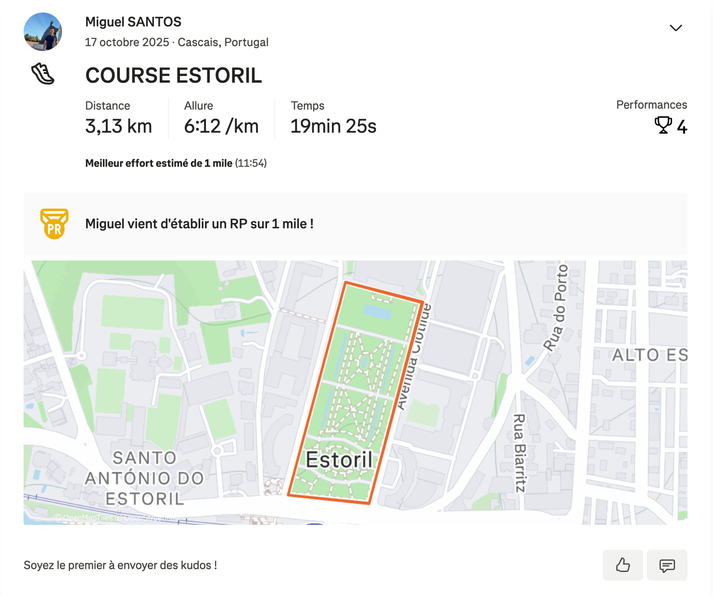
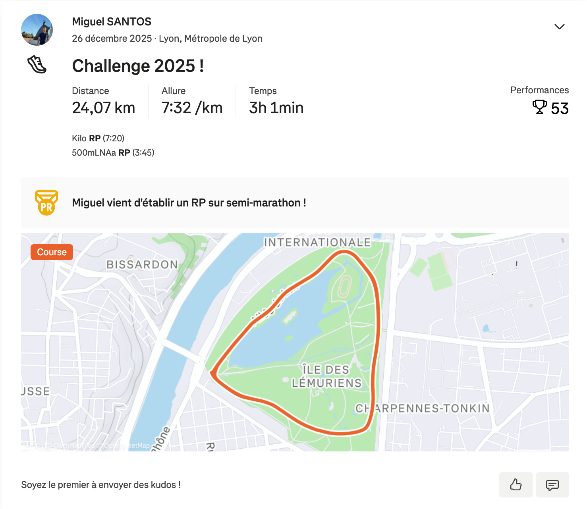
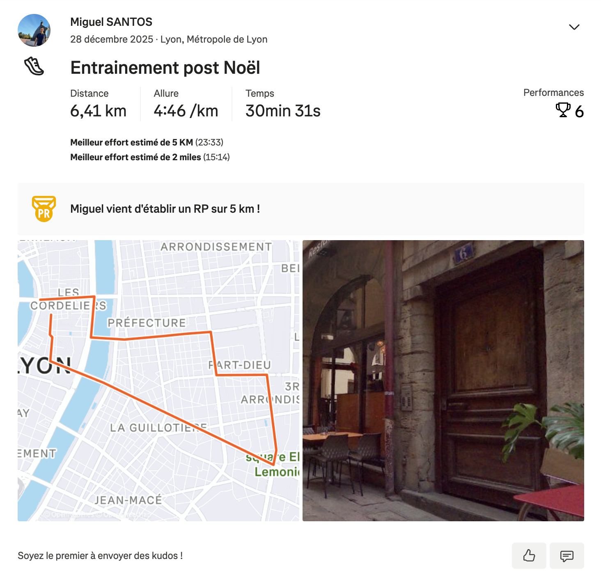

# Challenge : Nid urbain

## Informations du challenge

| Catégorie | Difficulté | Points | Auteur |
|-----------|------------|--------|--------|
| Osint | Facile | 200 | Debunk |

**Preuve :** `45.76192242742382,4.832446092086431`

---

## Résumé

Ce challenge nécessite de trouver les comptes Instagram et Strava de `Miguel SANTOS` afin de localiser son domicile à l'aide d'une course effectuée non loin de celui-ci.
1. **Instagram** - identifier le compte Instagram qui permet d'obtenir la photo de profil de `Miguel SANTOS`
2. **Strava** - trouver le compte Strava de `Miguel SANTOS`
3. **Localiser le domicile** - à partir des tracés Strava, retrouver le domicile de Miguel.

---

## Étape 1 : Identifier le compte Instagram

Suite au challenge intitulé 'Pseudo alibi' (le challenge ne porte pas sur l'Instagram de Miguel, mais l'asset est trouvé dans ce challenge), nous récupérons le compte Instagram ainsi que la photo de profil de `Miguel SANTOS`.

## Étape 2 : Trouver le compte Strava

Nous savons que `Miguel SANTOS` possède plusieurs réseaux sociaux et qu'il aime faire du sport (course au Portugal), ce qui nous amène à chercher un réseau social comportant des activités sportives.
Cela nous conduit à trouver son compte Strava à l'aide de sa photo de profil Instagram : https://www.strava.com/athletes/198017512

## Étape 3 : Localiser le domicile

Nous remarquons que sa première course, en OCTOBRE, se situe à `ESTORIL au PORTUGAL`.

Nous remarquons aussi une course en DÉCEMBRE à `LYON` :

Pour finir, une course encore à Lyon qui semble très spécifique, car celle-ci a une photo en pièce jointe :

✅ **Preuve :** `45.76192242742382,4.832446092086431`
