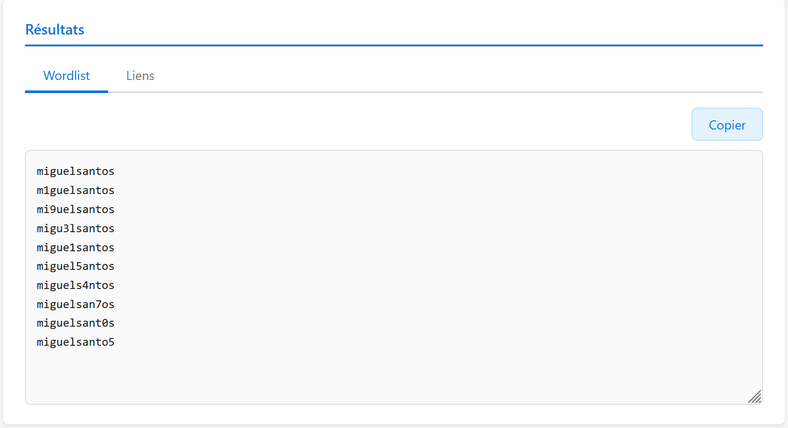
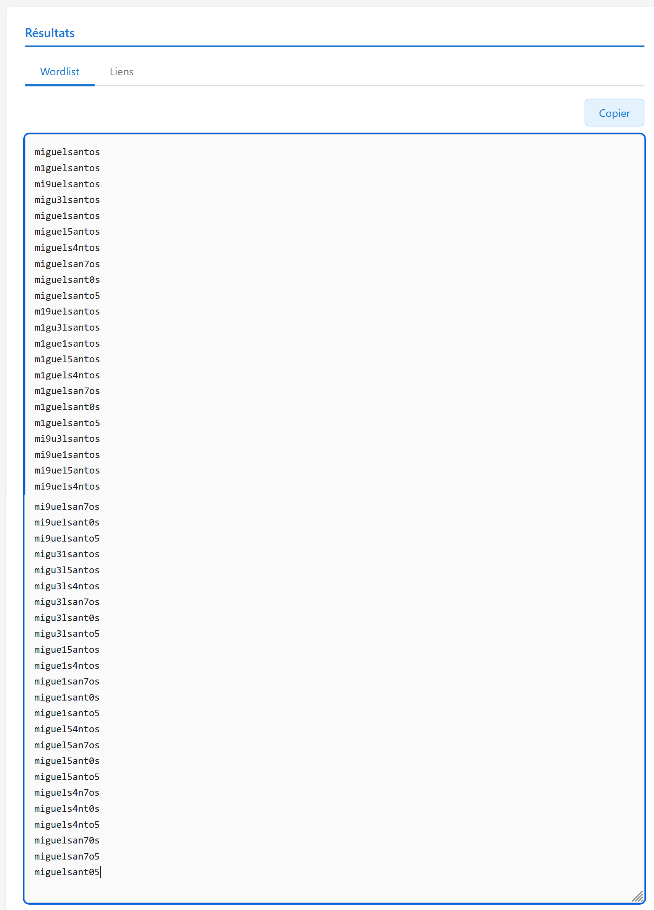
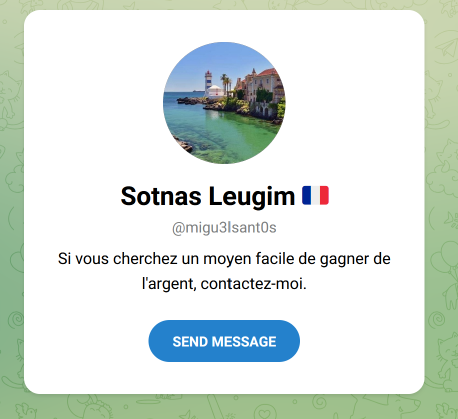
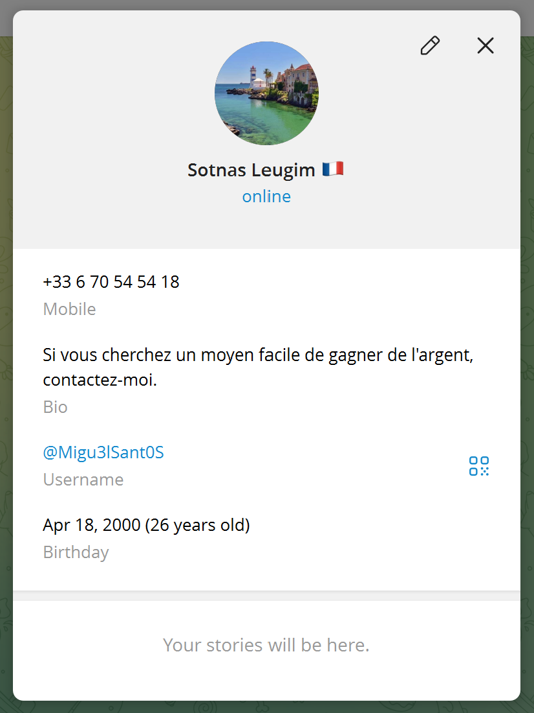
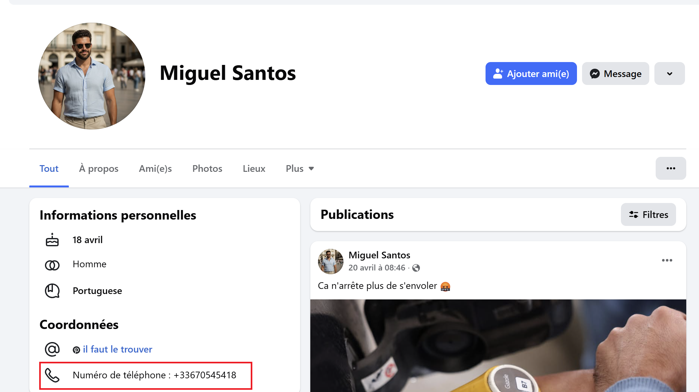

## Challenge : Numéro d'appel

## Informations du challenge

| Catégorie | Difficulté | Points | Auteur |
|-----------|------------|--------|--------|
| Osint | Moyen | 150 | B3cha |

**Preuve :** `0670545418`

---

## Résumé

Ce challenge nécessite de retrouver le compte Telegram de **Miguel** ; le numéro de téléphone a servi à créer ce compte Telegram.

Ce challenge est de niveau de difficulté facile (haut), car il faut tester plusieurs variantes du pseudo de Miguel pour trouver son compte Telegram. Gardons à l'esprit que Telegram est souvent utilisé pour conduire des activités sur lesquelles on souhaite garder une certaine forme d'anonymat. C'est donc tout à fait logique d'utiliser des variantes de son nom, prénom ou pseudo pour être identifié sur ce réseau social.

À l'inverse de Facebook ou LinkedIn, dont l'objectif est d'entrer en contact avec des amis ou des contacts professionnels, et où il est donc tout naturel de s'inscrire avec son identité réelle.

## Méthode 1 : Recherche du compte Telegram de Miguel

Comme lors du challenge `Banque Root`, nous allons réutiliser l'outil `hammer` https://nikoko107.github.io/hammer/ pour produire toutes les variantes possibles en leetspeak du pseudonyme de **Miguel SANTOS**.

Commençons d'abord par une distance de Hamming de 1, c'est-à-dire **une** substitution :



Puis passons à une distance de Hamming de 2, c'est-à-dire **deux** substitutions :



Puis ajoutons la partie url Telegram :
```shell
...
https://t.me/mi9uelsanto5
https://t.me/migu31santos
https://t.me/migu3l5antos
https://t.me/migu3ls4ntos
https://t.me/migu3lsan7os
       **https://t.me/migu3lsant0s**
https://t.me/migu3lsanto5
https://t.me/migue15antos
https://t.me/migue1s4ntos
...
```
Puis il suffit de tester chaque URL, jusqu'à obtenir un résultat valide.



Le message sur le compte est explicite : **Si vous cherchez un moyen facile de gagner de l'argent, contactez-moi.**

Le nom du compte est `Sotnas Leugim` ; en le lisant de droite à gauche, ceci nous donne `migueL santoS`.

En affichant les informations détaillées du profil, on peut y lire le numéro de téléphone de Miguel `+33 6 70 54 54 18`.



## Confirmation de la ligne

Le CTE v2 sous-entend qu'il y a un possible lien avec le CTE v1. Lors de la précédente édition, le chef de groupe criminel **Henri NAPOLINP** possédait la ligne téléphonique suivante : `+33 6 70 54 54 18`. En fonction de votre niveau d'avancement dans l'enquête, certaines équipes sont tombées sur le compte de Henri Napolino par une recherche du mot-clé `Fantasmas de Redes` (car son profil indique CEO_Fantasmas-de-redes). Donc ce n'est pas déconnant de rechercher les informations sur ce Henri issu de la première édition du CTE.
Les archives sont aussi une source d'information très utilisée par les enquêteurs. Il faut parfois savoir rouvrir des dossiers anciens.

Pour vérifier si cette ligne est toujours active, il faut mettre le numéro sur l'url telegram `t.me/+33670545418` : on tombe exactement sur le compte Telegram de Miguel identifié à l'étape 1. Cette technique facile évite d'utiliser des outils payants comme **OsintIndustrie** ou **Epios** afin de trouver le compte Telegram associé.

Nota : il est également possible de vérifier les autres numéros de téléphone de la V1, mais cela ne donnera rien d'intéressant.

Au passage, la date de naissance de Miguel est aussi mentionnée, le 18 avril 2000 (26 ans) ; cette information sera demandée pour résoudre le challenge `Biodata`.

En respectant le format de la preuve, la réponse attendue est `0670545418`.

## Méthode 2 : Recherche du compte Facebook de Miguel

Cette méthode est beaucoup plus facile et évidente, car le numéro de téléphone de Miguel est simplement écrit sur son profil. D'où l'identification du challenge comme un chall `Facile`.

En cherchant sur Facebook tous les comptes au nom de **Miguel SANTOS**, on trouve deux comptes :
1. https://www.facebook.com/@miguel.santos.299650
2. https://www.facebook.com/profile.php?id=61582916518941

L'astuce ici réside dans le fait de ne pas s'arrêter au premier compte trouvé. Il arrive souvent qu'une personne possède plusieurs comptes sur un même réseau social. Les raisons à cela peuvent être multiples : rechercher d'autres cercles d'amis, cacher des activités, un compte bloqué, etc.

Son profil indique clairement son numéro de téléphone `0670545418`. Une seconde confirmation que cette ligne est bien celle de Miguel SANTOS.



### Résultat

La solution de notre challenge est le numéro de téléphone trouvé sur les comptes Facebook et Telegram de Miguel :

✅ **Preuve :** `0670545418`
