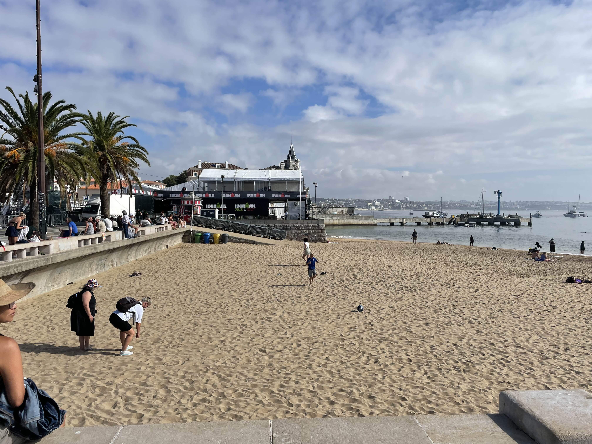
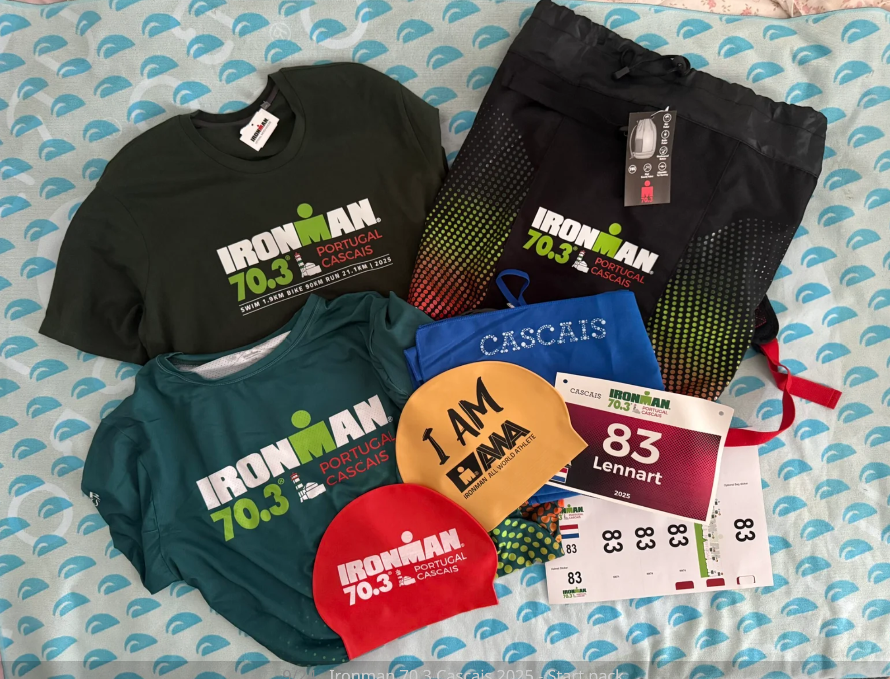
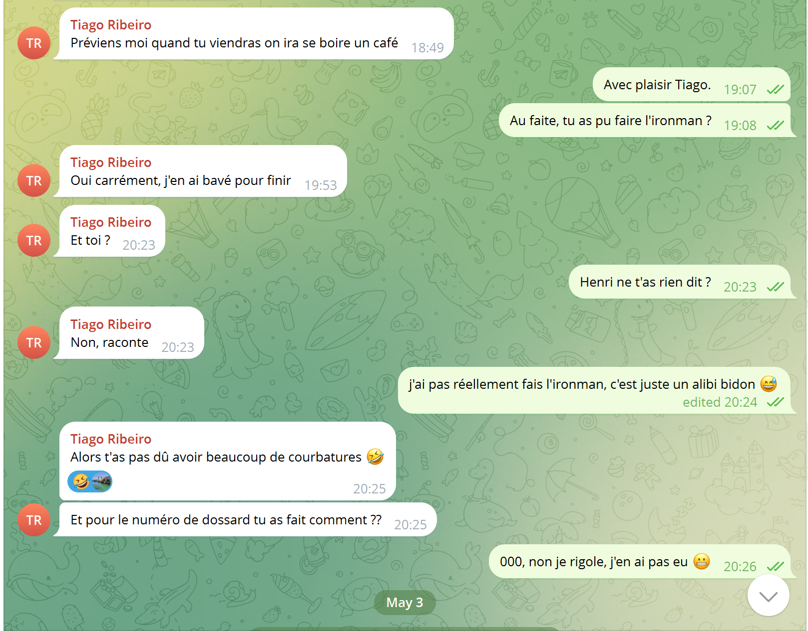

# Challenge : Numéro fétiche

## Informations du challenge

| Catégorie | Difficulté | Points | Auteur |
|-----------|------------|--------|--------|
| GoogleInt | Facile | 100 | B3cha |

**Preuve :** `000` ou `aucun`

---

## Résumé

Ce challenge Osint nécessite de la déduction. Le croisement des différentes dates et informations montre que Miguel s'est rendu à **Cascais** un jour après l'IRONMAN 2025.
Par conséquent, Miguel n'a pas eu de dossard.

---

## Analyse et déduction

L'énoncé du challenge `Pseudo alibi` précise les dates de séjour de Miguel au Portugal : du 18/10/2025 au 25/10/2025.
En cherchant sur internet les dates de l'IRONMAN 2025 https://www.ironman.com/races/im-cascais, le site officiel indique que la course s'est tenue le **17 octobre 2025**.
L'investigation indique que Miguel est arrivé à Lisbonne le **samedi 18 octobre 2025** dans l'après-midi et a rejoint son hôtel à Estoril vers **19h47** (d'après la preuve du challenge `Point de chute`).
Il est donc impossible que Miguel ait participé à la course. La photo du point d'arrivée postée par Miguel sur son compte Pinterest a été prise le 18/10/2025 d'après ses métadonnées : jour de remise des trophées.

D'ailleurs, comme tout coureur fier d'avoir terminé l'IRONMAN 2025, il n'aurait pas hésité une seconde à poster son maillot de course.

## Confirmation du flag

Sur le canal Telegram du groupe `Fantasmas-de-Redes`, une conversation entre Miguel et Tiago ne laisse aucun doute.

Le numéro de dossard prétendu par Miguel est bien `000`. Le flag `aucun` est également accepté.
La participation de Miguel à l'IRONMAN 2025 à Cascais est bien un alibi (pas très bien justifié, d'ailleurs).

### Résultat

La solution de notre challenge est `aucun`, car Miguel a utilisé la course comme alibi pour se rendre au Portugal.

✅ **Preuve :** `000` ou `aucun`
