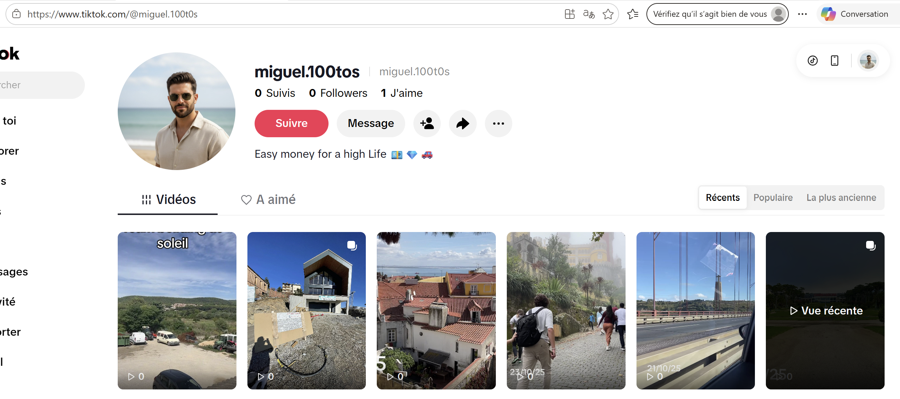
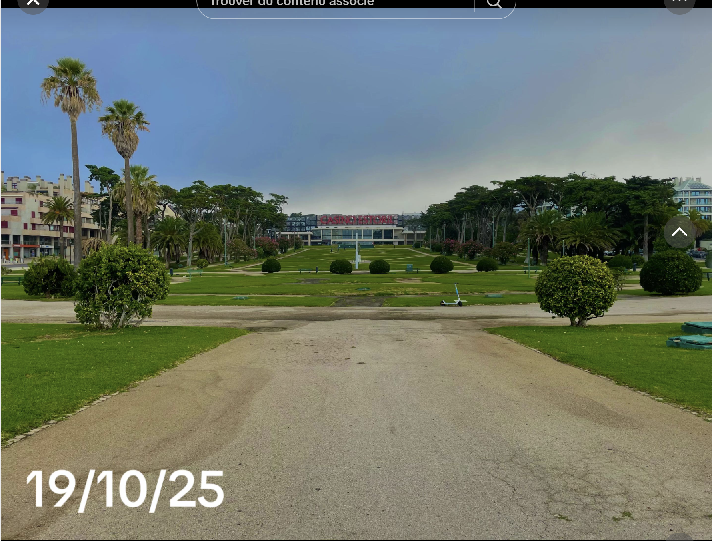
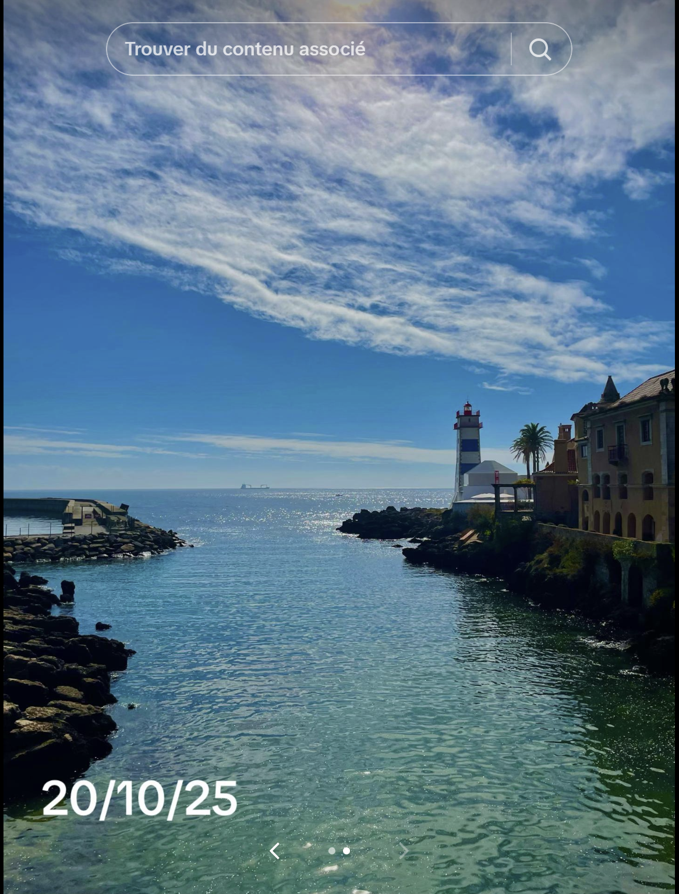
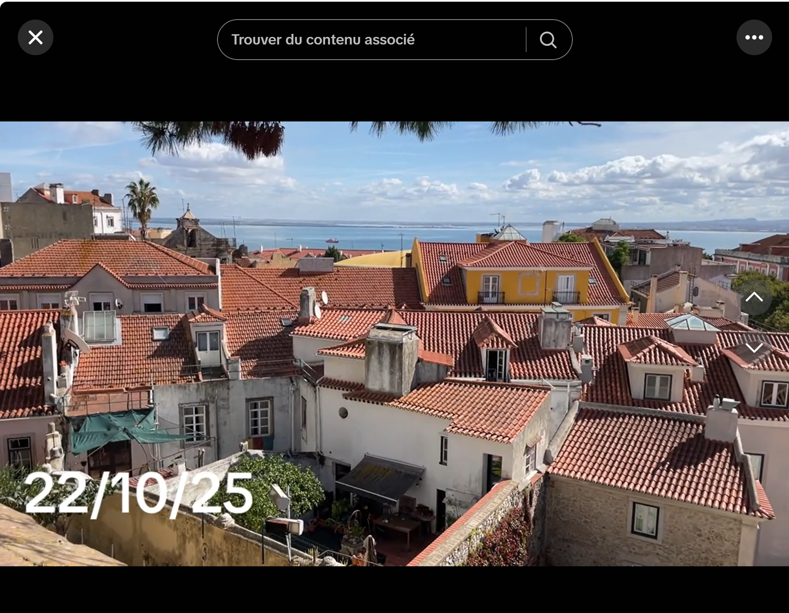
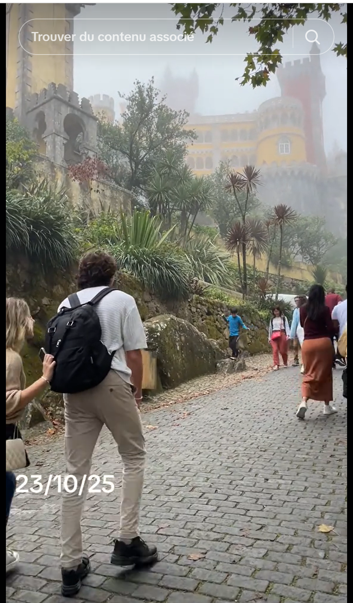

# Challenge : Parcours de visite

## Informations du challenge

| Catégorie | Difficulté | Points | Auteur |
|-----------|------------|--------|--------|
| Osint | Moyen | 350 | B3cha |

**Preuve :** `Estoril-Cascais-Lisbonne-Sintra` (insensible à la casse)
ou `Estoril-Cascais-Lisboa-Sintra` en portugais, également accepté.

---

## Résumé

Dans ce challenge, il est nécessaire de trouver le second compte `TikTok` de Miguel pour identifier l'ordre des villes visitées.

## Identification du compte TikTok de Miguel

Lors des challenges précédents, nous avons identifié les deux comptes `TikTok` de Miguel :
1. https://www.tiktok.com/@miguel.100tos
2. https://www.tiktok.com/@miguel.100t0s

La seule différence entre les deux comptes est l'avant-dernier caractère `o`, qui devient un `0`.

Et le second compte :

## Analyse du contenu du compte TikTok

En visionnant les différentes vidéos du compte, certaines portent une date :
1. 19/10/2025 - **Estoril**

2. 20/10/2025 - **Cascais**

3. 21/10/2025 et 22/10/2025 - **Lisbonne**

4. 23/10/2025 - **Sintra**

La localisation de chacune des images s'effectue en les rapprochant des événements de l'histoire (agenda Google, check-in à l'hôtel, etc.).
L'ordre chronologique de visite des villes par Miguel est : `Estoril-Cascais-Lisbonne-Sintra`.

---

## Résultat

La solution de notre challenge est la liste chronologique des lieux visités par Miguel.

✅ **Preuve :** `Estoril-Cascais-Lisbonne-Sintra` (insensible à la casse)
ou `Estoril-Cascais-Lisboa-Sintra` en portugais, également accepté.
