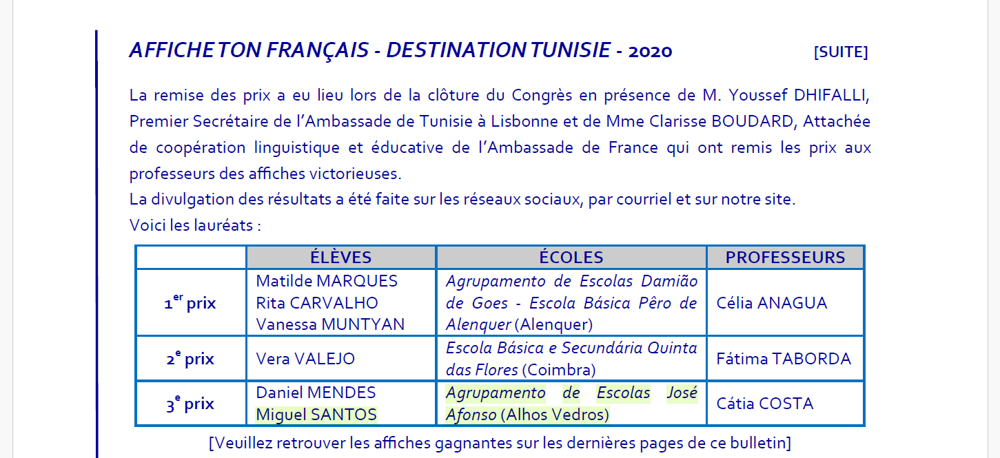

## Challenge : Parcours scolaire

## Informations du challenge

| Catégorie | Difficulté | Points | Auteur |
|-----------|------------|--------|--------|
| Osint | Moyen | 200 | B3cha |

**Preuve :** `Agrupamento de Escolas José Afonso (Alhos Vedros)`

## Résumé

Ce challenge nécessite de retrouver sur internet un document qui mentionne la scolarité de **Miguel SANTOS**.

## Recherche sur Google

### Dorks

Sur le navigateur Google, recherchez avec la chaîne suivante : `Lyon + "Miguel SANTOS" école`
Après une analyse approfondie de chaque lien, le 5e résultat `En direct de l' | APPF` propose un fichier **pdf** à analyser :

L'URL du fichier à télécharger est la suivante : https://www.google.com/url?sa=t&source=web&rct=j&opi=89978449&url=https://www.appf.pt/wp-content/uploads/2021/07/46.pdf&ved=2ahUKEwjA5cCSgNaRAxV4KvsDHcvzAWcQFnoECDYQAQ&usg=AOvVaw11QyOnJVgp7OCPezoITAzf

Une fois le fichier <a href="docs/46.pdf">46.pdf</a> téléchargé, une recherche CTRL+F "Miguel SANTOS" permet de trouver un résultat à la Página 5 :

La source indique que `Miguel SANTOS` a obtenu le **3e prix**, dans l'école maternelle.
Son enseignante se nommait `Mme Cátia COSTA` ; elle était fière de lui car il a remporté le `3ème prix`.
La ville de scolarité de Miguel est `(Alhos Vedros)`, qu'il est possible de confirmer via le compte Facebook :

La preuve recherchée est dans le tableau, colonne **ECOLE**. À recopier telle quelle.

## Résultat

La solution de notre challenge est : `Agrupamento de Escolas José Afonso` et la ville `(Alhos Vedros)`

✅ **Preuve :** `Agrupamento de Escolas José Afonso (Alhos Vedros)`
