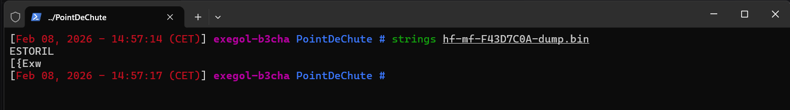
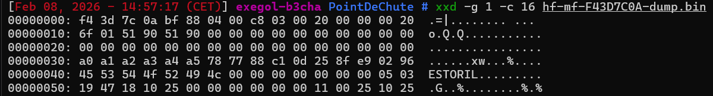
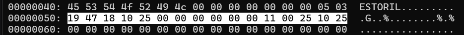
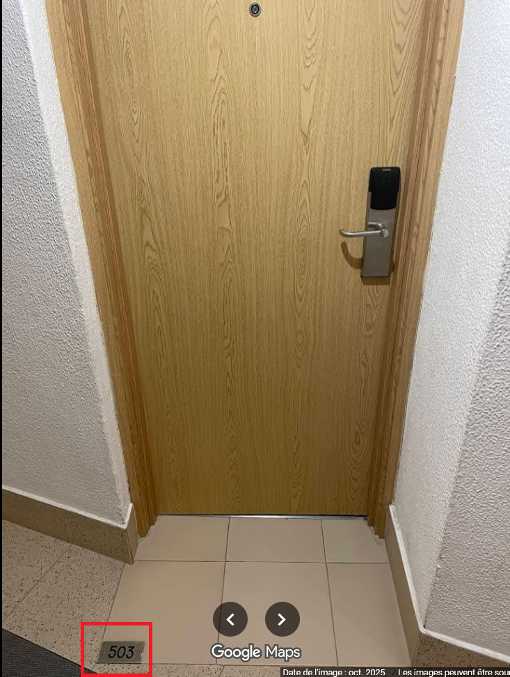

## Challenge : Point de chute

## Informations du challenge

| Catégorie | Difficulté | Points | Auteur |
|-----------|------------|--------|--------|
| Forensic | Moyen | 200 | Samy & B3cha |

**Preuve :** `503-19h47_18/10/2025-11h00_25/10/2025`

## Résumé

Ce challenge nécessite de mobiliser les compétences suivantes :

1. **Technologie sans contact** - NFC de type Mifare Classic (grâce à hf-mf)
2. **Reverse du dump** - analyse de l'hexa avec `xxd`
3. **Forensic** - étude du byte code en s'aidant de la datasheet Mifare Classic

---

## Étape 1 : Recherche des Strings

### Analyse élémentaire

Le fichier s'appelle `hf-mf-F43D7C0A-dump.bin` ; après une recherche Google, cela ressemble au format de fichier d'un dump d'une carte NFC de type Mifare Classic (grâce à hf-mf) généré par un outil de type **Proxmark**.

Commençons par passer le binaire à la commande `strings` :



On remarque la présence du mot `ESTORIL`, du nom de l'hôtel **Londres Estoril**.

Un strings sur le fichier renvoie le nom ESTORIL ; le fichier semble contenir de la donnée de type hexadécimal, dont une partie lisible en ASCII (ESTORIL).

### Analyse Mifare Classic

En recherchant Mifare sur internet, on trouve la <a href="docs/MF1S50YYX_V1.pdf">datasheet de la Mifare Classic</a>, qui semble être la carte la plus répandue et qui explique qu'un dump est structuré de la sorte :
- 16 secteurs (numérotés 0 à 15) de 4 blocs chacun (numérotés 0 à 3)
- 16 octets par bloc
- le 4e bloc de chaque secteur contient les clés de lecture/écriture (clé A/B)

---

## Étape 2 : Utilisation de la commande XXD

### Analyse approfondie

Avec XXD, on peut afficher le .bin en respectant la structure d'un dump Mifare Classic pour faciliter la lecture :
```shell
xxd -g 1 -c 16 hf-mf-F43D7C0A-dump.bin
```



L'explication des arguments de la commande :
- `-g 1` : regroupe les octets par groupes de *1* octet
- `-c 16` : place `<cols>` octets par ligne. 16 par défaut

Ces paramètres correspondent à la spécification issue de la datasheet d'une carte NFC de type Mifare Classic.

**Dump : résultat complet**
```bash
00000000: f4 3d 7c 0a bf 88 04 00 c8 03 00 20 00 00 00 20  .=|........ ...
00000010: 6f 01 51 90 51 90 00 00 00 00 00 00 00 00 00 00  o.Q.Q...........
00000020: 00 00 00 00 00 00 00 00 00 00 00 00 00 00 00 00  ................
00000030: a0 a1 a2 a3 a4 a5 78 77 88 c1 0d 25 8f e9 02 96  ......xw...%....
00000040: 45 53 54 4f 52 49 4c 00 00 00 00 00 00 00 05 03  ESTORIL.........
00000050: 19 47 18 10 25 00 00 00 00 00 00 11 00 25 10 25  .G..%........%.%
00000060: 00 00 00 00 00 00 00 00 00 00 00 00 00 00 00 00  ................
00000070: 0a ee 6e 2e de b7 78 77 88 01 9b b9 6c 07 71 4a  ..n...xw....l.qJ
00000080: 00 00 00 00 00 00 00 00 00 00 00 00 00 00 00 00  ................
00000090: 00 00 00 00 00 00 00 00 00 00 00 00 00 00 00 00  ................
000000a0: 00 00 00 00 00 00 00 00 00 00 00 00 00 00 00 00  ................
000000b0: a0 a1 a2 a3 a4 a5 78 77 88 05 9b b9 6c 07 71 4a  ......xw....l.qJ
000000c0: 00 00 00 00 00 00 00 00 00 00 00 00 00 00 00 00  ................
000000d0: 00 00 00 00 00 00 00 00 00 00 00 00 00 00 00 00  ................
000000e0: 00 00 00 00 00 00 00 00 00 00 00 00 00 00 00 00  ................
000000f0: ff ff ff ff ff ff ff 07 80 69 ff ff ff ff ff ff  .........i......
00000100: 00 00 00 00 00 00 00 00 00 00 00 00 00 00 00 00  ................
00000110: 00 00 00 00 00 00 00 00 00 00 00 00 00 00 00 00  ................
00000120: 00 00 00 00 00 00 00 00 00 00 00 00 00 00 00 00  ................
00000130: ff ff ff ff ff ff ff 07 80 69 ff ff ff ff ff ff  .........i......
00000140: 00 00 00 00 00 00 00 00 00 00 00 00 00 00 00 00  ................
00000150: 00 00 00 00 00 00 00 00 00 00 00 00 00 00 00 00  ................
00000160: 00 00 00 00 00 00 00 00 00 00 00 00 00 00 00 00  ................
00000170: ee b4 20 20 9d 0c 78 77 88 00 ee b4 20 20 9d 0c  ..  ..xw....  ..
00000180: 00 00 00 00 00 00 00 00 00 00 00 00 00 00 00 00  ................
00000190: 00 00 00 00 00 00 00 00 00 00 00 00 00 00 00 00  ................
000001a0: 00 00 00 00 00 00 00 00 00 00 00 00 00 00 00 00  ................
000001b0: 91 1e 52 fd 7c e4 78 77 88 00 91 1e 52 fd 7c e4  ..R.|.xw....R.|.
000001c0: 00 00 00 00 00 00 00 00 00 00 00 00 00 00 00 00  ................
000001d0: 00 00 00 00 00 00 00 00 00 00 00 00 00 00 00 00  ................
000001e0: 00 00 00 00 00 00 00 00 00 00 00 00 00 00 00 00  ................
000001f0: 75 2f bb 5b 7b 45 78 77 88 00 75 2f bb 5b 7b 45  u/.[{Exw..u/.[{E
00000200: 00 00 00 00 00 00 00 00 00 00 00 00 00 00 00 00  ................
00000210: 00 00 00 00 00 00 00 00 00 00 00 00 00 00 00 00  ................
00000220: 00 00 00 00 00 00 00 00 00 00 00 00 00 00 00 00  ................
00000230: 66 b0 3a ca 6e e9 78 77 88 00 66 b0 3a ca 6e e9  f.:.n.xw..f.:.n.
00000240: 00 00 00 00 00 00 00 00 00 00 00 00 00 00 00 00  ................
00000250: 00 00 00 00 00 00 00 00 00 00 00 00 00 00 00 00  ................
00000260: 00 00 00 00 00 00 00 00 00 00 00 00 00 00 00 00  ................
00000270: 48 73 43 89 ed c3 78 77 88 00 48 73 43 89 ed c3  HsC...xw..HsC...
00000280: 00 00 00 00 00 00 00 00 00 00 00 00 00 00 00 00  ................
00000290: 00 00 00 00 00 00 00 00 00 00 00 00 00 00 00 00  ................
000002a0: 00 00 00 00 00 00 00 00 00 00 00 00 00 00 00 00  ................
000002b0: 17 19 37 09 ad f4 78 77 88 00 17 19 37 09 ad f4  ..7...xw....7...
000002c0: 00 00 00 00 00 00 00 00 00 00 00 00 00 00 00 00  ................
000002d0: 00 00 00 00 00 00 00 00 00 00 00 00 00 00 00 00  ................
000002e0: 00 00 00 00 00 00 00 00 00 00 00 00 00 00 00 00  ................
000002f0: 1a cc 31 89 57 8c 78 77 88 00 1a cc 31 89 57 8c  ..1.W.xw....1.W.
00000300: 00 00 00 00 00 00 00 00 00 00 00 00 00 00 00 00  ................
00000310: 00 00 00 00 00 00 00 00 00 00 00 00 00 00 00 00  ................
00000320: 00 00 00 00 00 00 00 00 00 00 00 00 00 00 00 00  ................
00000330: c2 b7 ec 7d 4e b1 78 77 88 00 c2 b7 ec 7d 4e b1  ...}N.xw.....}N.
00000340: 00 00 00 00 00 00 00 00 00 00 00 00 00 00 00 00  ................
00000350: 00 00 00 00 00 00 00 00 00 00 00 00 00 00 00 00  ................
00000360: 00 00 00 00 00 00 00 00 00 00 00 00 00 00 00 00  ................
00000370: 36 9a 46 63 ac d2 78 77 88 00 36 9a 46 63 ac d2  6.Fc..xw..6.Fc..
00000380: 00 00 00 00 00 00 00 00 00 00 00 00 00 00 00 00  ................
00000390: 00 00 00 00 00 00 00 00 00 00 00 00 00 00 00 00  ................
000003a0: 00 00 00 00 00 00 00 00 00 00 00 00 00 00 00 00  ................
000003b0: ff ff ff ff ff ff ff 07 80 69 ff ff ff ff ff ff  .........i......
000003c0: 00 00 00 00 00 00 00 00 00 00 00 00 00 00 00 00  ................
000003d0: 00 00 00 00 00 00 00 00 00 00 00 00 00 00 00 00  ................
000003e0: 00 00 00 00 00 00 00 00 00 00 00 00 00 00 00 00  ................
000003f0: ff ff ff ff ff ff ff 07 80 69 ff ff ff ff ff ff  .........i......
```

### Analyse

En zoomant sur les blocs hexa du code qui nous intéresse :



Ainsi, à la ligne 04 on peut lire ESTORIL, correspondant à `45 53 54 4f 52 49 4c`, et à la fin de cette même ligne on lit **0503** ; la résolution du challenge `Une ville en chantier` permet également de confirmer le numéro de chambre de Miguel (photo trouvée sur l'avis Google de Miguel sur le site de l'hôtel **Londres Estoril**).



Et juste en dessous (ligne 05), on peut lire :
```bash
"19 47 18 10 25 00 00 00 00 00 00 11 00 25 10 25", 
```
Le contenu de cette ligne ressemble fortement à un horodatage (big up à Samy, qui a proposé de laisser le texte en ASCII et non en HEXA) :
- 19h47 le 18/10/2025
- 11h00 le 25/10/2025

### Exploitation outillée

Avec l'outil **Proxmark**, il est possible d'extraire le contenu du dump en json (`hf-mf-F43D7C0A-dump.json`) :

```python
{
  "Created": "proxmark3",
  "FileType": "mfcard",
  "Card": {
    "UID": "F43D7C0A",
    "ATQA": "0400",
    "SAK": "08"
  },
  "blocks": {
    "0": "F43D7C0ABF880400C803002000000020",
    "1": "6F015190519000000000000000000000",
    "2": "00000000000000000000000000000000",
    "3": "A0A1A2A3A4A5787788C10D258FE90296",
    "4": "4553544F52494C000000000000000503",
    "5": "19471810250000000000001100251025",
    "6": "00000000000000000000000000000000",
    "7": "0AEE6E2EDEB7787788019BB96C07714A",
    "8": "00000000000000000000000000000000",
    "9": "00000000000000000000000000000000",
    "10": "00000000000000000000000000000000",
    "11": "A0A1A2A3A4A5787788059BB96C07714A",
    "12": "00000000000000000000000000000000",
    "13": "00000000000000000000000000000000",
    "14": "00000000000000000000000000000000",
    "15": "FFFFFFFFFFFFFF078069FFFFFFFFFFFF",
    "16": "00000000000000000000000000000000",
    "17": "00000000000000000000000000000000",
    "18": "00000000000000000000000000000000",
    "19": "FFFFFFFFFFFFFF078069FFFFFFFFFFFF",
    "20": "00000000000000000000000000000000",
    "21": "00000000000000000000000000000000",
    "22": "00000000000000000000000000000000",
    "23": "EEB420209D0C78778800EEB420209D0C",
    "24": "00000000000000000000000000000000",
    "25": "00000000000000000000000000000000",
    "26": "00000000000000000000000000000000",
    "27": "911E52FD7CE478778800911E52FD7CE4",
    "28": "00000000000000000000000000000000",
    "29": "00000000000000000000000000000000",
    "30": "00000000000000000000000000000000",
    "31": "752FBB5B7B4578778800752FBB5B7B45",
    "32": "00000000000000000000000000000000",
    "33": "00000000000000000000000000000000",
    "34": "00000000000000000000000000000000",
    "35": "66B03ACA6EE97877880066B03ACA6EE9",
    "36": "00000000000000000000000000000000",
    "37": "00000000000000000000000000000000",
    "38": "00000000000000000000000000000000",
    "39": "48734389EDC37877880048734389EDC3",
    "40": "00000000000000000000000000000000",
    "41": "00000000000000000000000000000000",
    "42": "00000000000000000000000000000000",
    "43": "17193709ADF47877880017193709ADF4",
    "44": "00000000000000000000000000000000",
    "45": "00000000000000000000000000000000",
    "46": "00000000000000000000000000000000",
    "47": "1ACC3189578C787788001ACC3189578C",
    "48": "00000000000000000000000000000000",
    "49": "00000000000000000000000000000000",
    "50": "00000000000000000000000000000000",
    "51": "C2B7EC7D4EB178778800C2B7EC7D4EB1",
    "52": "00000000000000000000000000000000",
    "53": "00000000000000000000000000000000",
    "54": "00000000000000000000000000000000",
    "55": "369A4663ACD278778800369A4663ACD2",
    "56": "00000000000000000000000000000000",
    "57": "00000000000000000000000000000000",
    "58": "00000000000000000000000000000000",
    "59": "FFFFFFFFFFFFFF078069FFFFFFFFFFFF",
    "60": "00000000000000000000000000000000",
    "61": "00000000000000000000000000000000",
    "62": "00000000000000000000000000000000",
    "63": "FFFFFFFFFFFFFF078069FFFFFFFFFFFF"
  },
  "SectorKeys": {
    "0": {
      "KeyA": "A0A1A2A3A4A5",
      "KeyB": "0D258FE90296",
      "AccessConditions": "787788C1",
      "AccessConditionsText": {
        "block0": "read AB; write B",
        "block1": "read AB; write B",
        "block2": "read AB; write B",
        "block3": "write A by B; read ACCESS by AB; write ACCESS by B; write B by B",
        "UserData": "C1"
      }
    },
    "1": {
      "KeyA": "0AEE6E2EDEB7",
      "KeyB": "9BB96C07714A",
      "AccessConditions": "78778801",
      "AccessConditionsText": {
        "block4": "read AB; write B",
        "block5": "read AB; write B",
        "block6": "read AB; write B",
        "block7": "write A by B; read ACCESS by AB; write ACCESS by B; write B by B",
        "UserData": "01"
      }
    },
    "2": {
      "KeyA": "A0A1A2A3A4A5",
      "KeyB": "9BB96C07714A",
      "AccessConditions": "78778805",
      "AccessConditionsText": {
        "block8": "read AB; write B",
        "block9": "read AB; write B",
        "block10": "read AB; write B",
        "block11": "write A by B; read ACCESS by AB; write ACCESS by B; write B by B",
        "UserData": "05"
      }
    },
    "3": {
      "KeyA": "FFFFFFFFFFFF",
      "KeyB": "FFFFFFFFFFFF",
      "AccessConditions": "FF078069",
      "AccessConditionsText": {
        "block12": "read AB; write AB; increment AB; decrement transfer restore AB",
        "block13": "read AB; write AB; increment AB; decrement transfer restore AB",
        "block14": "read AB; write AB; increment AB; decrement transfer restore AB",
        "block15": "write A by A; read/write ACCESS by A; read/write B by A",
        "UserData": "69"
      }
    },
    "4": {
      "KeyA": "FFFFFFFFFFFF",
      "KeyB": "FFFFFFFFFFFF",
      "AccessConditions": "FF078069",
      "AccessConditionsText": {
        "block16": "read AB; write AB; increment AB; decrement transfer restore AB",
        "block17": "read AB; write AB; increment AB; decrement transfer restore AB",
        "block18": "read AB; write AB; increment AB; decrement transfer restore AB",
        "block19": "write A by A; read/write ACCESS by A; read/write B by A",
        "UserData": "69"
      }
    },
    "5": {
      "KeyA": "EEB420209D0C",
      "KeyB": "EEB420209D0C",
      "AccessConditions": "78778800",
      "AccessConditionsText": {
        "block20": "read AB; write B",
        "block21": "read AB; write B",
        "block22": "read AB; write B",
        "block23": "write A by B; read ACCESS by AB; write ACCESS by B; write B by B",
        "UserData": "00"
      }
    },
    "6": {
      "KeyA": "911E52FD7CE4",
      "KeyB": "911E52FD7CE4",
      "AccessConditions": "78778800",
      "AccessConditionsText": {
        "block24": "read AB; write B",
        "block25": "read AB; write B",
        "block26": "read AB; write B",
        "block27": "write A by B; read ACCESS by AB; write ACCESS by B; write B by B",
        "UserData": "00"
      }
    },
    "7": {
      "KeyA": "752FBB5B7B45",
      "KeyB": "752FBB5B7B45",
      "AccessConditions": "78778800",
      "AccessConditionsText": {
        "block28": "read AB; write B",
        "block29": "read AB; write B",
        "block30": "read AB; write B",
        "block31": "write A by B; read ACCESS by AB; write ACCESS by B; write B by B",
        "UserData": "00"
      }
    },
    "8": {
      "KeyA": "66B03ACA6EE9",
      "KeyB": "66B03ACA6EE9",
      "AccessConditions": "78778800",
      "AccessConditionsText": {
        "block32": "read AB; write B",
        "block33": "read AB; write B",
        "block34": "read AB; write B",
        "block35": "write A by B; read ACCESS by AB; write ACCESS by B; write B by B",
        "UserData": "00"
      }
    },
    "9": {
      "KeyA": "48734389EDC3",
      "KeyB": "48734389EDC3",
      "AccessConditions": "78778800",
      "AccessConditionsText": {
        "block36": "read AB; write B",
        "block37": "read AB; write B",
        "block38": "read AB; write B",
        "block39": "write A by B; read ACCESS by AB; write ACCESS by B; write B by B",
        "UserData": "00"
      }
    },
    "10": {
      "KeyA": "17193709ADF4",
      "KeyB": "17193709ADF4",
      "AccessConditions": "78778800",
      "AccessConditionsText": {
        "block40": "read AB; write B",
        "block41": "read AB; write B",
        "block42": "read AB; write B",
        "block43": "write A by B; read ACCESS by AB; write ACCESS by B; write B by B",
        "UserData": "00"
      }
    },
    "11": {
      "KeyA": "1ACC3189578C",
      "KeyB": "1ACC3189578C",
      "AccessConditions": "78778800",
      "AccessConditionsText": {
        "block44": "read AB; write B",
        "block45": "read AB; write B",
        "block46": "read AB; write B",
        "block47": "write A by B; read ACCESS by AB; write ACCESS by B; write B by B",
        "UserData": "00"
      }
    },
    "12": {
      "KeyA": "C2B7EC7D4EB1",
      "KeyB": "C2B7EC7D4EB1",
      "AccessConditions": "78778800",
      "AccessConditionsText": {
        "block48": "read AB; write B",
        "block49": "read AB; write B",
        "block50": "read AB; write B",
        "block51": "write A by B; read ACCESS by AB; write ACCESS by B; write B by B",
        "UserData": "00"
      }
    },
    "13": {
      "KeyA": "369A4663ACD2",
      "KeyB": "369A4663ACD2",
      "AccessConditions": "78778800",
      "AccessConditionsText": {
        "block52": "read AB; write B",
        "block53": "read AB; write B",
        "block54": "read AB; write B",
        "block55": "write A by B; read ACCESS by AB; write ACCESS by B; write B by B",
        "UserData": "00"
      }
    },
    "14": {
      "KeyA": "FFFFFFFFFFFF",
      "KeyB": "FFFFFFFFFFFF",
      "AccessConditions": "FF078069",
      "AccessConditionsText": {
        "block56": "read AB; write AB; increment AB; decrement transfer restore AB",
        "block57": "read AB; write AB; increment AB; decrement transfer restore AB",
        "block58": "read AB; write AB; increment AB; decrement transfer restore AB",
        "block59": "write A by A; read/write ACCESS by A; read/write B by A",
        "UserData": "69"
      }
    },
    "15": {
      "KeyA": "FFFFFFFFFFFF",
      "KeyB": "FFFFFFFFFFFF",
      "AccessConditions": "FF078069",
      "AccessConditionsText": {
        "block60": "read AB; write AB; increment AB; decrement transfer restore AB",
        "block61": "read AB; write AB; increment AB; decrement transfer restore AB",
        "block62": "read AB; write AB; increment AB; decrement transfer restore AB",
        "block63": "write A by A; read/write ACCESS by A; read/write B by A",
        "UserData": "69"
      }
    }
  }
}
```

### Résultats

L'analyse du dump mémoire permet d'extraire les informations suivantes :

```
- Numéro de chambre : 503
- Date et heure du check-in : 19h47 le 18/10/2025
- Date et heure du check-out : 11h00 le 25/10/2025
```

Ces informations correspondent parfaitement aux dates et lieu de séjour de `Miguel` à **ESTORIL**.
Nous pouvons donc reporter les preuves trouvées.

✅ **Preuve :** `503-19h47_18/10/2025-11h00_25/10/2025`
