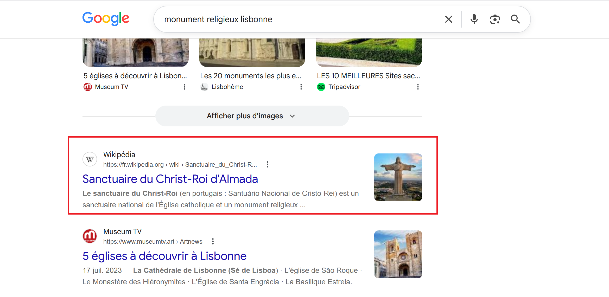
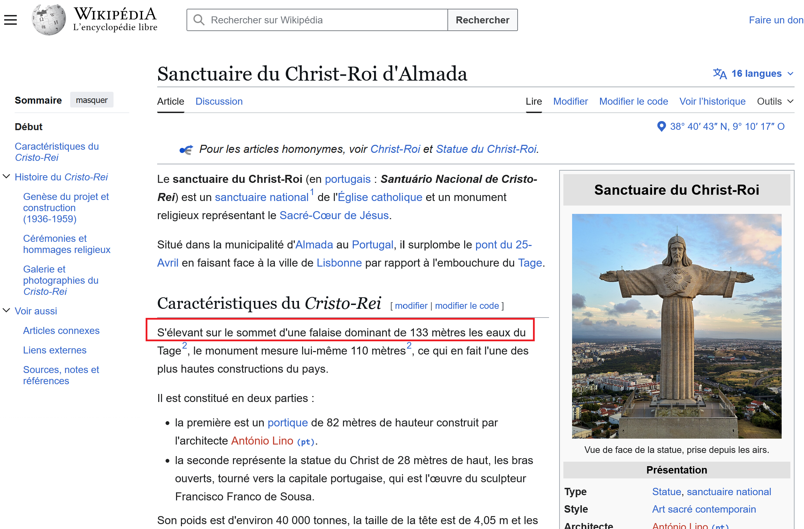
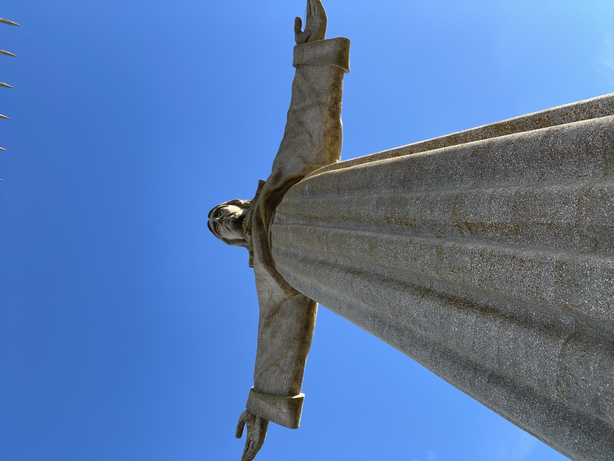
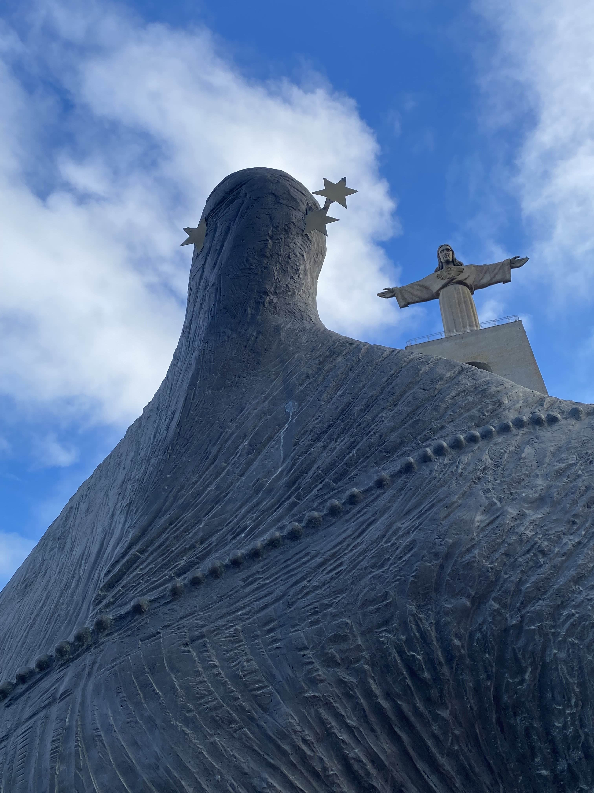
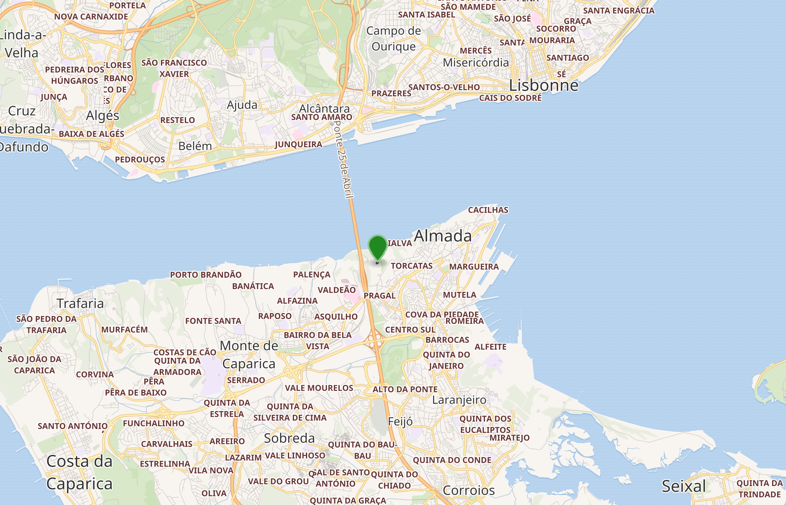

# Challenge : Proche du ciel

## Informations du challenge

| Catégorie | Difficulté | Points | Auteur |
|-----------|------------|--------|--------|
| Osint | Facile | 100 | B3cha |

**Preuve :** `Do whatever he tells you !-12|Fazei O Que ele Vos Disser !-12`

---

## Résumé

Dans ce challenge, il faut identifier le monument célèbre de Lisbonne proche du ciel, le **Christ-Roi d'Almada**, visible sur le trailer du CTE ainsi que sur le poster (à ne pas confondre avec celui de Rio de Janeiro).
Puis localiser la statuette de la `Vierge Marie` située juste en face, pour ensuite lire les textes gravés en dessous de la statuette et compter le nombre d'étoiles de la couronne.

## Identification du monument

Une recherche rapide par mot-clé `Monument religieux Lisbonne` : les premiers résultats nous donnent la bonne réponse :

La fiche Wikipédia du monument indique que la statue culmine à 133 m.

La photo originale de la statue est la suivante :

Juste en face de cette chapelle, une célèbre statuette de la `Vierge Marie` :

## Recherche Google de la statuette

Avec une recherche sur Google Maps avec le nom `Vergin Mary Statue`, on identifie une couronne ornée d'étoiles :

Puis une localisation sur carte de l'emplacement de la statue :

En recherchant une ressource plus complète pour trouver une image entière de la couronne :
https://fr.dreamstime.com/vue-statue-vierge-marie-devant-sanctuaire-du-christ-roi-lisbonne-portugal-image144623059

## Identification du proverbe au pied de la statuette

L'affichage d'une photo du pied de la statuette, postée sur les réseaux sociaux, permet d'identifier clairement le proverbe : `Do whatever he tells you !` en anglais, ou son équivalent en portugais.

**Nota :** cette citation est inscrite noir sur noir sur le dossier de mission.

---

## Résultat

La solution de notre challenge est située au niveau de la statuette **Vergin Mary Statue**, située face au Cristo Rei.

✅ **Preuve :** `Do whatever he tells you !-12` ou `Fazei O Que ele Vos Disser !-12`
