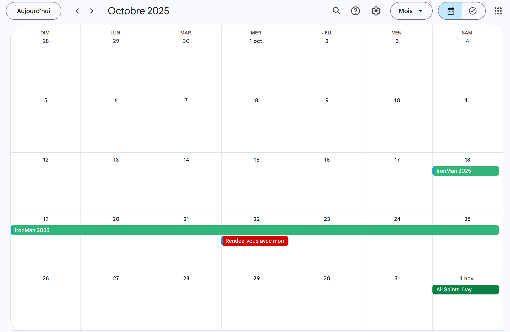
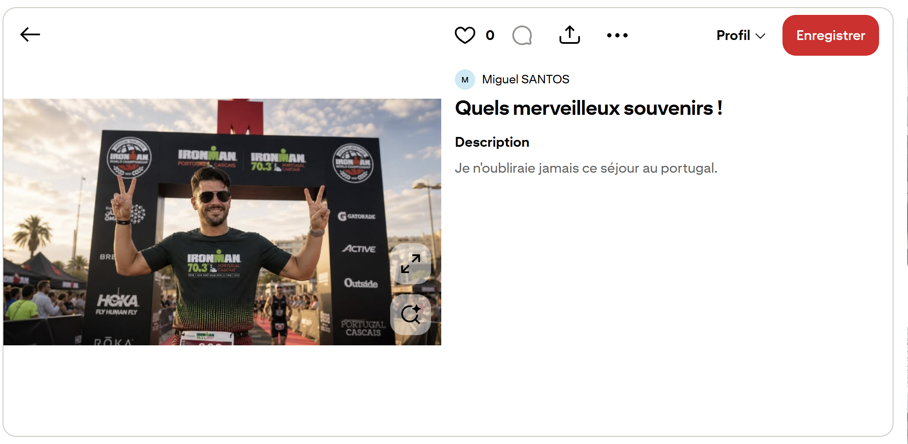
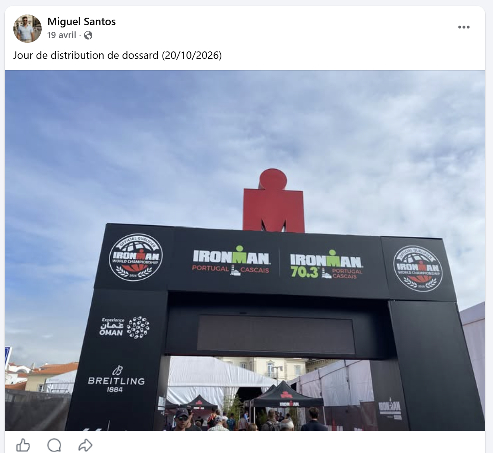

# Challenge : Pseudo alibi

## Informations du challenge

| Catégorie | Difficulté | Points | Auteur |
|-----------|------------|--------|--------|
| Osint | Facile | 200 | B3cha |

**Preuve :** `ironman-cascais` (insensible à la casse)

---

## Résumé

Dans ce challenge, les joueurs doivent découvrir, par des corrélations de dates, que Miguel s'est rendu au Portugal aux mêmes dates que l'IRONMAN à Cascais, sans y participer.

## Identification des dates de voyage de Miguel

Lors du challenge `Point de chute`, nous avons appris que Miguel s'est rendu à Estoril, au Portugal.
Ses dates de check-in et de check-out à l'hôtel sont les suivantes :
- Arrivée : `samedi 18/10/2025 à 19h47`
- Départ : `samedi 25/10/2025 à 11h00`

L'analyse du Google Calendar de Miguel sur le mois d'octobre 2025 confirme la durée du séjour :

Le motif indiqué sur l'événement : IronMan2025.

## Vérification du motif de séjour

L'analyse du compte **Pinterest** de Miguel (https://fr.pinterest.com/miguel100tos/_profile/) présente une photo de Miguel à la ligne d'arrivée, vêtu du t-shirt de la course :

Miguel prétend avoir participé à la course de l'IronMan 2025.
Un post sur le compte Facebook de Miguel (https://www.facebook.com/profile.php?id=61582916518941) indique le jour de distribution du dossard.

## Concordance des dates

Une rapide recherche sur Google concernant l'événement `IronMan 2025` à Cascais, sur le site officiel (https://www.ironman.com/races/im-cascais), indique que la course a eu lieu le `vendredi 17 octobre 2025`.
Le vol aller de Miguel (en partance de l'aéroport de Nice) est du **samedi 18 octobre 2025** au matin.
Cela signifie que Miguel n'a pas pu participer à la course de l'IronMan 2025. Il a tout à fait pu participer à la remise des médailles, d'après les photos publiées sur la plage de Cascais face au podium.
Le titre du challenge est assez parlant : **Pseudo Alibi**. La réponse à notre challenge est donc : `ironman-cascais`.

---

## Résultat

La solution de notre challenge est à déduire d'une corrélation d'indices permettant d'identifier le prétexte de séjour de Miguel au Portugal.

✅ **Preuve :** `ironman-cascais`
