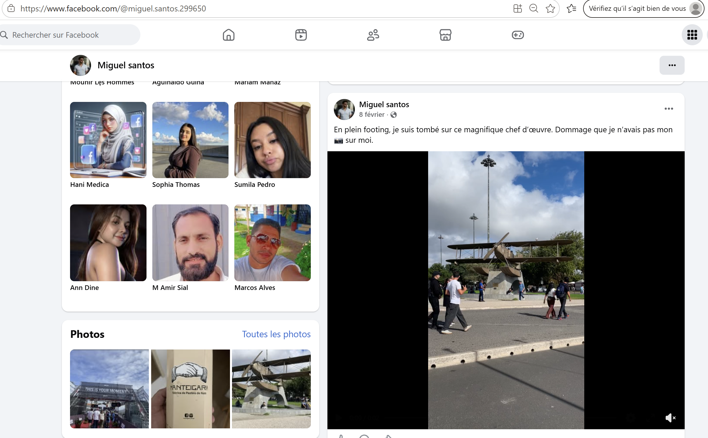
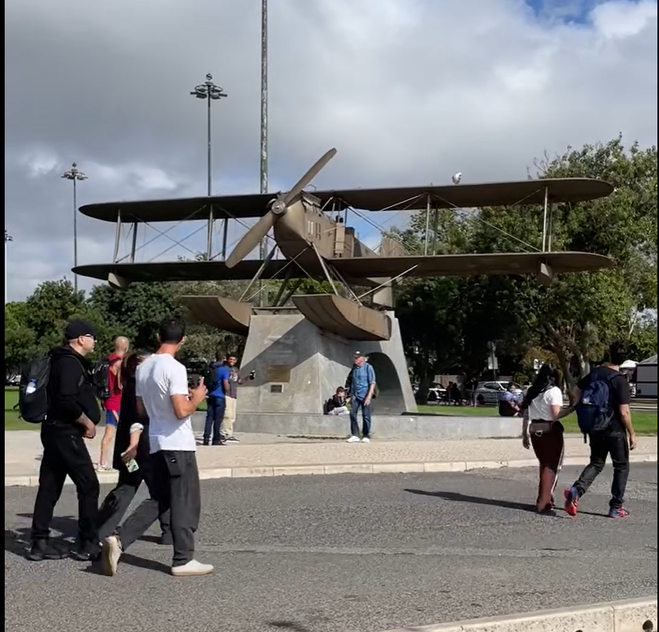
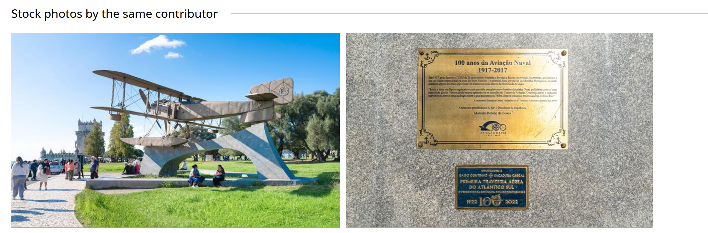
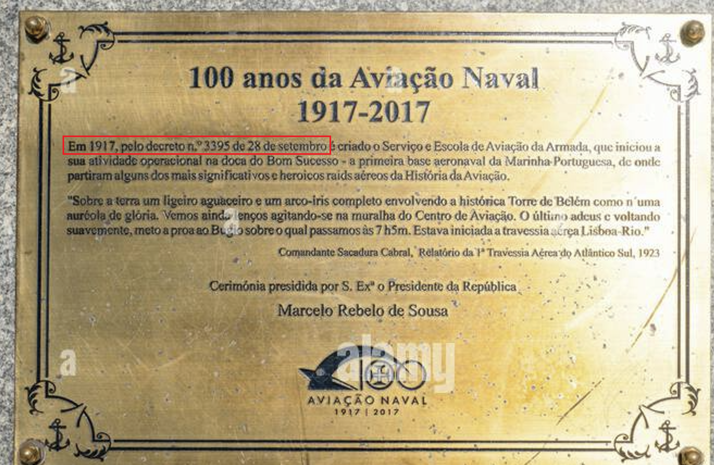

# Challenge : Rendez-vous avec l'histoire

## Informations du challenge

| Catégorie | Difficulté | Points | Auteur |
|-----------|------------|--------|--------|
| SocMint & GeoInt | Facile | 150 | B3cha |

**Preuve :** `28-09-1917_3395`

---

## Résumé

Dans ce challenge, il faut identifier la photo de l'avion sur l'un des deux comptes Facebook de Miguel.
Puis procéder à une recherche par image inversée pour identifier l'avion en question.
Enfin, des recherches Google permettent d'identifier les informations placées sous l'avion lui-même.

## Identification de l'avion sur le Facebook de Miguel

Lors des précédents challenges, nous avons pu déterminer que **Miguel** possède deux comptes Facebook :
1. https://www.facebook.com/@miguel.santos.299650
2. https://www.facebook.com/profile.php?id=61582916518941

Sur le premier compte, une vidéo postée par Miguel en date du 08 février 2026 montre un ancien avion à hélice.

Il faut ensuite réussir à extraire une photo de l'avion depuis la vidéo :

Une recherche par image inversée nous indique qu'il s'agit du Monument à Gago Coutinho et Sacadura Cabral.
Plusieurs photos de cet avion sont disponibles sur ce lien :
https://www.alamy.com/stock-photo/monument-to-gago-coutinho-and-sacadura-cabral.html?sortBy=relevant

## Recherche Google sur l'avion

Sur le même site `Alamy`, un utilisateur a pris en photo la plaque placée en dessous de l'avion :
https://www.alamy.com/lisbon-portugal-october-30-2024-statue-of-gago-coutinho-sacadura-cabral-plane-image643148313.html?imageid=E8FFB3BE-30F4-4E0C-B35A-958FC74EACD6&pn=1&searchId=30b94ada145d19b618477cbde4bd6b34&searchtype=0

En zoomant sur la plaque, les informations recherchées du flag sont présentes :
1. Date du décret : `28 septembre 1917`
2. Numéro de décret : `3395`

Ne pas oublier de former le flag conformément au format attendu : **28-09-1917_3395**.

---

## Résultat

La solution de notre challenge est située sur la plaque d'information juste en dessous de l'avion.

✅ **Preuve :** `28-09-1917_3395`
