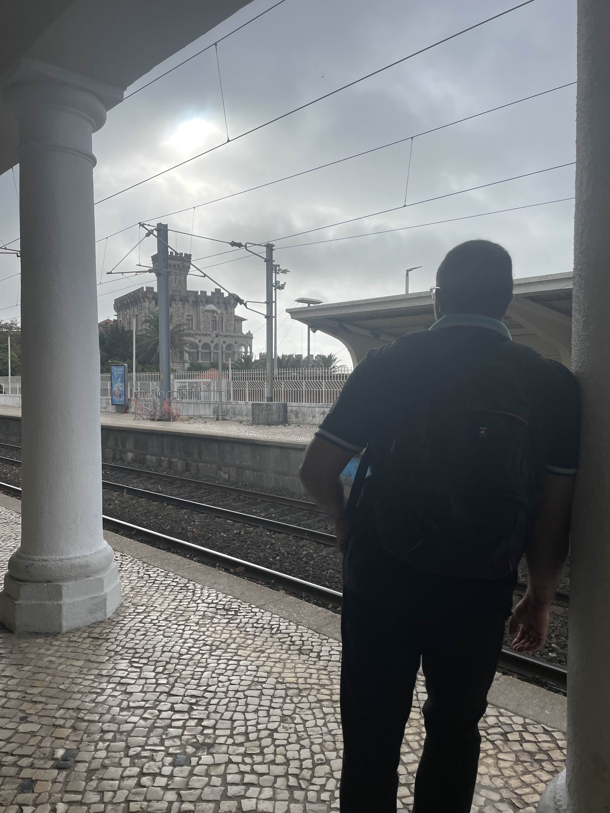
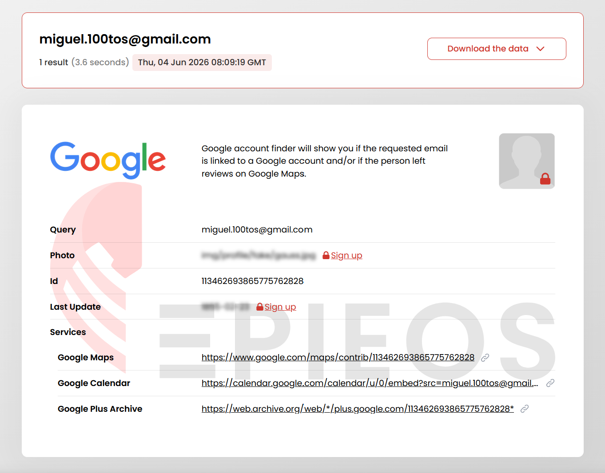
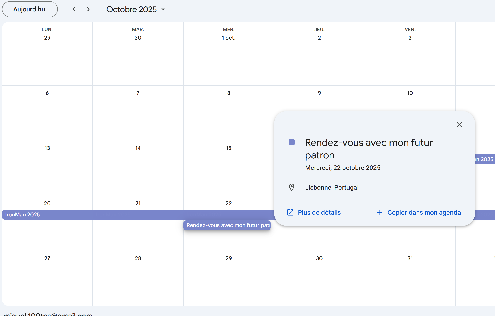
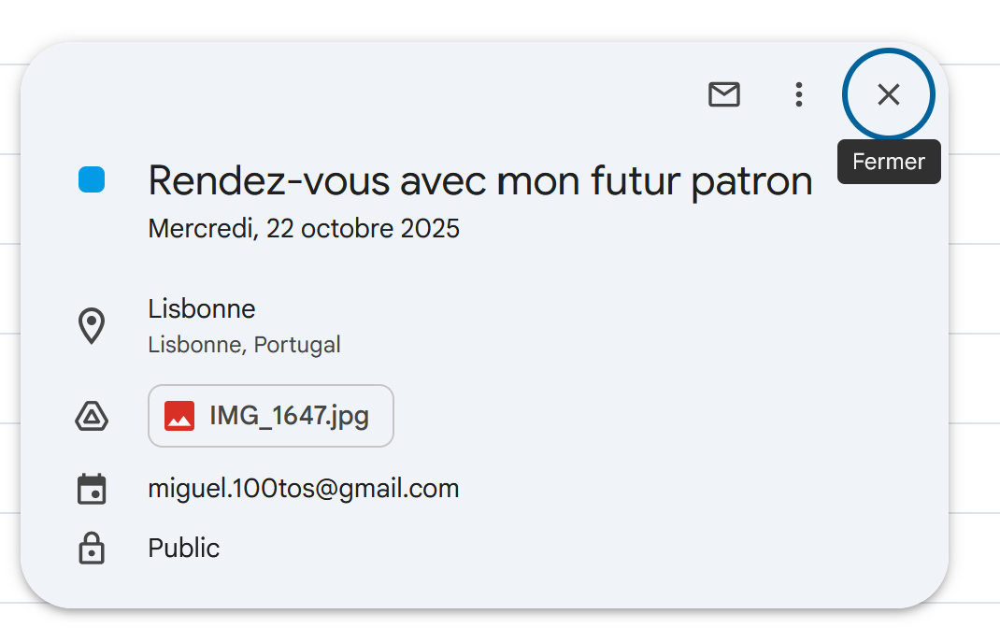
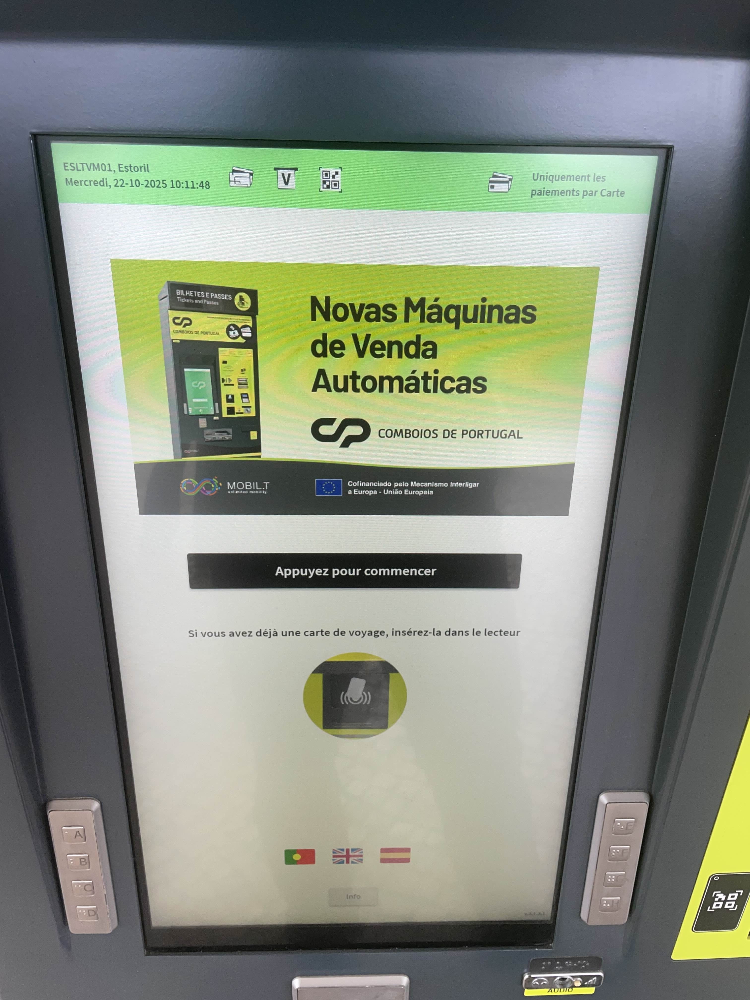
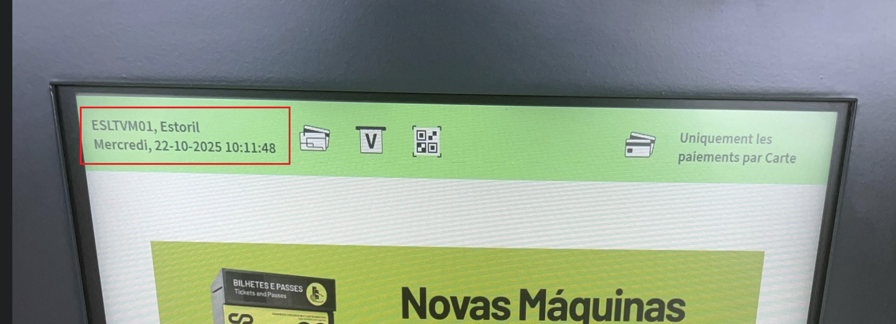

# Challenge : Rendez-vous imminent

## Informations du challenge

| Catégorie | Difficulté | Points | Auteur |
|-----------|------------|--------|--------|
| Osint | Facile | 300 | B3cha |

**Preuve :** `ESLTVM01_mercredi_22-10-2025_10:11:48` (insensible à la casse)

---

## Résumé

Dans ce challenge, il est nécessaire d'identifier le Google Calendar de Miguel pour en extraire l'image du jour du rendez-vous, le mercredi 22 octobre 2025.

## Identification du jour de rendez-vous

Le challenge `Rendez-vous imminent` fournit l'image d'une personne sur le quai de la gare ferroviaire :

Une recherche par image inversée sur le bâtiment au fond montre que Miguel est en gare d'Estoril. Il est sur le quai direction `Cascais` vers `Lisbon`.
Il est possible de regarder sur le site de la compagnie https://www.rome2rio.com/fr/s/Estoril/Lisbonne, qui permet de voir que les trains circulent à horaires réguliers.
Un rendez-vous si important avec son chef (cf. challenge `Nouveau boss`) a dû être noté sur son agenda pour ne pas l'oublier.

## Analyse de l'agenda de Miguel

Il faut commencer par trouver l'adresse mail Gmail de Miguel `miguel.100tos@gmail.com`, qu'on passe à l'outil `Epios` :

Ceci permet d'identifier un lien Google Drive de Miguel :
Sur la période de séjour de Miguel au Portugal, un rendez-vous est positionné le 22 octobre 2025.

En cliquant sur l'événement `Rendez-vous avec mon futur patron`, titre proche du nom du challenge, un fichier `IMG_1647.jpg` est joint à l'événement :

L'image présente la photo d'une borne à tickets affichant les informations du voyage de Miguel :

Les informations recherchées sont affichées en haut de l'image :

Les preuves attendues sont :
- NOMTRAIN : **ESLTVM01**
- jour : **mercredi**
- date : **22-10-2025**
- heure : **10:11:48**

Il ne reste plus qu'à former le flag conformément au modèle : `ZOUSUDN08_lundi_11-06-2026_16:23:34`

---

## Résultat

La solution de notre challenge est située sur la photo de la borne prise sur le quai de la gare. Cette photo est accessible depuis le Google Calendar de Miguel.

✅ **Preuve :** `ESLTVM01_mercredi_22-10-2025_10:11:48`
