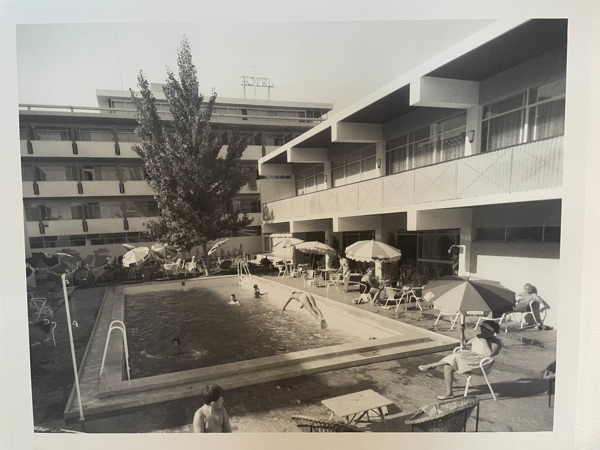
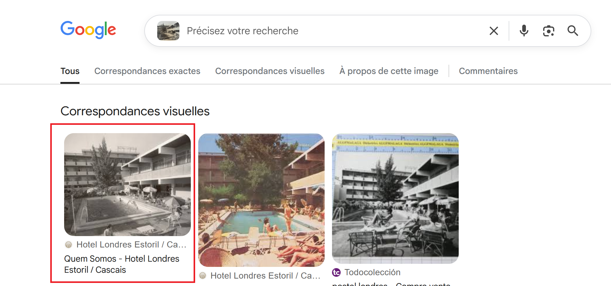
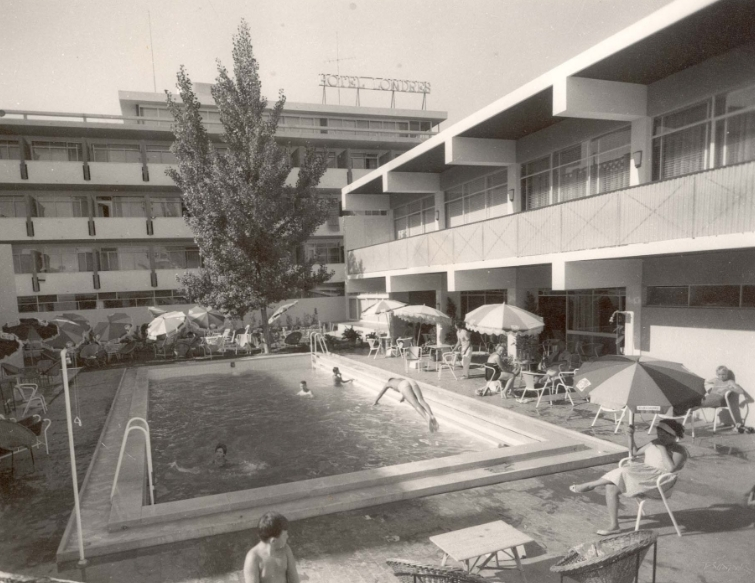
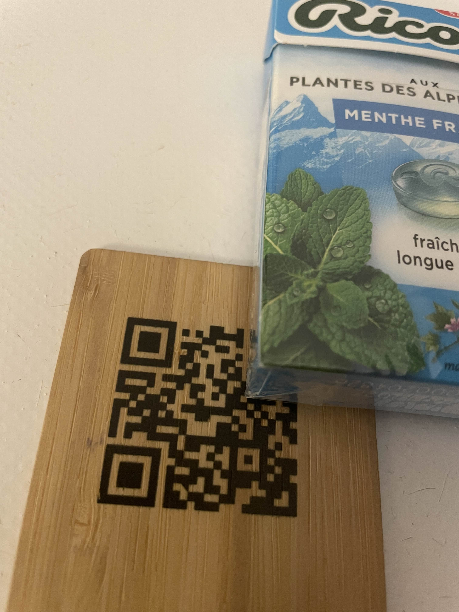
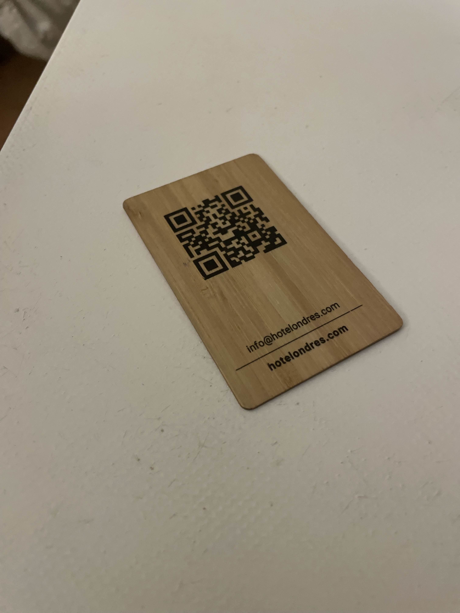
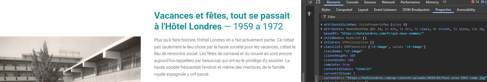
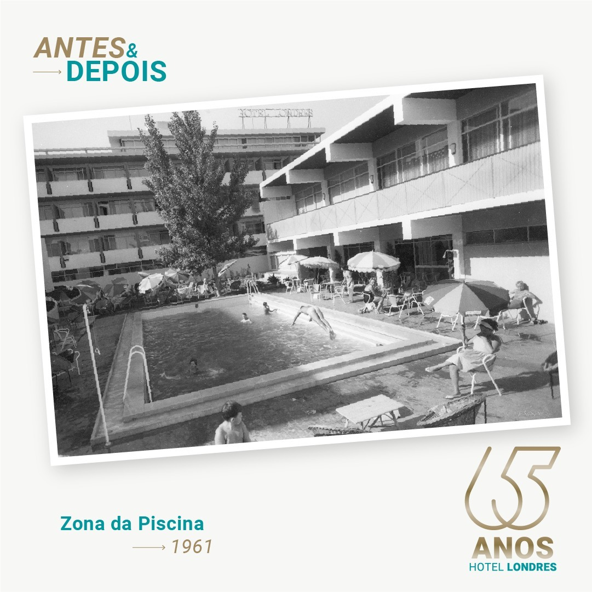
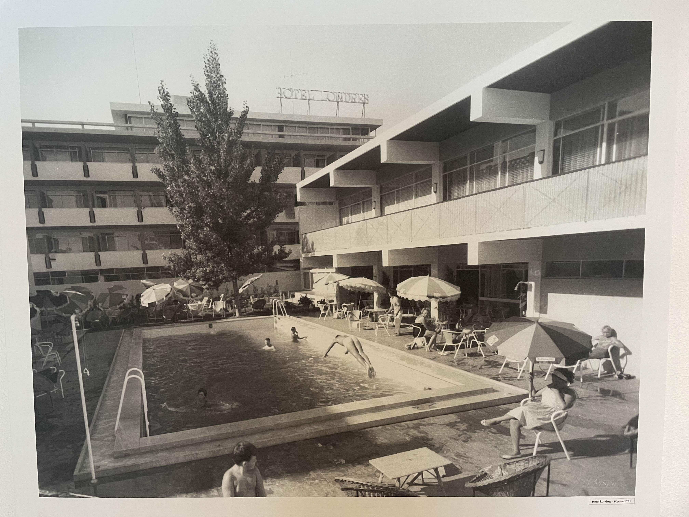

# Challenge : Séjour à l'hôtel

## Informations du challenge

| Catégorie | Difficulté | Points | Auteur |
|-----------|------------|--------|--------|
| Osint | Facile | 150 | B3cha |

**Preuve :** `Hotel-Londres-Estoril-1961` (insensible à la casse)

---

## Résumé

Ce challenge facile nécessite de faire une recherche par image inversée à partir de l'image fournie avec l'énoncé du challenge.
La date de la photo est présente sur le compte Facebook de l'hôtel.

---

## Étape 1 : identifier le nom de l'hôtel du séjour de Miguel

Le challenge est accompagné de l'image suivante :

Le premier résultat retourné par Google Images est le bon : **Hôtel Londres Estoril**.

La première partie de la preuve est donc : `Hotel-Londres-Estoril`

Un autre point de confirmation de l'hôtel se trouve sur le compte Pinterest de Miguel :
https://fr.pinterest.com/pin/978618194041162137/

C'est la photo de son badge de chambre d'hôtel ; pour l'exploiter, il est nécessaire de compléter le QR code, qui donne l'url du site de l'hôtel.

Le site de l'hôtel https://hotelondres.com présente l'image originale.

---

## Étape 2 : retrouver l'année de la photo

En téléchargeant la photo originale depuis le site de l'hôtel, on constate que le fichier est nommé : **Pool-area-1961-comp.jpg**.

L'année de la photo est donc `1961`.
Procédons à quelques vérifications pour confirmer cette hypothèse. En faisant une recherche sur Google avec les mots-clés suivants : `Hotel Londres Estoril + 1961 + instagram + facebook`, nous trouvons un post sur le compte Facebook de l'hôtel :
https://www.facebook.com/photo.php?fbid=941961547933202&set=pb.100063580960067.-2207520000&type=3

Le post Facebook date de 2024 : l'hôtel a fêté ses 65 ans et publie une photo de la zone piscine qui date de **1961**.
La photo originale prise par Miguel est au cinquième étage de l'hôtel, face à la porte de l'ascenseur :

Il est clairement indiqué au bas de la photo l'année de prise de vue : **1961**.
Notre preuve finale est composée du nom de l'hôtel suivi de l'année de la prise de vue de la photo, séparés par des tirets **-**.

---

### Résultat

✅ **Preuve :** `Hotel-Londres-Estoril-1961` ou `Hôtel-Londres-Estoril-1961` (les deux preuves sont acceptées).
