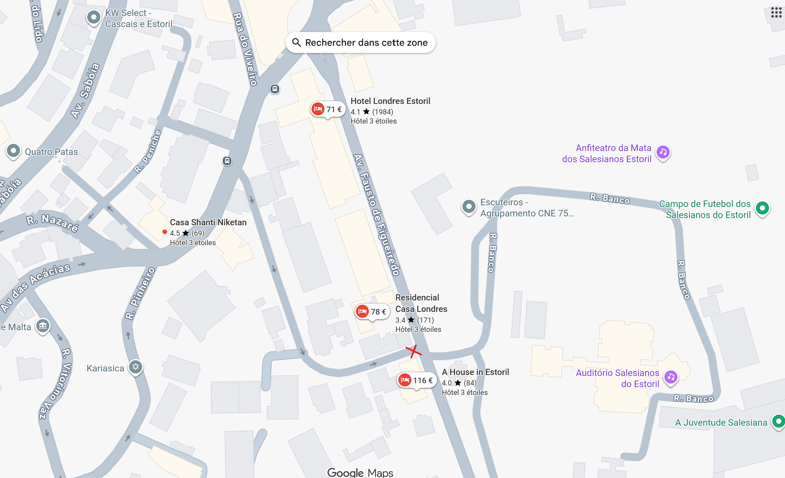
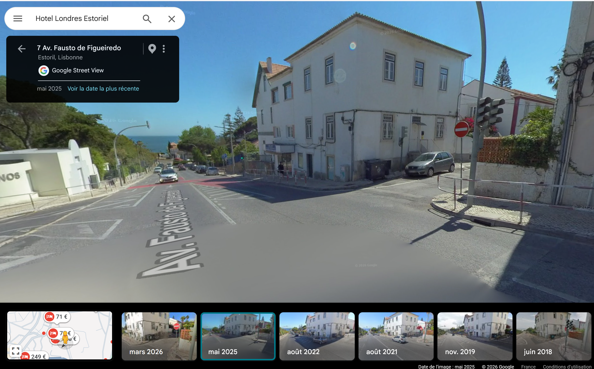
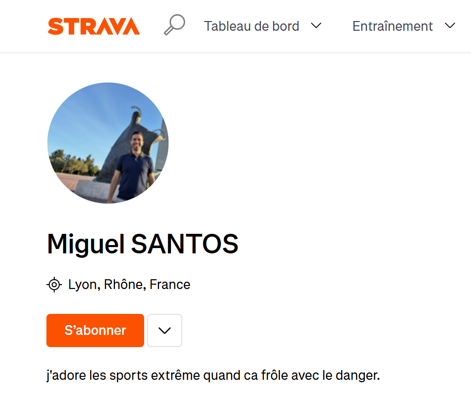
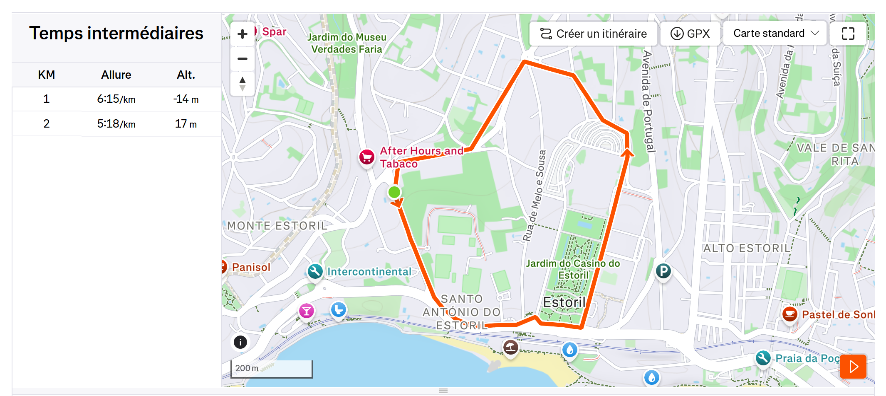
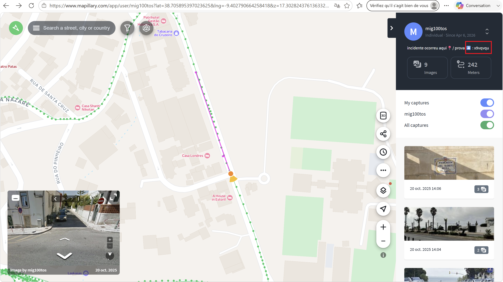
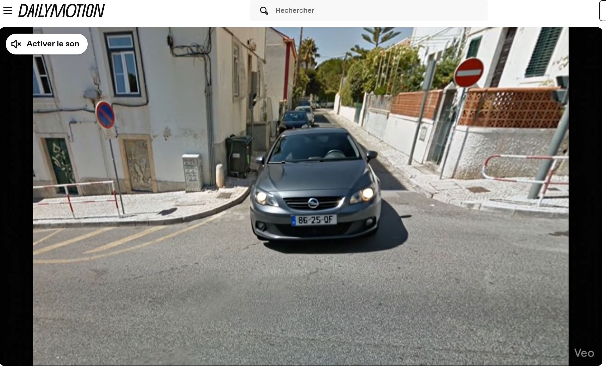

# Challenge : Surveillance pas très discrète

## Informations du challenge

| Catégorie | Difficulté | Points | Auteur |
|-----------|------------|--------|--------|
| Osint | Moyen | 300 | B3cha |

**Preuve :** `86-25-QF` (sensible à la casse)

---

## Résumé

Dans ce challenge, il est nécessaire de franchir les 4 étapes suivantes :
1. reconnaître le lieu de surveillance, intersection **7 Av. Fausto de Figueiredo**
2. identifier le parcours de course de Miguel sur Strava
3. trouver le compte Mapillary de Miguel avec son pseudo `mig100tos` (extrait d'un cas concret de recherche)
4. identifier le site d'hébergement de la vidéo **Dailymotion** avec la fin de l'url `x9vqvqu`

Une fois la vidéo de la voiture autonome visionnée, il suffit de lire l'immatriculation de la voiture.

## Étape 1 : identification du lieu de surveillance

En analysant l'un des deux comptes `Facebook` de Miguel (https://www.facebook.com/@miguel.santos.299650), on trouve un post du 8 février 2026 dans lequel Miguel parle d'une voiture qui le suit.

Dans le texte, Miguel donne des indications sur l'emplacement de surveillance de la voiture qu'il a remarquée.

Passons donc en Google Street pour voir s'il est possible de voir cette voiture stationnée. Il faut bien évidemment essayer plusieurs dates ; celle de mai 2025 pourrait correspondre.

L'apparence extérieure du modèle pourrait correspondre à une `Opel Astra` grise. Malheureusement, l'immatriculation du VL n'est pas visible.

Il faut donc chercher une photo de cette même voiture, à la surveillance pas très discrète, prise par Miguel avec un peu de chance et de discrétion.

## Étape 2 : recherche de site pouvant héberger des photos

En s'appuyant sur le parcours sportif et les nombreux posts de Miguel, on constate que ce dernier est amateur de course à pied.

Qui dit course à pied dit `Strava` (ou autre).

Recherchons le compte Strava de Miguel : https://www.strava.com/athletes/miguel100tos

Bien entendu, il faut posséder un compte Strava pour accéder au contenu du profil (si par chance celui-ci est public).
Pas de doute, c'est bien notre **Miguel SANTOS**.

Il y a 3 courses ; celle du 20 octobre 2025 nous intéresse particulièrement, car elle a lieu pendant la période du séjour de Miguel à Estoril (ce qui confirme bien sa présence sur place). Le tracé de son jogging part de l'hôtel et passe par le point de surveillance du véhicule suspect.

Malheureusement pour nous, aucune photo prise par Miguel n'a été ajoutée à cette course.

Il faut donc rechercher un autre site qui permet de positionner des photos sur son tracé de course (en posant la question à une IA, elle nous répond `Mapillary`). Let's go !

## Étape 3 : recherche du compte Mapillary de Miguel

La recherche ici s'annonce un peu difficile (tout à fait normal pour un challenge à 300 pts).

Il faut :
1. posséder un compte sur Mapillary
2. utiliser la barre de recherche de Mapillary et décliner tous les pseudos de Miguel déjà trouvés sur les autres réseaux sociaux : `miguel.100tos, miguel.100t0s, miguel.sant0s, migu3lSant0s`, ... and the winner is `mig100tos`

On trouve un compte Mapillary : https://www.mapillary.com/app/user/mig100tos

Et une course sur le même tracé Strava de Miguel, à l'intersection de rue (lieu de la surveillance) qui nous intéresse :

Un joli commentaire nous attend : `incidente ocorreu aqui📍/ prova ` => `L'incident s'est produit ici📍 / preuve`

Un élément dans les métadonnées du post nous interpelle : **x9vqvqu**.

Qu'est-ce que cela peut bien être ?

## Étape 4 : recherche de la vidéo de la voiture suiveuse

Si l'on se réfère au challenge `Lutte d'influence`, nous avions trouvé une partie d'une URL Proton Drive qu'il fallait compléter avec le début classique d'un lien Proton Drive.

Dans ce même challenge, le nom de la pétition servait de suite d'url pour un framapad.

Si on considère que le concepteur du challenge est un récidiviste, il faut trouver le début d'url pour compléter `x9vqvqu`.

En le donnant à ChatGPT, il nous dit que ça ressemble à un morceau d'url du site `Dailymotion`. On regarde donc à quoi ressemble le début d'une url d'une vidéo : 'https://www.dailymotion.com/video/' + `x9vqvqu`, ce qui nous donne l'url complète suivante :

https://www.dailymotion.com/video/x9vqvqu

BINGO ! Une vidéo de la surveillance du futur, avec véhicule 100% autonome sans conducteur :

Il suffit maintenant de lire l'immatriculation de la voiture, qui est bien une **Opel Astra** de couleur grise, à l'emplacement indiqué par Miguel dans son post Facebook.

---

## Résultat

La solution de notre challenge est située sur la vidéo prise par Miguel lors de sa course et postée sur le site Dailymotion.

✅ **Preuve :** `86-25-QF` (sensible à la casse)
