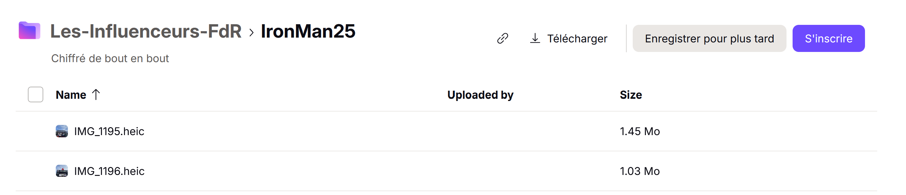
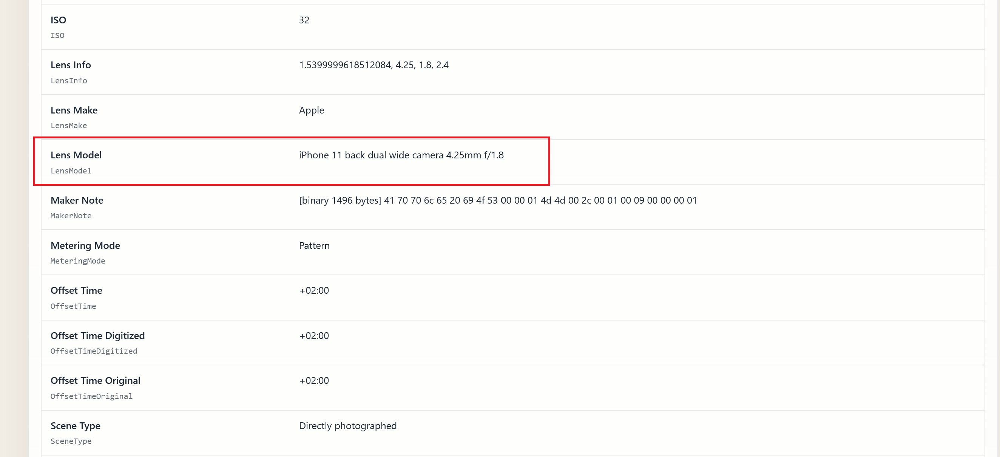

# Challenge : Toujours dans la poche

## Informations du challenge

| Catégorie | Difficulté | Points | Auteur |
|-----------|------------|--------|--------|
| Osint | Moyen | 200 | B3cha |

**Preuve :** `iPhone 11 black dual wide camera 4.25mm f/1.8` (insensible à la casse)

---

## Résumé

Dans ce challenge, il est nécessaire d'avoir déjà résolu le challenge `Lutte d'influence` pour trouver le Proton Drive de Miguel, puis de récupérer l'une des deux photos prises par Miguel de l'IronMan à Cascais.
L'analyse des métadonnées des images permet de trouver les informations recherchées.

## Identification des photos

Lors du challenge `Lutte d'influence`, nous avons identifié le Proton Drive de Miguel : https://drive.proton.me/urls/X8GMZPNV74#GFhopliaf5M7
Sur ce drive, un dossier nommé **IronMan2025** contient deux photos :
1. IMG_1195.heic
2. IMG_1196.heic

L'extension des fichiers `.heic` indique qu'il s'agit d'un modèle **iPhone**.

## Analyse des métadonnées du fichier

Il faut donc utiliser l'outil **exiftool** pour analyser les métadonnées des fichiers retrouvés précédemment sur le drive.

Les informations demandées sont les suivantes :
1. Modèle : **iPhone 11**
2. Couleur : **black**
3. Caméra : **dual wide camera 4.25mm**
4. Type d'objectif : **f/1.8**

La photo de Miguel (un verre à la main), sur le post Facebook suivant (https://www.facebook.com/photo/?fbid=122123340255097217&set=ecnf.61582916518941), confirme que le téléphone est bien de couleur noire.
Il faut donc maintenant former le flag conformément à l'exemple de preuve fourni : `Android S15 blanc triple wide camera 6.75mm f/2.9`

---

## Résultat

La solution de notre challenge est située sur les photos de l'IronMan2025 disponibles sur le Proton Drive de Miguel.

✅ **Preuve :** `iPhone 11 black dual wide camera 4.25mm f/1.8`
