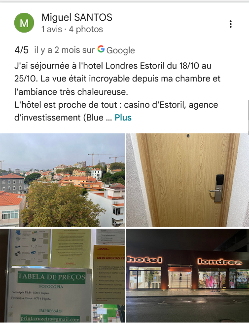
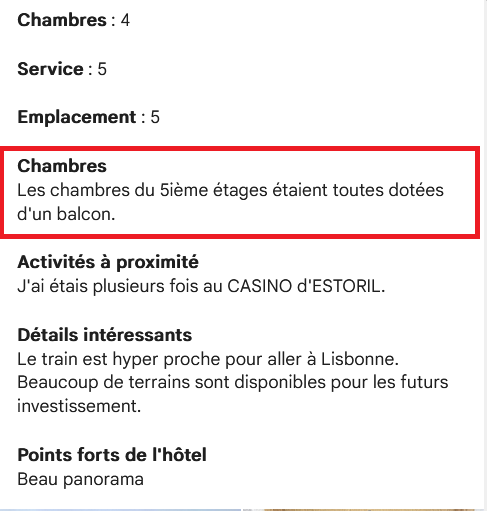
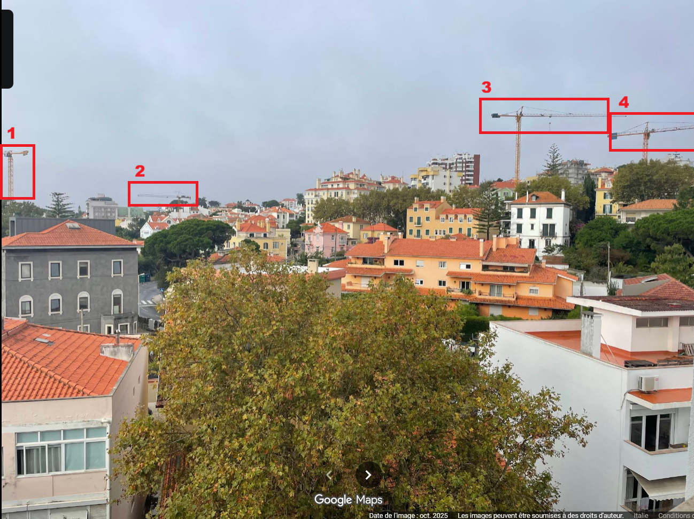

## Challenge : Ville en chantier

## Informations du challenge

| Catégorie | Difficulté | Points | Auteur |
|-----------|------------|--------|--------|
| Osint | Facile | 100 | B3cha |

**Preuve :** `5-5`

## Résumé

Ce challenge nécessite de trouver en sources ouvertes deux informations :
1. **Le numéro de l'étage de la chambre de Miguel** - exploitation des commentaires Google de Miguel sur l'hôtel Estoril
2. **Le nombre de grues visibles** - visibles sur une photo prise par Miguel depuis sa chambre d'hôtel, sur son compte Pinterest

## Étape 1 : Rechercher le numéro d'étage

### Fonctionnement de l'hôtel

Le nom de l'hôtel découvert au challenge `Séjour à l'hôtel` nous mène à nous intéresser au site web de l'hôtel.
On découvre qu'il y a plusieurs catégories de chambres avec plusieurs tarifs : https://hotelondres.com/
On constate que le premier chiffre du numéro de chambre correspond à l'étage :
- **0**14 pour le RDC
- **1**23 pour le 1er étage
- ..
- **5**04 pour le 5e étage

Ainsi, si la chambre de Miguel est **3**33, cela signifie que sa chambre est au **troisième étage**.

### Analyse des commentaires Google

En faisant une recherche sur Google Maps avec les mots-clés `hôtel Londres Estoril` :

En parcourant les avis sur l'hôtel, on voit qu'un certain Miguel SANTOS a déposé un commentaire il y a 8 mois (la période correspond à notre fenêtre de recherche).

Il a laissé 4 photos intéressantes, dont celle-ci :

On distingue clairement le numéro de chambre de Miguel : `503`. Sa chambre est probablement située au 5e étage.
En guise de confirmation, il laisse un commentaire explicite :

Pas de doute, c'est bien le 5e étage, sinon pourquoi parlerait-il du balcon ? D'autant plus que la photo prise de sa chambre ne présente pas d'encadrement de fenêtre dans la prise de vue. Il a donc pris la photo depuis son balcon.

## Étape 2 : Compter le nombre de grues

Toujours croiser les sources lorsqu'on recherche des preuves.

### La photo de l'avis Google

On pourrait se dire "facile, cette question" : la réponse est dans la photo de l'avis Google :

Donc, pour nous, la réponse est : `4`.
En essayant 5-4 comme réponse attendue, on récolte un fail !
Ce n'est pas possible ! Le challenge est tagué facile. Apparemment, juste compter les grues sur la photo postée par Miguel ne suffit pas.
C'est à ce moment-là que la plupart des joueurs nous ont écrit pour nous demander si le flag n'était pas foireux.
Réponse des admins : avez-vous croisé les sources ? Heu...
Revérifions tout.
Finalement, peut-être que Miguel n'a pas posté uniquement sur Google Maps ?

### La même photo sur Pinterest

En cherchant sur les différents comptes de Miguel sur internet, on lui trouve un compte `Pinterest`, avec une photo qui ressemble étrangement à celle de la prise de vue de l'hôtel. Miguel écrit : **Vue de ma chambre.** `Temps maussade, pas motivé pour aller courir.` (on apprend au passage que Miguel aime courir, cela peut toujours servir).
https://fr.pinterest.com/pin/978618194041360383/
Celle-ci présente un ciel nuageux, mais quelque chose attire notre attention : **une cinquième grue, non visible sur l'autre photo** :

Celle-là, on ne l'avait pas vue. La prochaine fois, nous serons plus attentifs avant de flaguer trop vite. **Une preuve est plus solide lorsqu'elle est confirmée par une seconde source (la base) !**

### Résultat

Les réponses attendues sont donc : **5e étage** et **5** grues visibles depuis la chambre de Miguel.

**Preuve :** `5-5`
