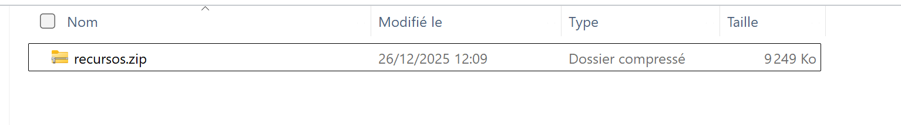
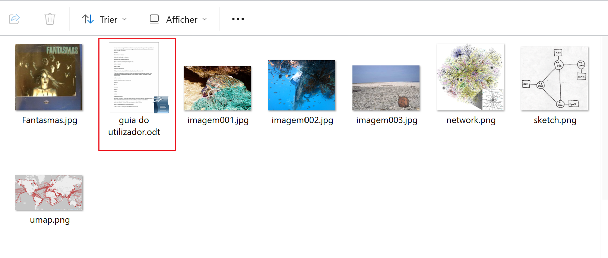
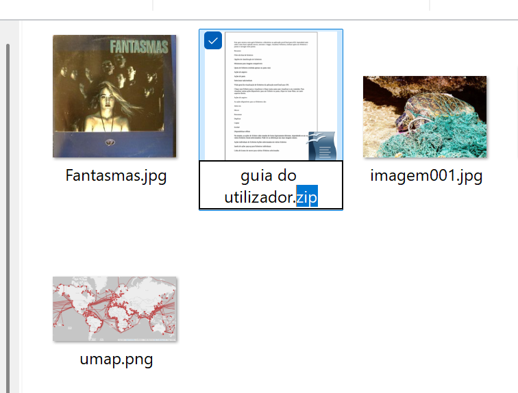
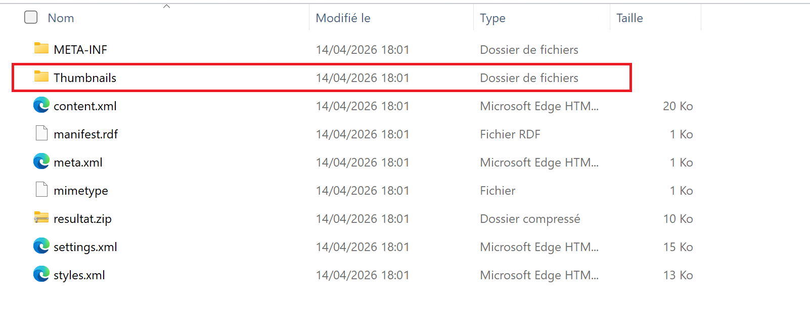
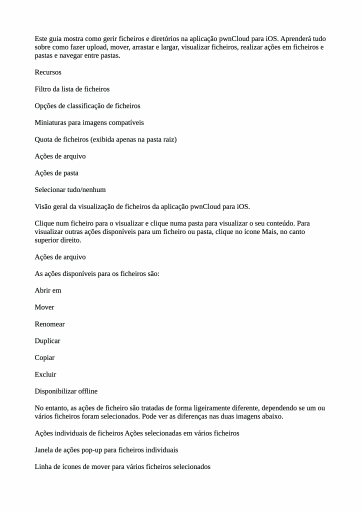
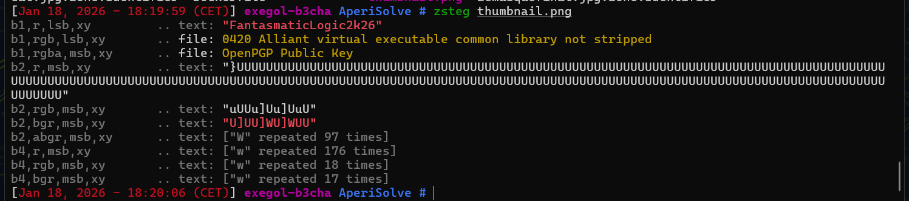
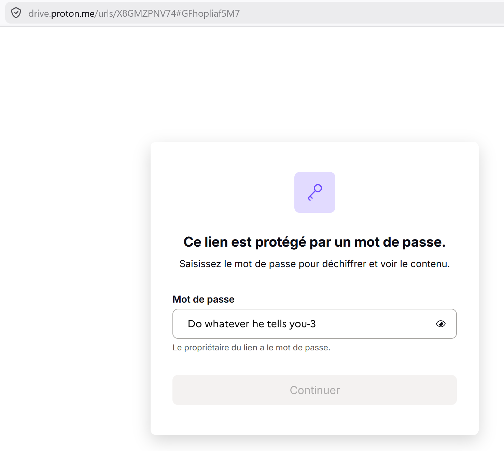

# Challenge : Vol retour 1

## Informations du challenge

| Catégorie | Difficulté | Points | Auteur |
|-----------|------------|--------|--------|
| Forensic | Facile | 100 | Hekct |

**Preuve :** `TP482-S48328-S` (sensible à la casse)

---

## Résumé

Ce challenge est facile, il nécessite d'effectuer les étapes suivantes :
1. **recursos.zip** - décompresser le fichier zip et extraire le mot de passe caché `FantasmaticLogic2k26`
2. **fichiers-perso.zed** - localiser le fichier zed sur le Proton Drive de `Miguel` et l'ouvrir avec le mot de passe trouvé à l'étape 1
3. **IMG_1819** - identifier l'image qui contient les informations d'embarquement pour le vol retour du 25/10/2025

---

## Étape 1 : analyse forensic sur le fichier recursos.zip

### Analyse de l'archive ZIP

L'énoncé fournit une pièce jointe à analyser :

Après une décompression de l'archive recursos.zip, on obtient les fichiers suivants :

L'archive contient plusieurs **fichiers images** ainsi qu'un fichier **guia do utilizador.odt**.
L'analyse des métadonnées de chacun de ces fichiers ne donne pas de résultat concluant.
Le résultat de la commande `zsteg` (outil de stéganographie) sur l'ensemble des fichiers ne permet pas de trouver d'information cachée.
On s'intéresse de plus près au document **guia do utilizador.odt**. À savoir que les documents de ce type sont en réalité des archives `.zip`. On décide donc de renommer l'extension du fichier :

La nouvelle archive présente plusieurs fichiers :

L'étude approfondie des différents fichiers nous amène à examiner le contenu du dossier `Thumbnails`, qui contient un fichier de type image ; celui-ci représente la vignette du document :

L'analyse de l'image `thumbnail.png` par l'outil **zsteg** énoncé plus haut permet de trouver le résultat suivant :

### Résultat étape 1

Le fichier **thumbnail.png** nous révèle un mot de passe : `FantasmaticLogic2k26`.

---

## Étape 2 : analyse du contenu de l'archive zed

Lors du challenge `Lutte d'influence`, le Proton Drive de Miguel est trouvé : https://drive.proton.me/urls/X8GMZPNV74#GFhopliaf5M7
Ce dernier exige un mot de passe **Do whatever he tells you-3**, que nous venons de récupérer lors du challenge `Proche du ciel`.

Plusieurs fichiers sont disponibles sur le Proton Drive de Miguel, dont une archive Zed **fichier-perso.zed** :

Une fois l'archive récupérée en local, on utilise le logiciel `Zed` (version gratuite) : https://www.primx.eu/fr/zed-free/
Pour décompresser l'archive, il faut utiliser le mot de passe trouvé lors de l'étape 1 :

Le contenu de l'archive présente plusieurs images ; celle qui nous intéresse est le fichier `IMG_1819.jpg` :

La troisième ligne en partant de la fin du tableau d'affichage permet de récolter les informations demandées par le challenge pour la journée du 25/10/2025.

---

### Résultat

Les renseignements sur le vol retour sont :
1. L'indicatif du vol retour : **TP482**
2. Le numéro de vol retour : **S48328**
3. La porte d'embarquement : **S**

✅ **Preuve :** `TP482-S48328-S`
