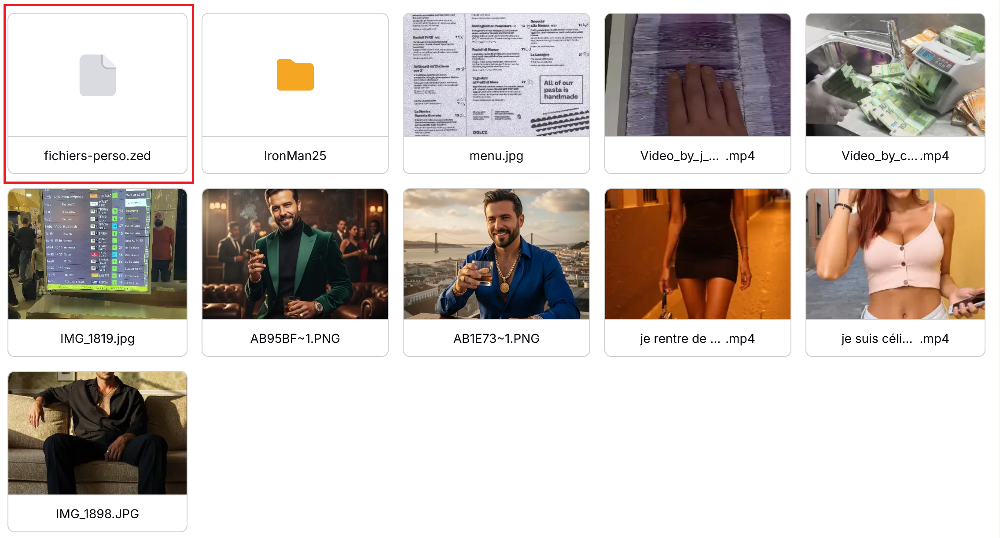
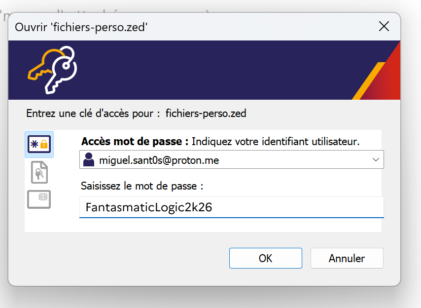
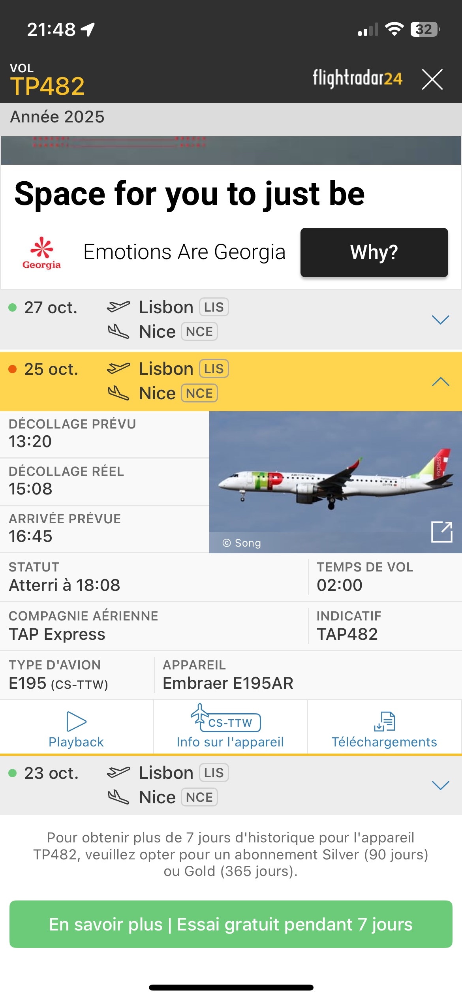

# Challenge : Vol retour 2

## Informations du challenge

| Catégorie | Difficulté | Points | Auteur |
|-----------|------------|--------|--------|
| SOsint | Facile | 150 | B3cha |

**Preuve :** `13h20-15h08` (insensible à la casse)

---

## Résumé

Dans ce challenge, il est nécessaire d'avoir déjà résolu le challenge `Vol retour 1` pour trouver le Proton Drive de Miguel, puis d'extraire le fichier `fichier-perso.zed`. Il faut ensuite déchiffrer l'archive Zed et extraire l'image contenant la réponse à notre challenge.

## Identification de l'archive Zed

Lors du challenge `Vol retour 1`, nous avions identifié le Proton Drive de Miguel : https://drive.proton.me/urls/X8GMZPNV74#GFhopliaf5M7
Ce dossier contient une archive Zed nommée `fichier-perso.zed`, qu'il est logiquement impossible de brute-forcer.

## Analyse du contenu de l'archive

Il faut donc utiliser le mot de passe `FantasmaticLogic2k26` trouvé lors du challenge `Vol retour 1` pour déchiffrer l'archive Zed :

L'archive contient les fichiers suivants :
1. IMG_1819.jpg
2. IMG_4329.png
3. IMG_4330.PNG
4. IMG_4331.PNG

Les informations recherchées sont dans l'image de Flightradar : **IMG_4329.png**
L'heure locale de décollage prévue est : `13h20`
L'heure locale de décollage réelle est : `15h08`

---

## Résultat

La solution de notre challenge est située sur la capture d'écran Flightradar disponible sur le Proton Drive de Miguel.

✅ **Preuve :** `13h20-15h08`
