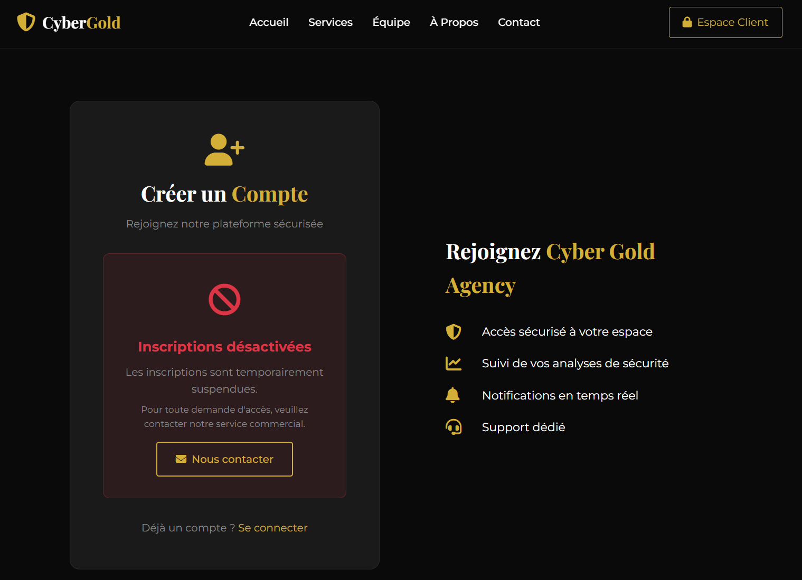
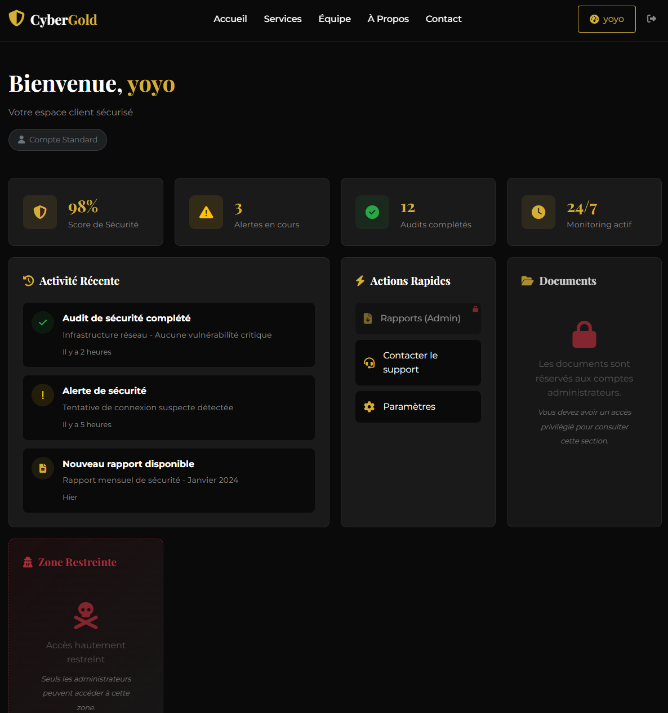
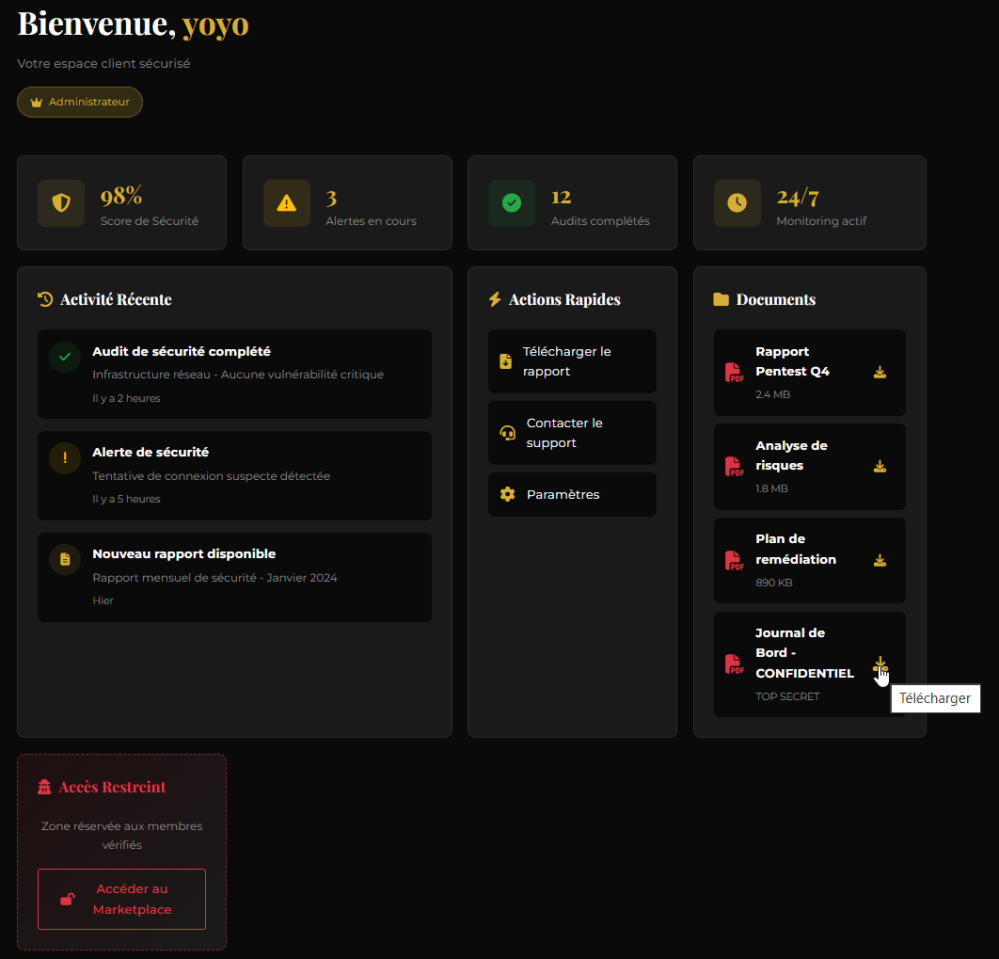
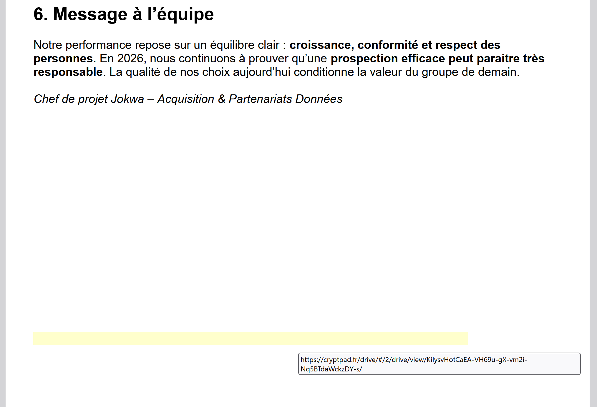

## Challenge : Agence en Or

## Informations du challenge

| Catégorie | Difficulté | Points | Auteur |
|-----------|------------|--------|--------|
| Web | Moyen | 300 | YoyoChaud |

**Preuve :** Le contenu du fichier `Journal de bord 3.pdf`

## Résumé

Ce challenge exploite une vulnérabilité critique dans la gestion des JSON Web Tokens (JWT) :

1. **Formulaire caché** - bypass de l'inscription "désactivée" via inspection du code source
2. **JWT kid Header Path Traversal** - injection du paramètre `kid` pour pointer vers `/dev/null` et forger un token admin

Référence : [PortSwigger - JWT authentication bypass via kid header path traversal](https://portswigger.net/web-security/jwt/lab-jwt-authentication-bypass-via-kid-header-path-traversal)

## Étape 1 : Découverte du formulaire d'inscription caché

### Découverte

L'application présente un site d'agence de cybersécurité avec une page de connexion `/login` et une page d'inscription `/register`.

En accédant à `/register`, un message indique que les inscriptions sont désactivées.



### Analyse

En inspectant le code source (F12), on découvre un formulaire HTML caché avec la classe `hidden-form` :

```html
<form class="login-form hidden-form" method="POST" action="/register">
    <input type="text" name="name" placeholder="Jean Dupont" required>
    <input type="text" name="username" placeholder="jean.dupont" required>
    <input type="email" name="email" placeholder="votre@email.fr" required>
    <input type="password" name="password" placeholder="Minimum 8 caractères" required>
    <input type="password" name="confirmPassword" placeholder="Confirmez votre mot de passe" required>
</form>
```

Le CSS applique `display: none` sur cette classe, mais le formulaire est fonctionnel côté serveur.

### Exploitation

**Méthode 1 : Via les DevTools**

1. Ouvrir les DevTools (F12)
2. Trouver l'élément `<form class="login-form hidden-form">`
3. Supprimer la classe `hidden-form`
4. Le formulaire apparaît et devient utilisable

**Méthode 2 : Via curl**

```bash
curl -X POST http://<IP>:<PORT>/register \
  -d "name=Hacker" \
  -d "username=hacker" \
  -d "email=hacker@test.com" \
  -d "password=password123" \
  -d "confirmPassword=password123" \
  -c cookies.txt -L
```

### Résultat

Le compte est créé et on est automatiquement connecté. On est redirigé vers `/dashboard`.



## Étape 2 : Analyse du JWT et identification de la vulnérabilité

### Observations sur le dashboard

- Notre rôle est `user` (Compte Standard)
- La section "Documents" est réservée aux administrateurs
- La "Marketplace" est également verrouillée

### Découverte

Après connexion, on intercepte une requête avec Burp Suite. L'extension **JWT Editor** (disponible gratuitement dans le BApp Store, version Community) permet de décoder automatiquement le token JWT présent dans le cookie `token`.

### Analyse

Dans l'onglet **JSON Web Token** de Burp Repeater, on visualise le contenu du JWT :

**Header :**
```json
{
  "alg": "HS256",
  "typ": "JWT",
  "kid": "secret"
}
```

**Payload :**
```json
{
  "id": 2,
  "username": "yoyo",
  "role": "user",
  "name": "yoyo",
  "iat": 1770580825,
  "exp": 1770595225
}
```
Le paramètre `kid` (Key ID) dans le header est un vecteur d'attaque connu. Le serveur l'utilise pour déterminer quelle clé utiliser pour vérifier la signature :

```javascript
// Côté serveur (vulnérable)
const keyPath = path.join(KEYS_DIR, kid);
const key = fs.readFileSync(keyPath);
```

Si on peut contrôler `kid`, on peut faire pointer le serveur vers un fichier arbitraire via path traversal.

## Étape 3 : JWT kid Header Path Traversal

### Contexte

La vulnérabilité exploitée est documentée par PortSwigger : le serveur lit un fichier basé sur le paramètre `kid` sans validation. On peut utiliser `/dev/null` (fichier vide sur Linux) pour signer avec un null byte.

### Technique d'exploitation

1. Pointer `kid` vers `/dev/null` via path traversal
2. `/dev/null` est un fichier vide, donc la clé sera un null byte (`\x00`)
3. Signer notre JWT forgé avec cette clé nulle
4. Le serveur vérifiera la signature avec le contenu de `/dev/null` = succès

### Exploitation avec Burp Suite

**Étape 3a : Créer une clé de signature nulle**

1. Installer l'extension **JWT Editor** depuis le BApp Store (disponible en version Community/gratuite)
2. Aller dans l'onglet **JWT Editor Keys** dans la barre principale de Burp
3. Cliquer sur **New Symmetric Key**
4. Cliquer sur **Generate** pour créer une clé JWK
5. Remplacer la valeur de `k` par `AA==` (null byte en Base64)
6. Cliquer **OK** pour sauvegarder

**Étape 3b : Forger le JWT malveillant**

1. Intercepter une requête authentifiée (ex : `GET /dashboard`)
2. Aller dans l'onglet **JSON Web Token** de Burp Repeater
3. Modifier le **header** - changer uniquement le `kid` pour pointer vers `/dev/null` :

```json
{
  "alg": "HS256",
  "typ": "JWT",
  "kid": "../../../../../../../dev/null"
}
```

4. Modifier le **payload** - changer uniquement `role` de `user` à `admin` :

```json
{
  "id": 2,
  "username": "yoyo",
  "role": "admin",
  "name": "yoyo",
  "iat": 1770580825,
  "exp": 1770595225
}
```

> **Note :** On garde notre identité (id, username, name), on modifie uniquement le rôle.

5. Cliquer sur **Sign** en bas
6. Sélectionner la clé symétrique créée précédemment (avec `k= AA==`)
7. Cocher **Don't modify header**
8. Cliquer **OK**

### Résultat

Après avoir envoyé la requête avec le token forgé, on accède au dashboard avec les privilèges admin :

- Notre nom s'affiche toujours (yoyo) mais avec le badge "Administrateur"
- La section Documents est déverrouillée
- La Marketplace est accessible

### Ce qui ne fonctionne PAS

- **Modifier uniquement le payload sans resigner** → la signature est invalide, le serveur rejette le token
- **Modifier uniquement le role sans changer le kid** → la signature est vérifiée avec la clé originale, échec
- **Utiliser `kid: ""` (chaîne vide)** → erreur de lecture de fichier
- **Utiliser `kid: /etc/passwd`** → le contenu n'est pas prévisible/contrôlable pour signer
- **Path traversal sans assez de `../`** → ne remonte pas assez pour atteindre `/dev/null`
- **Signer avec une clé vide `""`** → JWT Editor ne le permet pas (utiliser `AA==` comme workaround)
- **Changer `alg` en `none`** → le serveur vérifie que l'algorithme est HS256

## Pourquoi ça fonctionne

La vulnérabilité existe car :

1. **Pas de validation du paramètre `kid`** - le serveur utilise directement la valeur pour construire un chemin de fichier
2. **Path traversal possible** - les séquences `../` ne sont pas filtrées
3. **`/dev/null` est prévisible** - ce fichier existe sur tout système Linux et est toujours vide
4. **Contenu vide = null byte** - le serveur lit un fichier vide et utilise un null byte comme clé
5. **Signature vérifiable** - on peut signer notre token avec le même null byte

## Étape 4 : Récupération du flag

### Découverte

Dans la section Documents du dashboard, on trouve maintenant :

| Document | Type |
|----------|------|
| Rapport Pentest Q4 | PDF généré |
| Analyse de risques | PDF généré |
| Plan de remédiation | PDF généré |
| **Journal de Bord - CONFIDENTIEL** | TOP SECRET |

Le bouton de téléchargement du "Journal de Bord - CONFIDENTIEL" est maintenant accessible.

### Exploitation

1. Cliquer sur l'icône de téléchargement du "Journal de Bord - CONFIDENTIEL"
2. Le fichier `Journal de bord 3.pdf` est téléchargé



### BONUS histoire

Le fichier récupéré <a href="pdf/Journal de bord 3.pdf">Journal de bord 3.pdf</a> contient une URL cachée sur la dernière page :



Cette URL pointe vers le fichier cryptpad suivant :
https://cryptpad.fr/drive/#/2/drive/view/KilysvHotCaEA-VH69u-gX-vm2i-Nq5BTdaWckzDY-s/

Ce document permet de mieux comprendre l'agenda de construction du groupe criminel `Fantasmas-de-Redes`.

### Résultat

Le nom du fichier PDF est le flag du challenge.

✅ **Preuve :** `Journal de bord 3.pdf`
