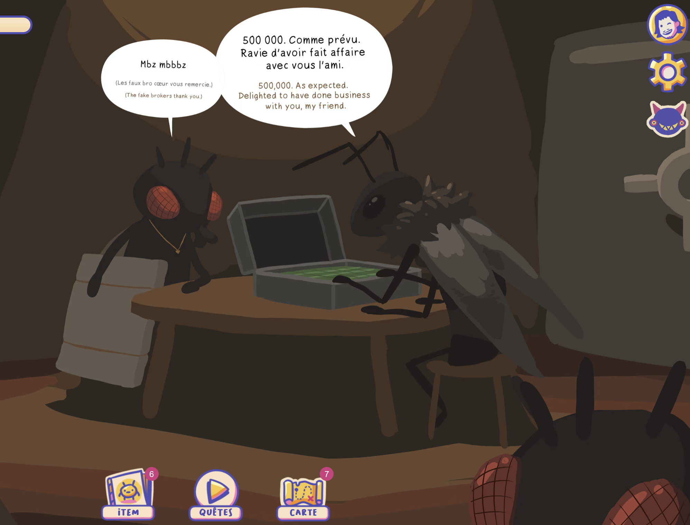
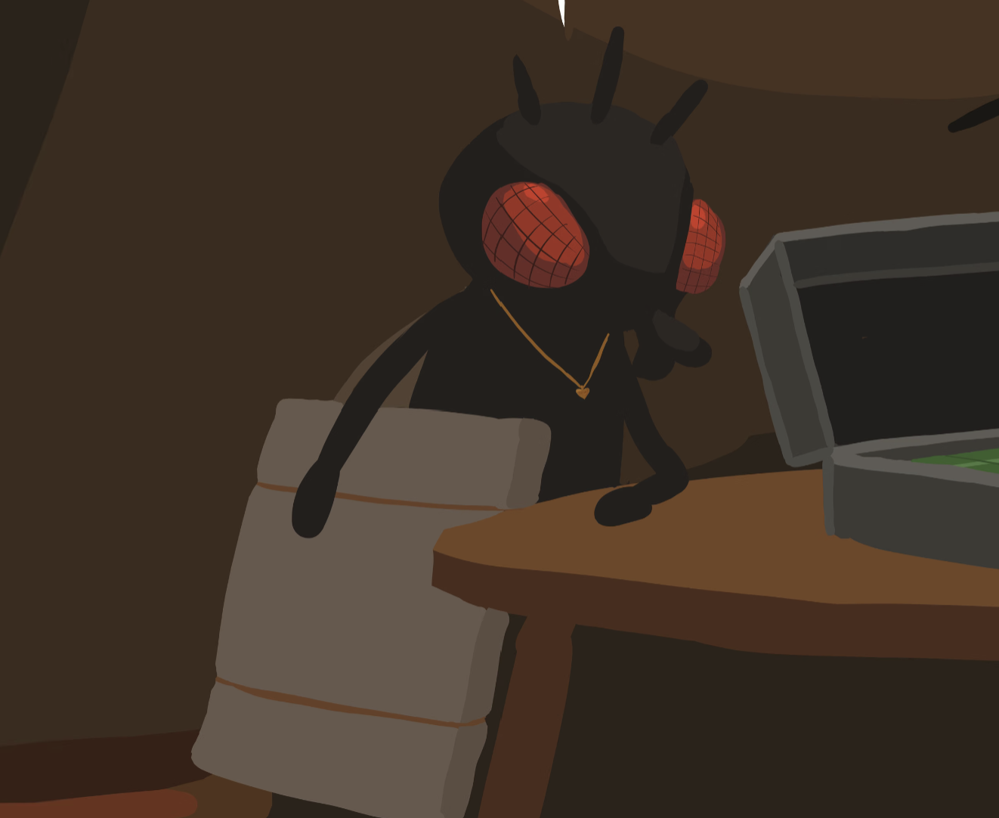
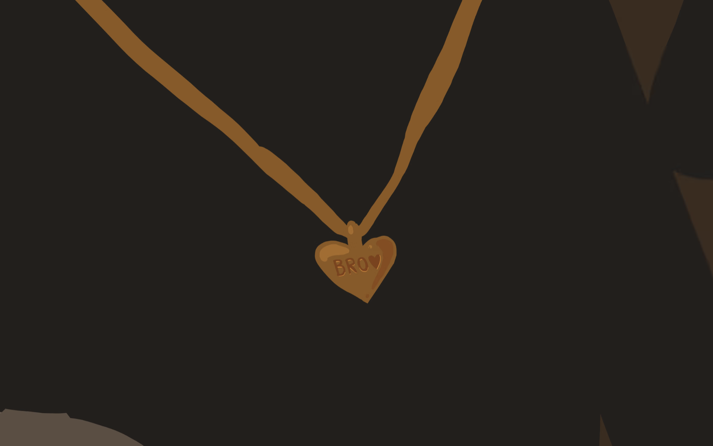

# Challenge : Infiniment précieux

## Informations du challenge

| Catégorie | Difficulté | Points | Auteur |
|-----------|------------|--------|--------|
| Misc & Osint | Moyen | 350 | Vaskange |

**Preuve :** `coeur` ou `cœur` (les deux sont acceptés)

---

## Résumé

Dans ce challenge, il est nécessaire d'avoir déjà résolu le challenge `En quête de l'infini` pour trouver l'insecte au pendentif qui effectue la transaction du Camaïeu volé.

## Identification du personnage

Lors du challenge `En quête de l'infini`, on se retrouve sur l'île **Cocciland**, dans la tanière :

Puis il ne faut pas se tromper de personnage : c'est celui qui a le listing sous le bras :

Enfin, il faut zoomer sur son pendentif :

Le pendentif a la forme d'un `coeur`, normal pour les **Bro** ❤️ => ce qui donne brockeurs.

# Raison d'être du challenge

En début de CTE, ce challenge n'existait pas. Or, plusieurs joueurs utilisant les IA en ligne ont trouvé la solution du challenge `En quête de l'infini` sans faire la quête de Vaskange, ce qui était dommageable à notre collaboration avec l'artiste.
Ainsi, les joueurs sont obligés de se rendre dans la tanière de la transaction sur Cocciland pour trouver la forme du pendentif.
Nous n'avons pas demandé l'inscription présente sur le pendentif, car il existe une très grande variété de codes pour l'emoji ❤️.

**NOUS ESPÉRONS QUE LA QUÊTE VOUS A PLU, ET QUE VOUS AUREZ APPRÉCIÉ LE TRAVAIL DE VASKANGE.**

Bravo à lui pour ce partenariat avec la RGPACA 💪🏽

---

## Résultat

La solution de notre challenge est située dans la tanière de **Cocciland**, au moment de la transaction avec les Fakebrokeurs, autour du cou du méchant qui effectue la transaction.

✅ **Preuve :** `coeur` ou `cœur` (les deux sont acceptés)
